## 221109

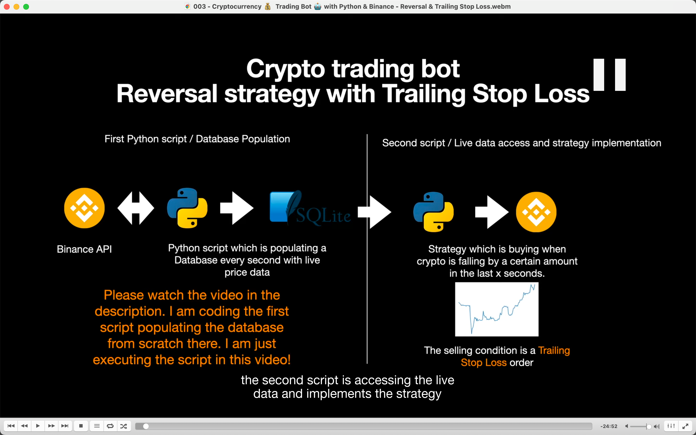</img>  
上节课获取了 live data，这节课根据 live data 来实施策略  
策略是买入币如果之前的一些秒钟此币价格下降了一定比例

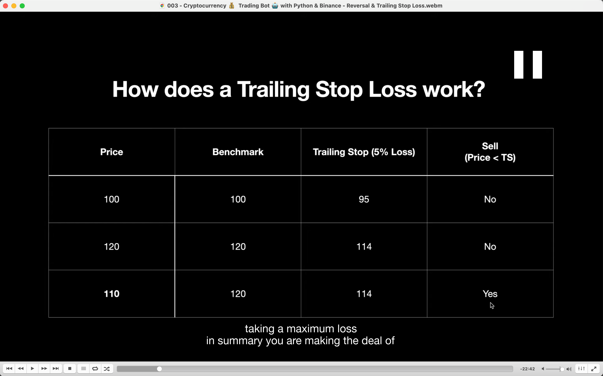</img>  
卖出条件是基于 trailing stop loss 机制

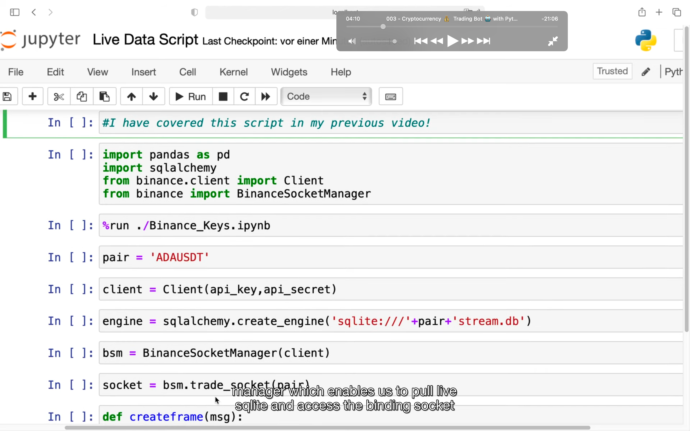</img>  
--=  
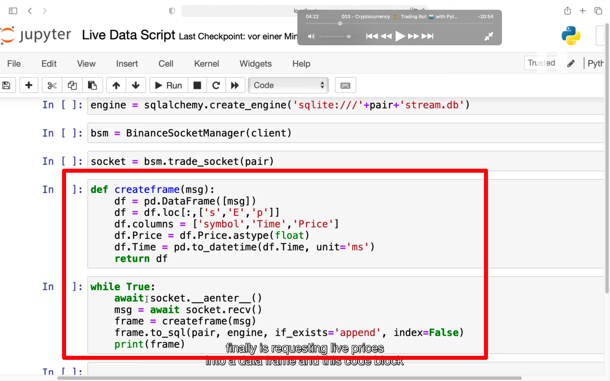</img>  
获取币的价格数据并存入 sql 中，这些代码已经在上节课介绍

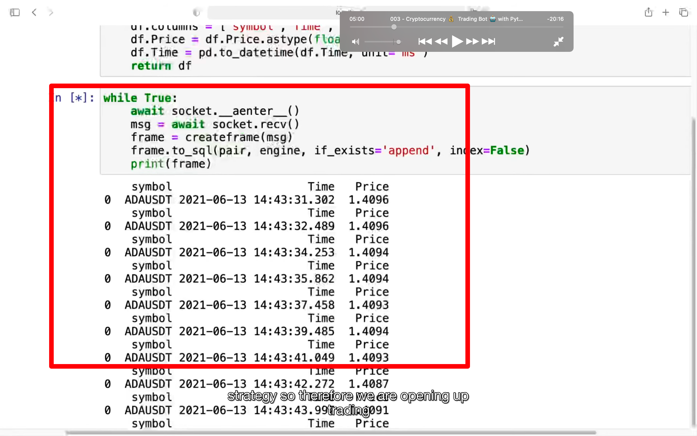</img>  
运行起来的效果

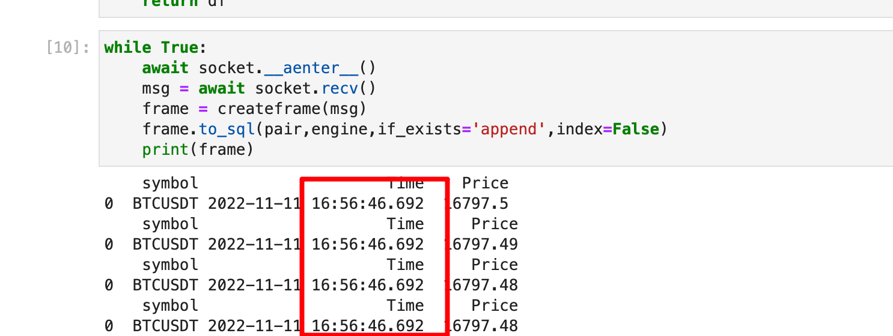</img>  
add221111  
同样代码写出来，时间不对，都是同一秒。暂不知道原因，先跳到下一节。

add221114  
注意此时应该是按输入命令后依次显示自此产生的每一笔交易的价格，而不是一秒钟显示一次交易价格。  
所以像 btcusdt 这样交易很频繁的 pair 会有很多行都显示在同一秒中。

add230102  
这种形式叫做逐笔订单

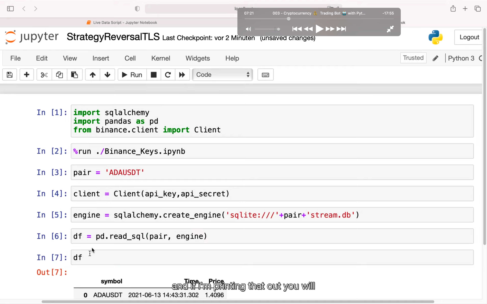</img>  
之前的是获取并存入 sql 的 py，这里新开一个读取 sql 数据的 py

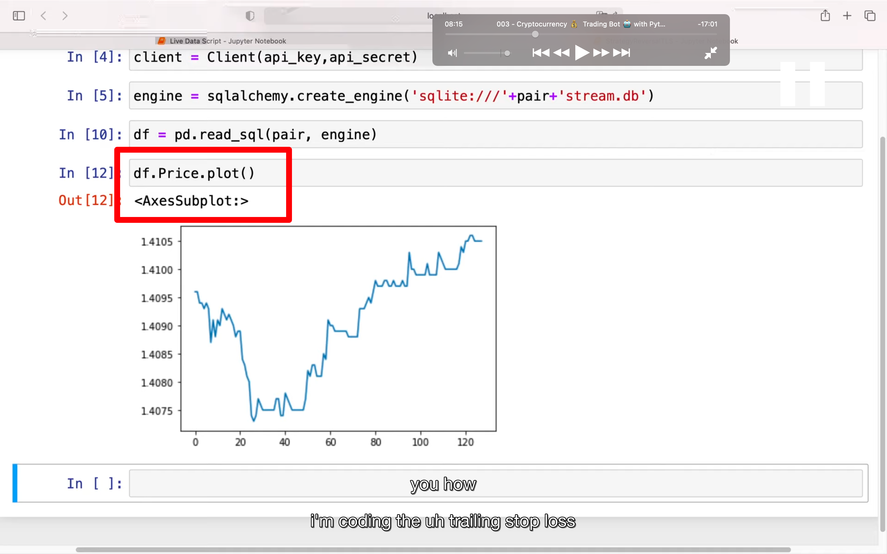</img>  
df.Price.plot()获得图表

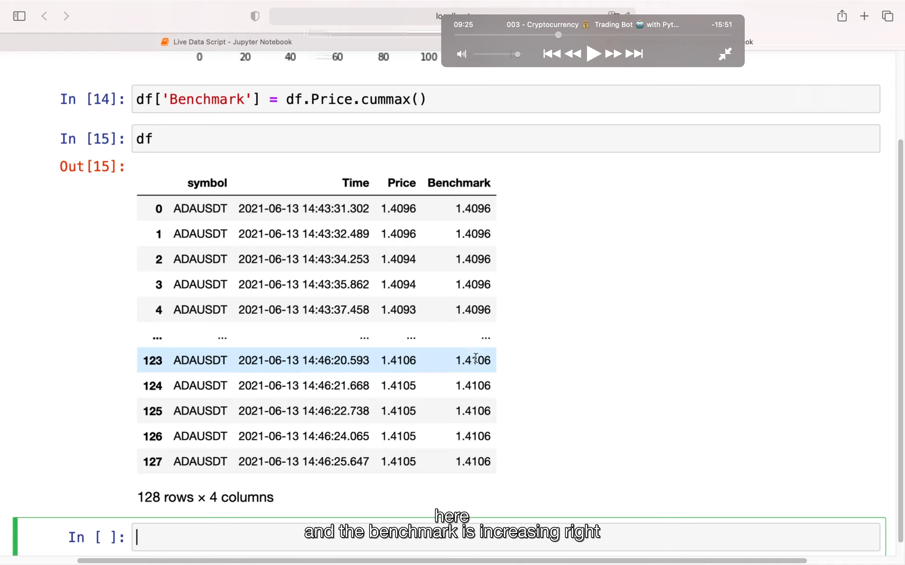</img>  
定义一个 benchmark，标记点。它是之前价格里最高的那个  
注意 benchmark 会变化，如图。

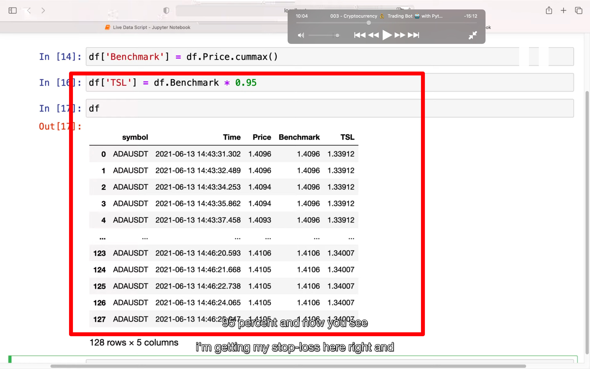</img>  
定义 tsl，traing stop loss，它一直是 benchmark 的 0.95 倍。  
当 price 小于 tsl 时就卖出

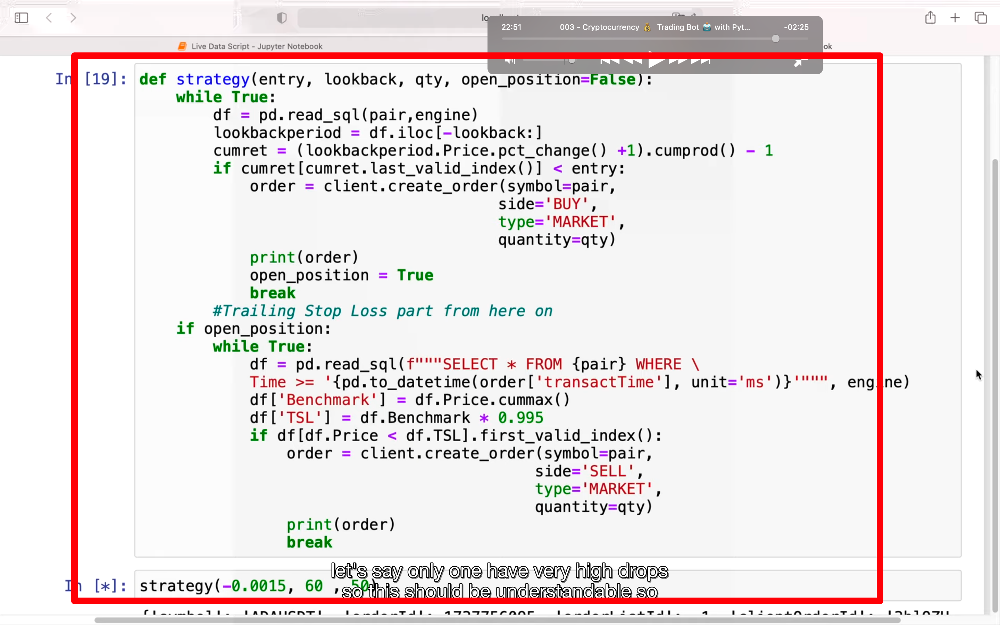</img>  
策略代码，具体含义看视频
