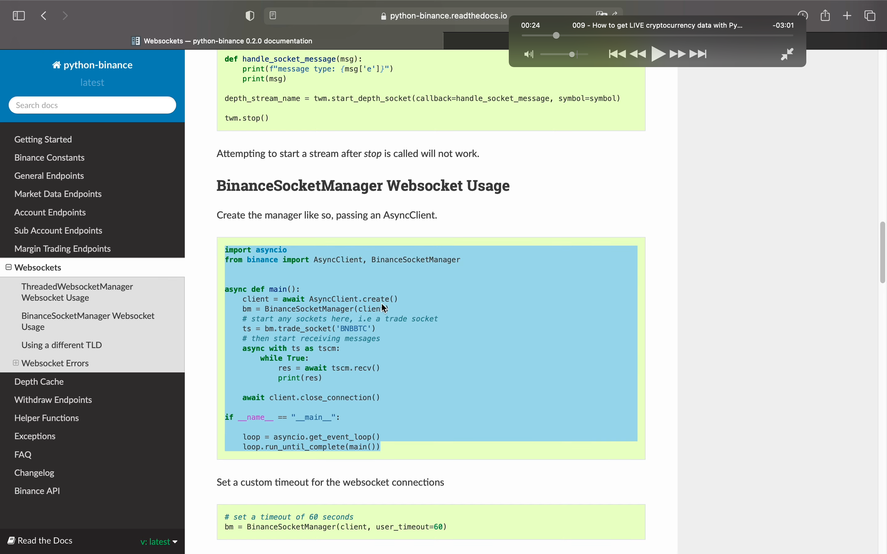
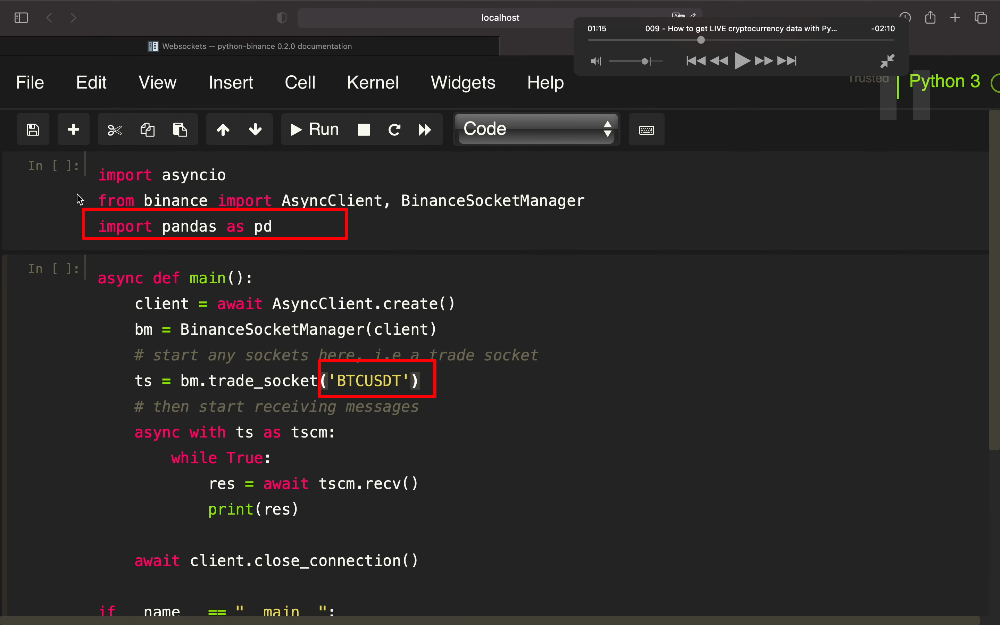
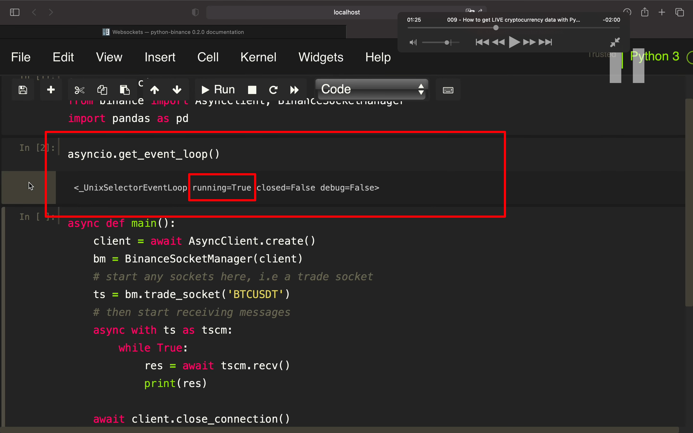
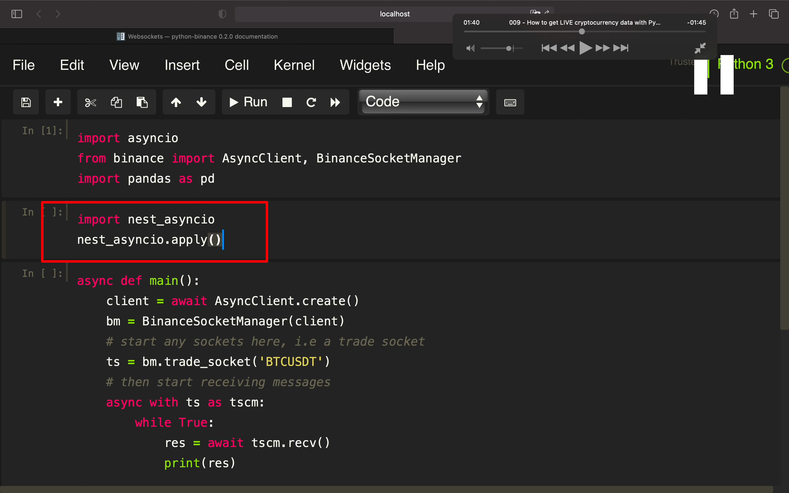
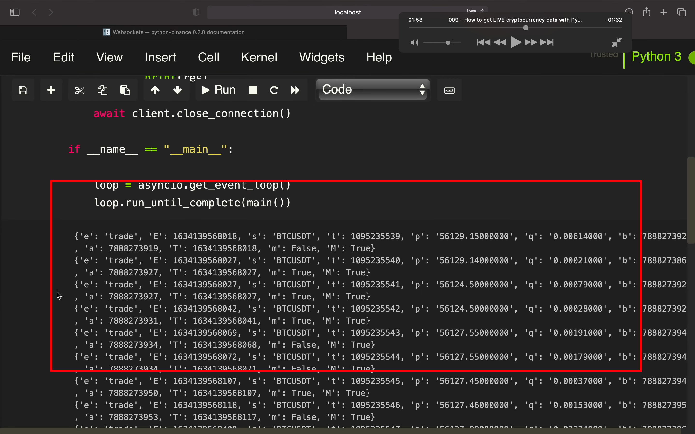
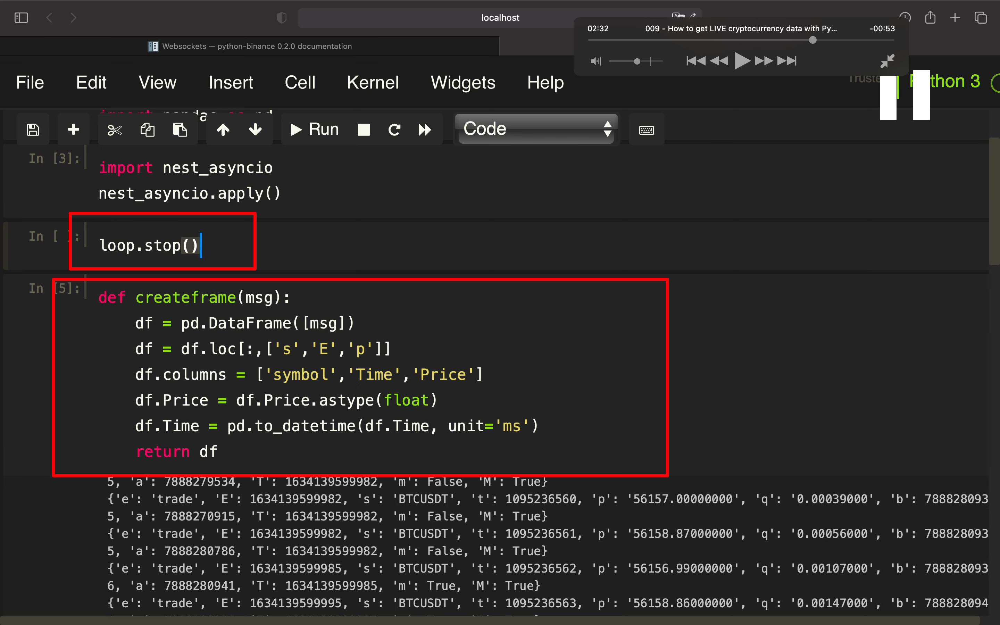
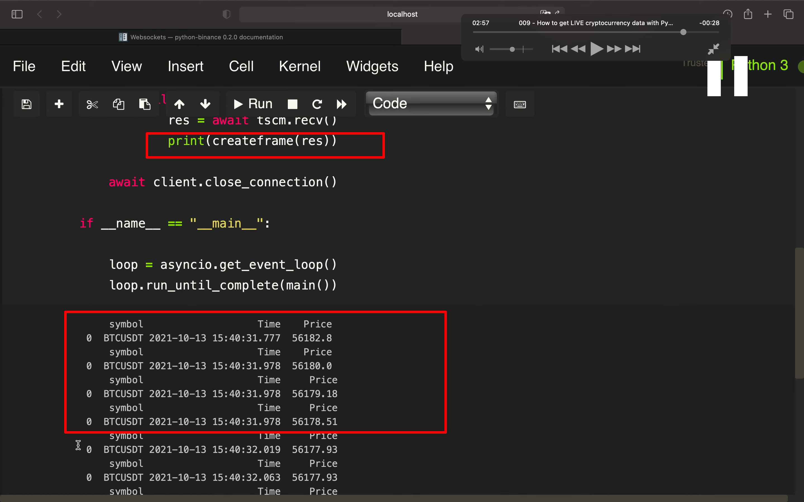

## 230109

## 此节是为了修复当获取 stream 太长时间出现 error 的 bug。同时也能学到怎么用 LS live stream api

</img>  
复制粘贴这段代码，如果是 py 文件直接用就行，如果是 jupyter，还需要下面的改造

</img>  
原代码上的修改，引入了 pandas，以及修改 symbol 为 btcusdt，可能是因为这是 trade_socket，会显示每笔交易，btc 的交易更多些。

</img>  
--=  
</img>  
直接运行可能会报错，因为 event loop 可能已经在运行了。所以用图一代码来查看是否有已运行的，图二代码来解决问题

</img>  
解决了以上问题就可以获得 live data 了。

</img>  
用 loop.stop 可以停止循环（停止后删除了此代码，可能重启脚本也能停止循环？），用 createframe 让获得的 live data 以 DF 的形式显示

</img>  
修改下这里，就能用 DF 形式显示了。
