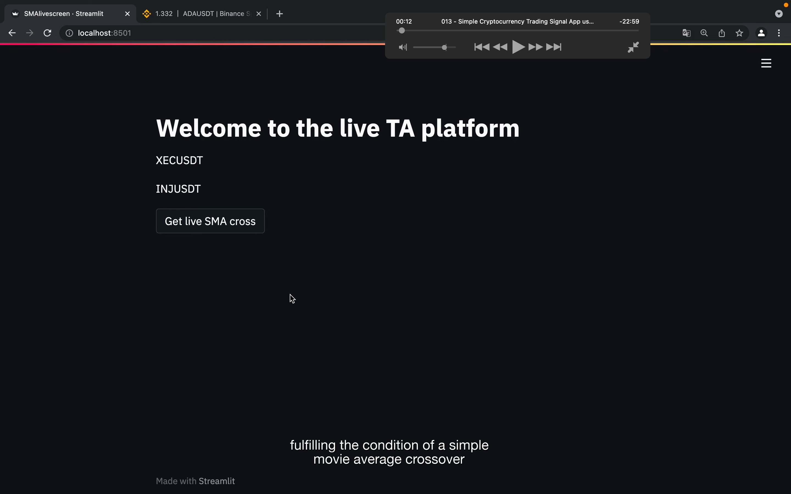
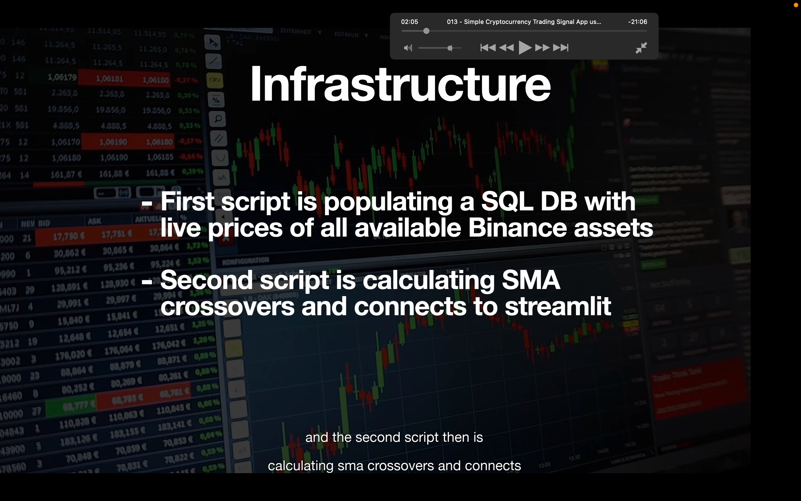
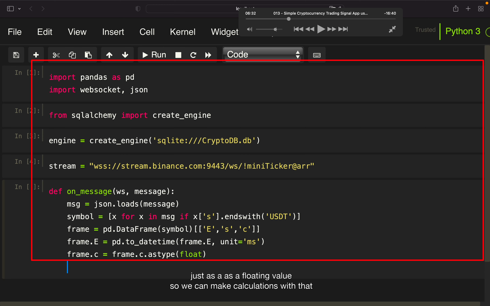
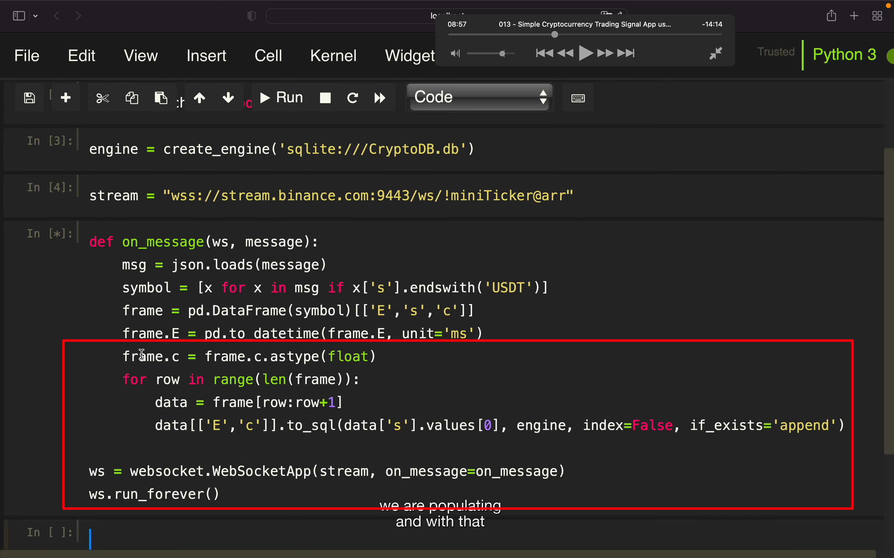
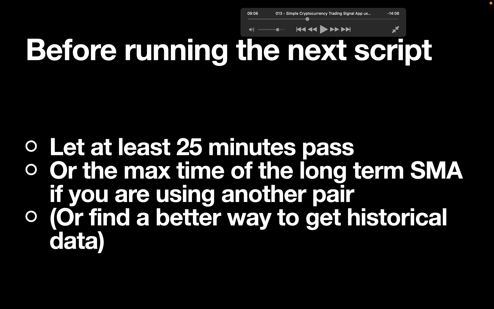
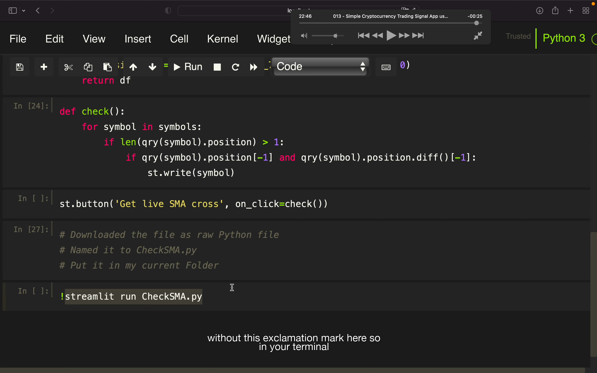

## 221121

</img>  
此节目标是建立一个可以告诉自己哪些币在金叉时刻的 app

</img>  
第一个脚本用于存储数据到 sql db  
第二个脚本计算 sma，并连接到 streamlit

</img>  
--=  
</img>  
往 db 存入相关数据

</img>  
在跑下个脚本前需要做的

</img>  
之后内容较复杂，暂时用不到所以省略。需要时再看
