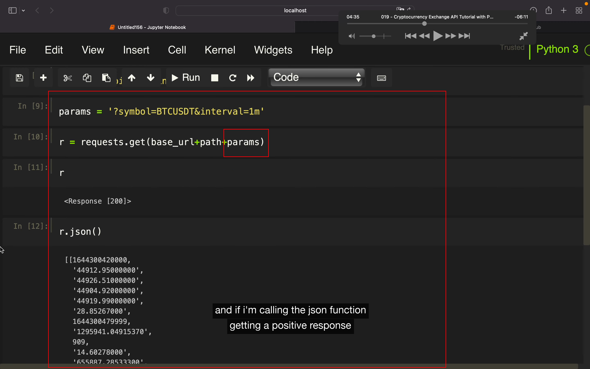

## 230201

其它教程大多用的 python-binance 库，这里介绍直接用币安原装 api。再演示下 kucoin 的原装 api，就能大概掌握其它交易所用 api 的方法了。

</img>  
需要两个东西，一个是 api 文档，用来找到用啥终端获取数据。和 requests 库来使用这些终端。

</img>  
--=  
</img>  
--=  
</img>  
看图就懂了。

</img>  
--=  
</img>  
--=  
</img>  
--=  
</img>  
加了参数的请求方式，看图就懂

</img>  
第二种写法

</img>  
kucoin 的写法

</img>  
--=  
</img>  
用 api 发起交易需要
1，需要提供包括 api key 的 header  
2，需要提供个 sha256 签名  
3，需要提供个时间戳  
较复杂，需要时看视频        

