## 221201

## 可能大概意思是获取过去的价格走势。截取前一部分，让机器学习，让机器预测之后的走势。最终 btcusdt 达到了约 51 的成功率，ethusdt 达到了约 55 成功率。需要前置知识，暂不仔细学习额

## 不过可以参考文中获得每 tick 之间价差的方法，用于自己的策略。

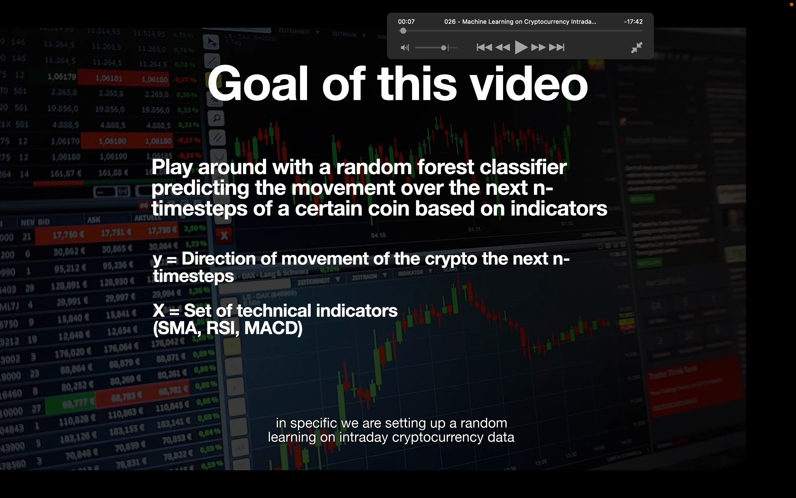</img>  
ML on intraday CP data  
setting a random forest classifier to predict the movement direction of a certain coin based on a set of indicators

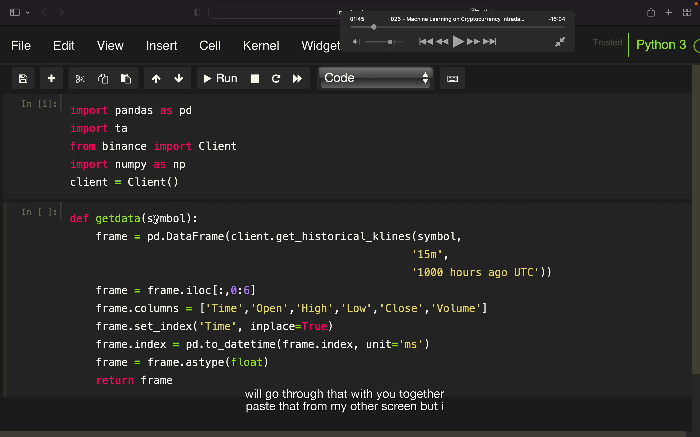</img>  
ta 用于计算技术指标-calculate technical indicators  
numpy 条件检查？-conditional checkings

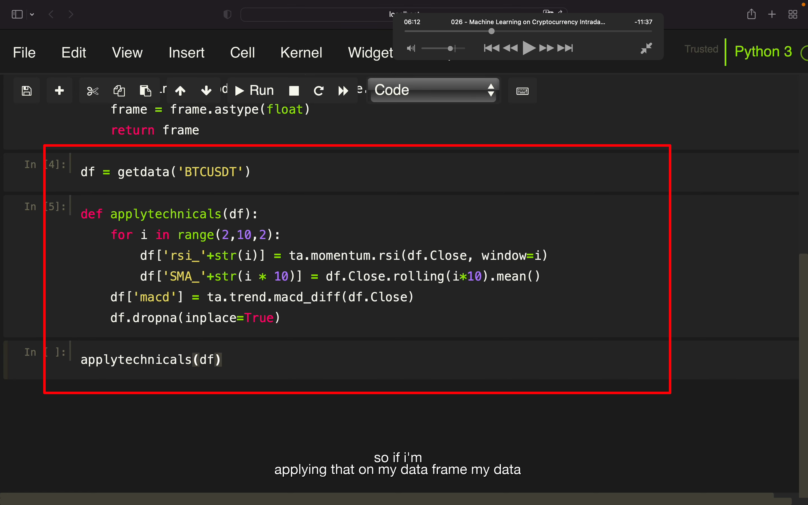</img>  
--=  
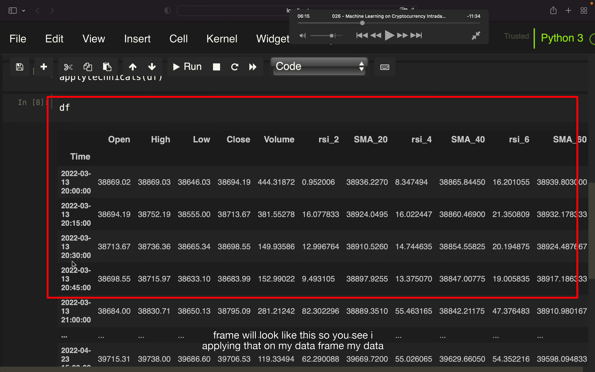</img>  
--=  
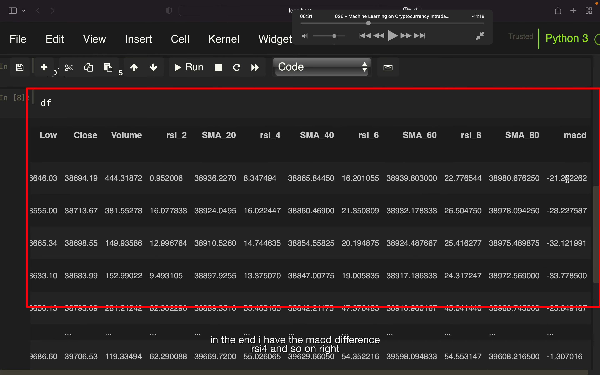</img>  
写了个函数应用到此 df 上，df 变成下图，增加了一些指标数据。函数具体内容暂未看

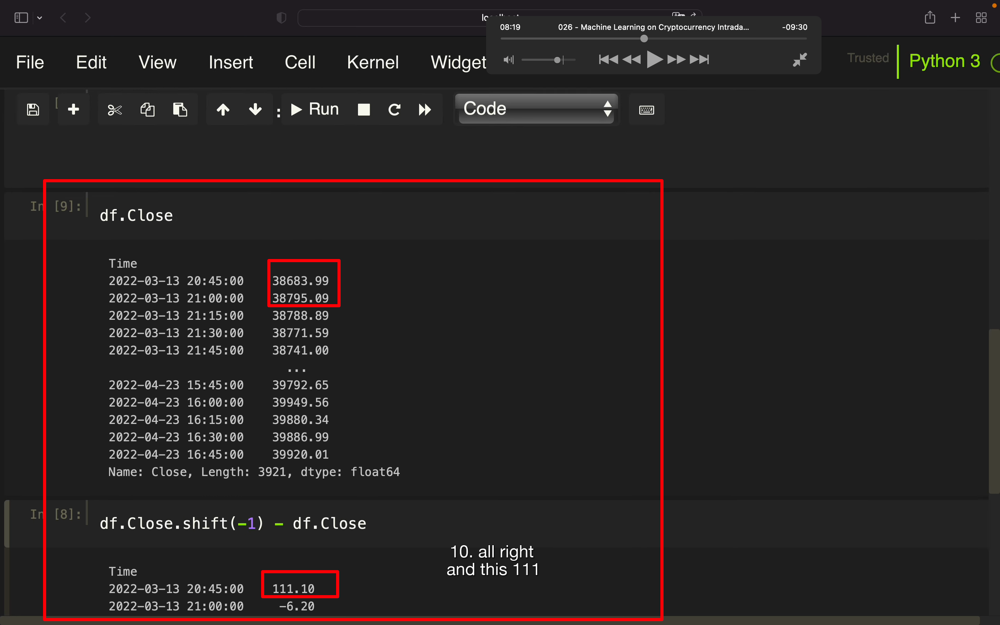</img>
之后是定义非独立和独立变量  
此图只是讲解内部细节，并不是最终代码  
下图第一行为上图第二行减去第一行的值，即变化量。

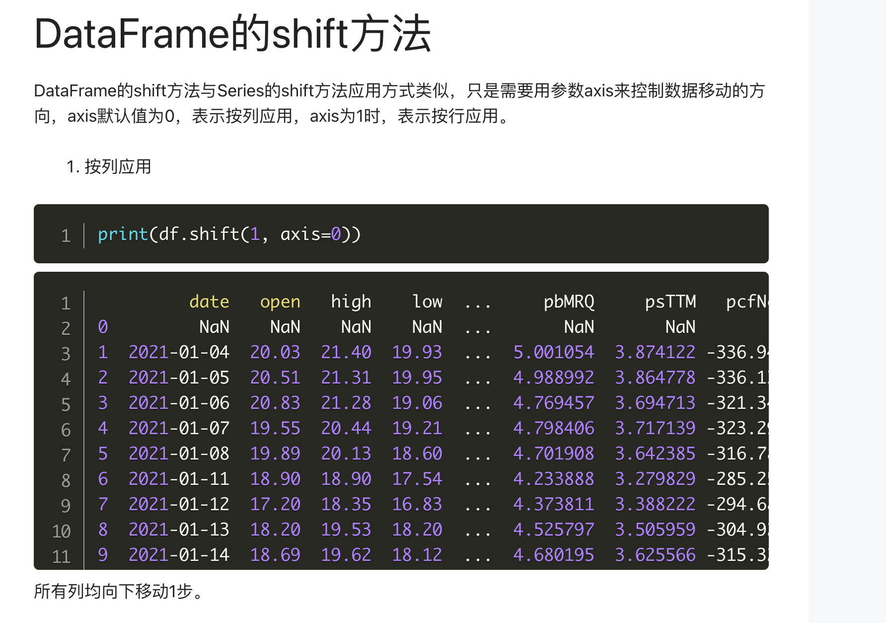</img>  
add221203  
shift 的用法  
上例中 shift(-1)相当于让列整体上移一行，再减去原始的数据，结果就刚好是后一天跟当天比的变化量。

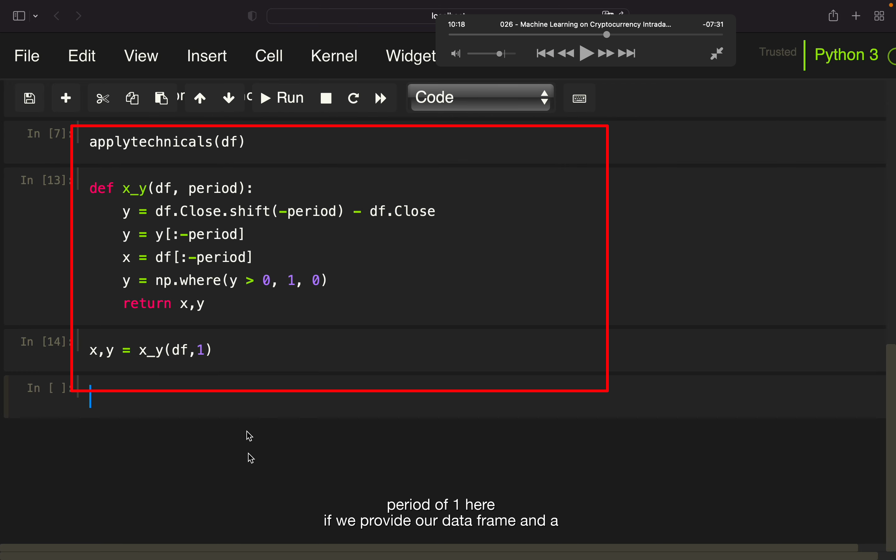</img>  
处理过后末尾会是 nan，所以用 y=[:-period]和 x=\*过滤掉 nan 部分  
让结果为正值即价格增加显示为 1，否则为 0

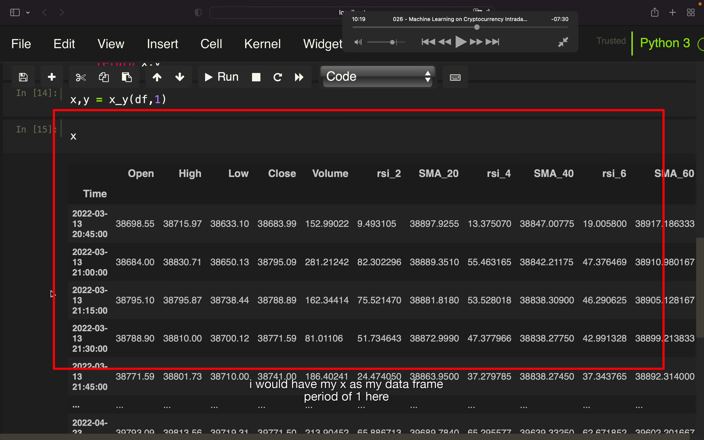</img>  
--=  
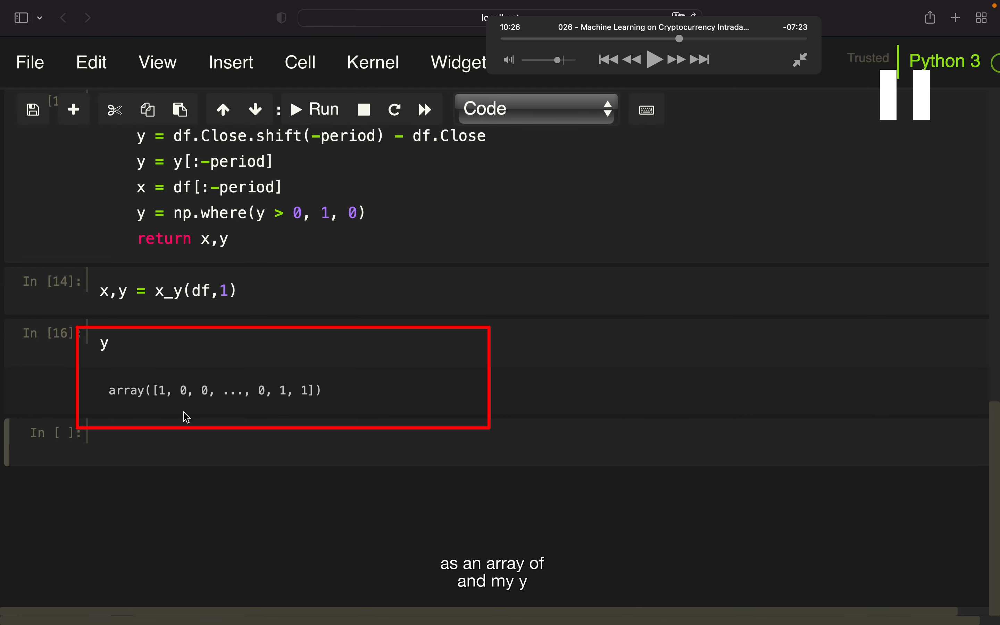</img>  
最终 x 就是 df，y 就是表示价格增加或减少的数组

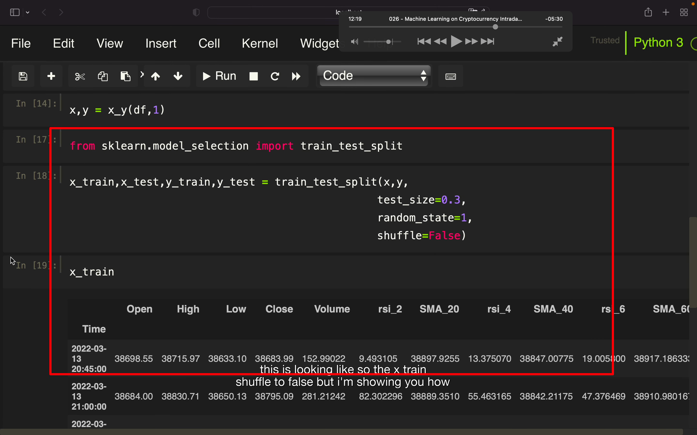</img>  
--=  
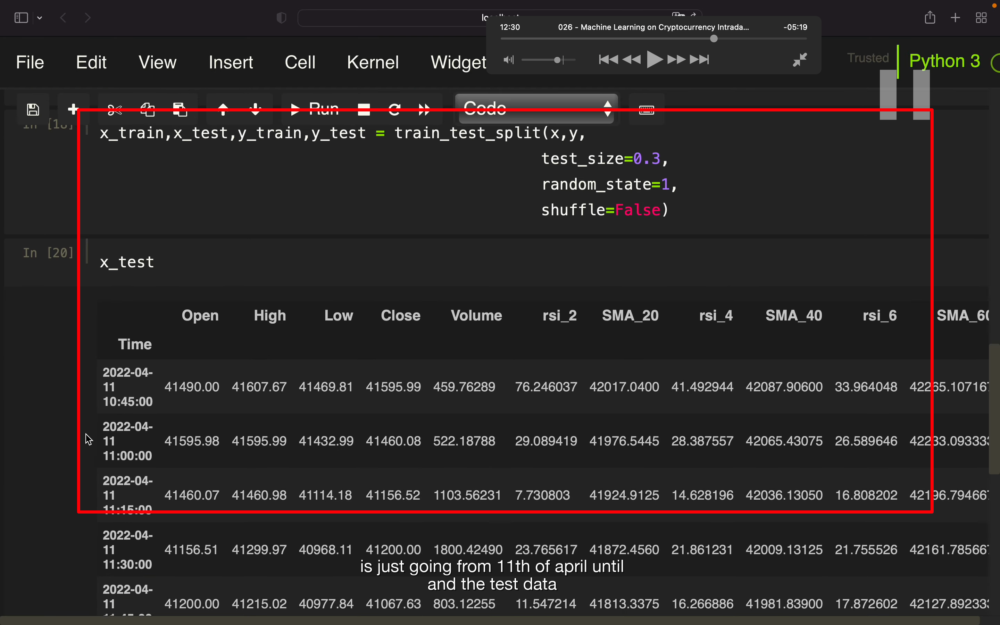</img>  
这段没看太懂，可能需要前置知识  
x-train 获得 03-13 到 04-11 的数据，x-test 获得 04-11 到现在的数据

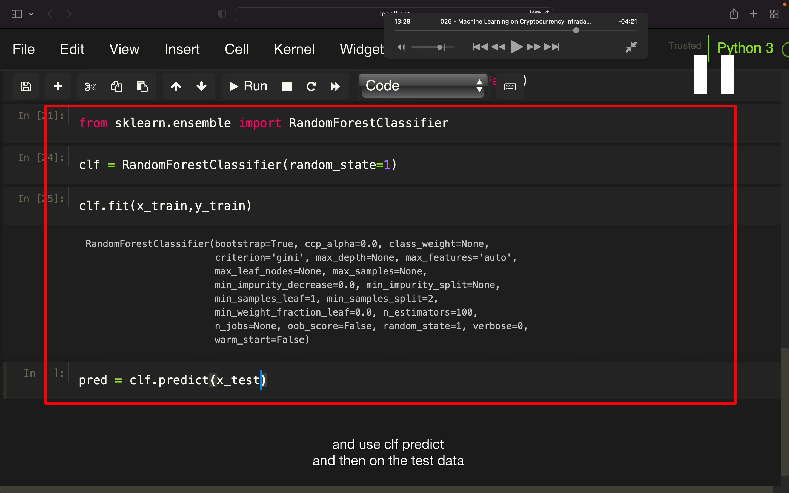</img>  
--=  
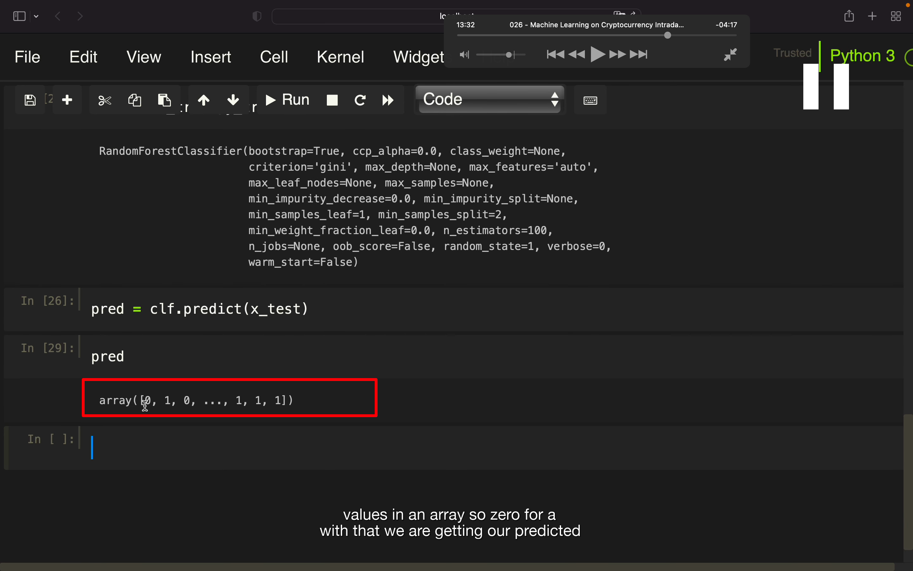</img>  
获得 prediction value，预测值

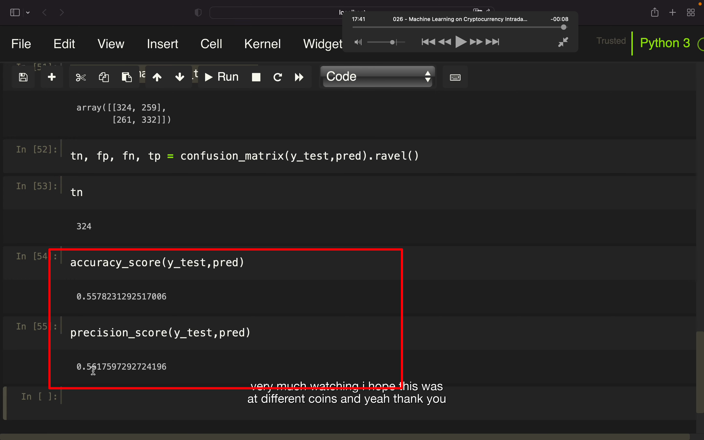</img>

## 省略了很多内容，直接看结尾，可能大概意思是获取过去的价格走势。截取前一部分，让机器学习，让机器预测之后的走势。最终 btcusdt 达到了约 51 的成功率，ethusdt 达到了约 55 成功率。
