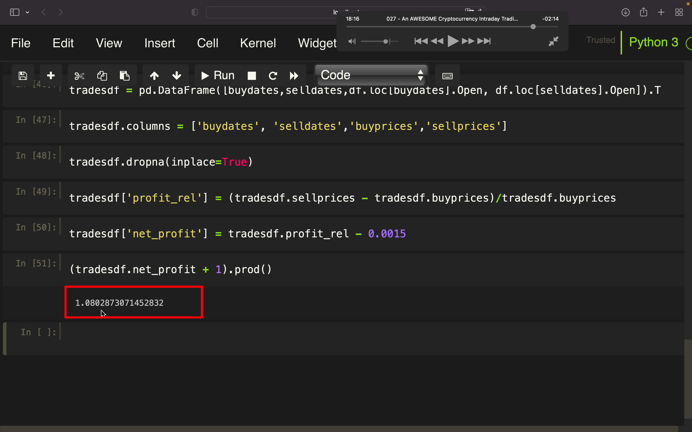

## 221203

</img>  
回测一个有趣的日内交易策略

</img>  
创建一个 rolling maximum high 和 rolling minimum low 的 channle-通道。  
前者是黄线，后者是蓝线，红线是两者的平均值，蓝绿色线是每日最新 close 价。  
当 close 超过红线时买入，当 close 接近黄线时卖出。

### 需要以下两个前置视频

https://www.youtube.com/watch?v=_IV1qfSPPwI  
已看过
https://www.youtube.com/watch?v=rYfe9Bg2GcY  
还未看

</img>  
初始代码

</img>  
新增 rollinghigh 列

</img>  
--=  
</img>  
类似方法新增其它很多列  
其中 midcross 是只有当 close-a-mid 从 0 变为 1 时才为 true。此时才买入

</img>  
标记出买入和卖出的 date，并存入两个数组中  
由于在出现信号之后才能买入卖出，所以 i+1

</img>  
画出图像

</img>  
--=  
</img>  
--=  
</img>  
创建 tradesdf，注意各个转换达到的效果

</img>  
计算出每个 tick 的收益  
inplace=True 可以丢掉无效值

</img>  
算出运行期间总利润。  
0.0015 是买卖各 0.00075 的手续费  
结果约 1.021，也就是大约 2.1%的总利润

</img>  
--=  
</img>  
调整下回测周期，得到大约百分之 8 利润

</img>  
但调整为其它币，就亏损了，再调整其它参数就又盈利了。所以此策略是否盈利可能有运气原因，也可能跟各参数有关。
