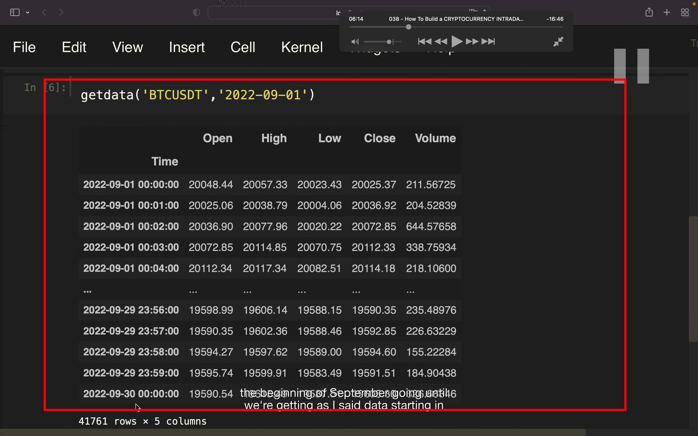
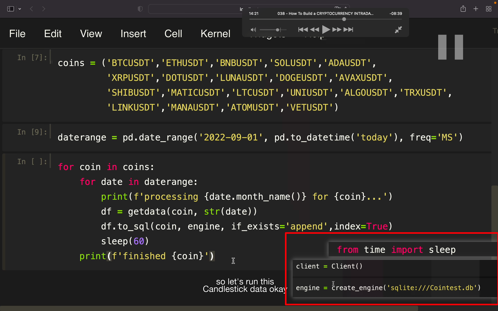
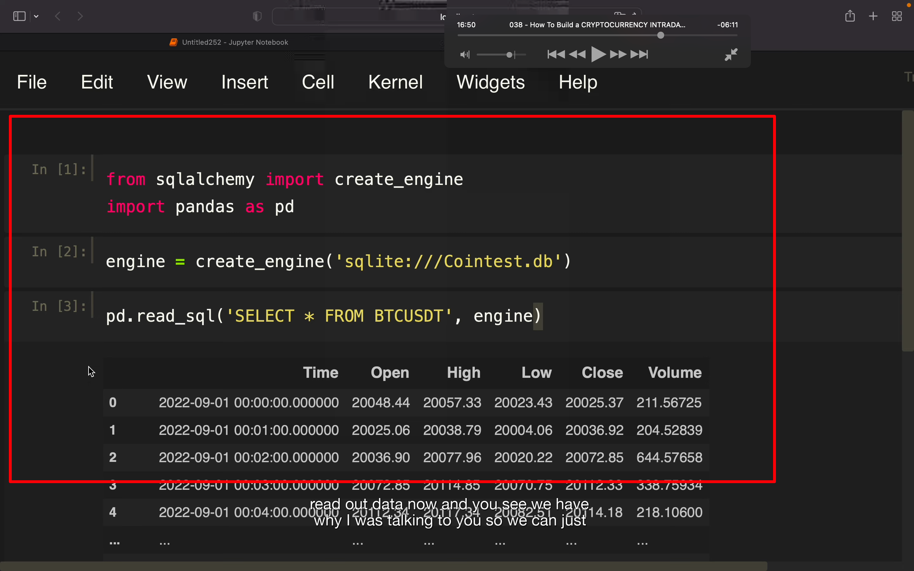
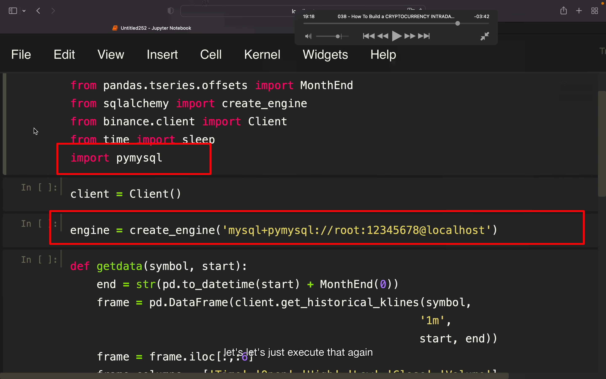
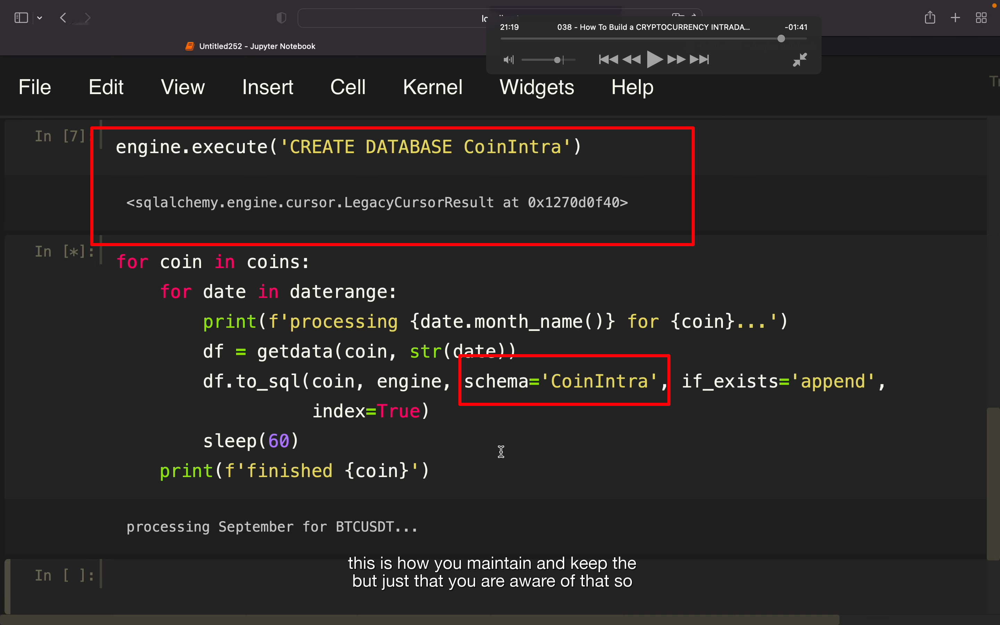
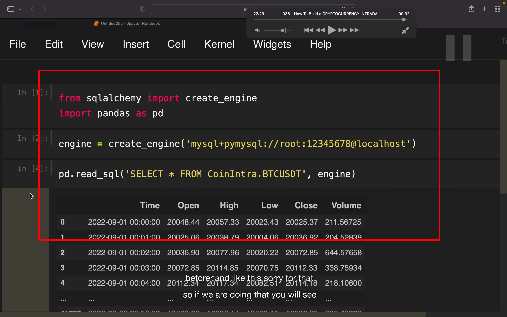

## 221210

## 使用 py 和 sql 创建一个日内 cp db。一个 py 脚本从币安 api 获取数据然后写入 sql。原因是如果不写入 sql 则每次分析都需要调取大量数据。

</img>  
--=  
</img>  
--=  
</img>  
图二修改了一些，让获取数据为从指定日期开始，到当月最后一天截止。这样可以 chunk by chunk 的把数据传递给 sql。效果如图三

</img>  
之后的代码，存入各种 pair 的数据到 sql。注意添加右下角之前遗漏的代码

</img>  
另外新建一个文件，就能读取数据了

</img>  
--=
</img>  
--=
</img>  
原来的代码基础上做些修改，就能使用 mysql 来读写数据了。此外 2050 介绍了怎么把最新时间加入当前数据，需要时再看。
