## 221210

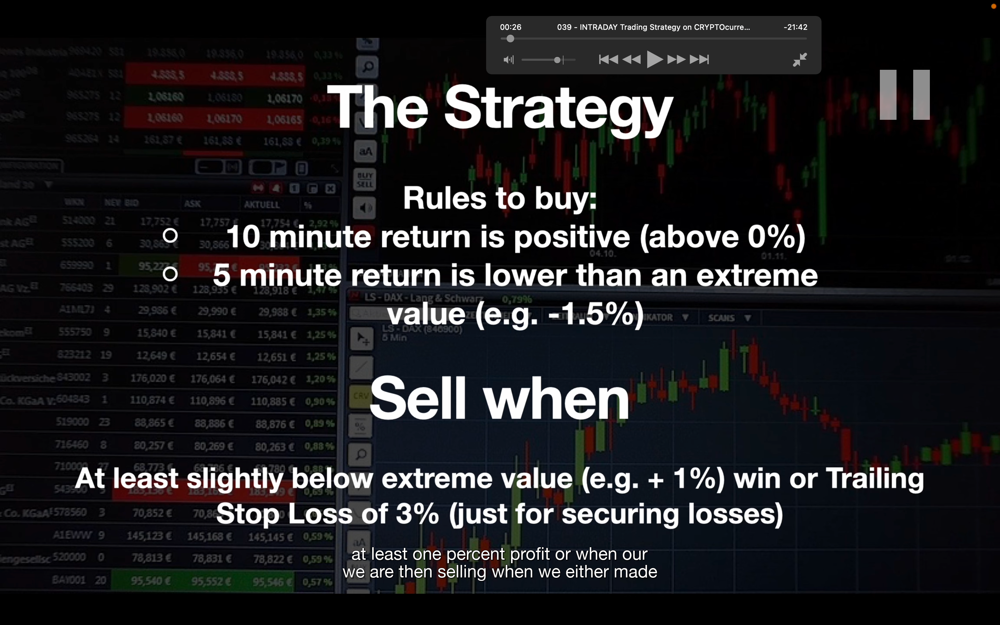</img>  
--=  
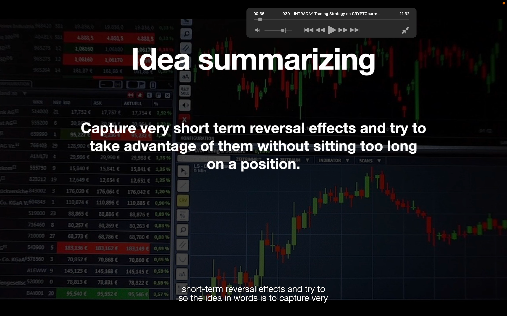</img>  
--=  
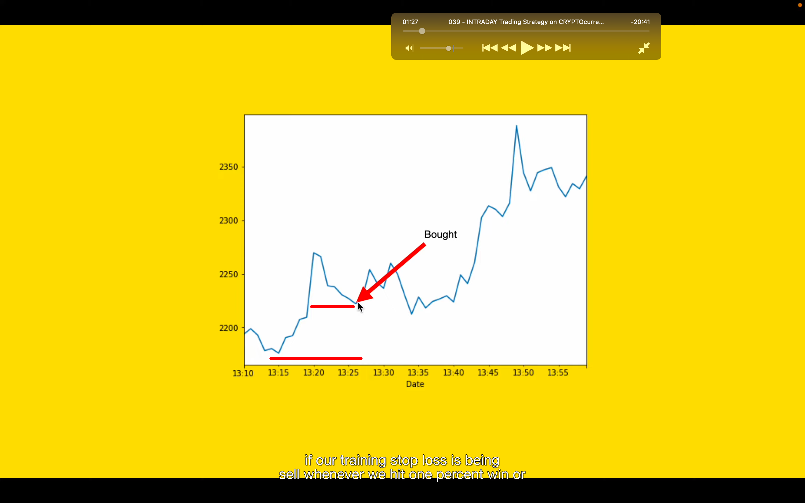</img>  
策略，大致是在 10 分钟内是涨，但 5 分钟内是跌的时候买入。

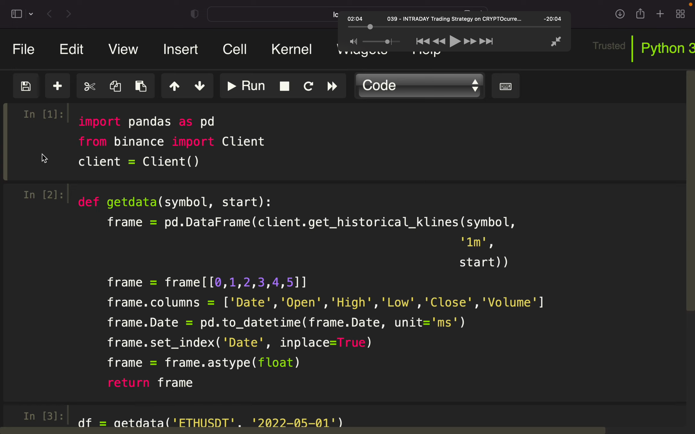</img>  
--=  
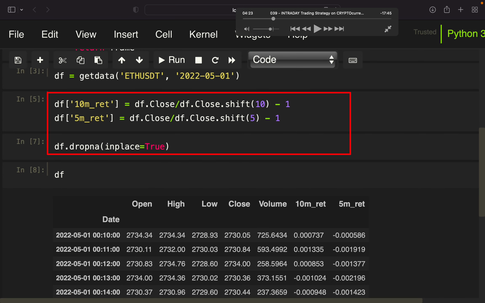</img>  
--= shift 正数是把数据往下拉，即更早的数据提到现在这样子。  
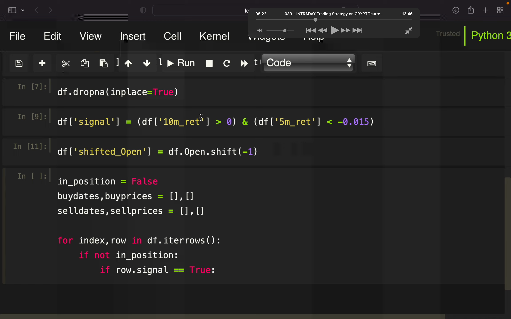</img>  
--= signal，买入信号点，shift-open，用信号点下一个 tick 的 open 价格作为买入价格。  
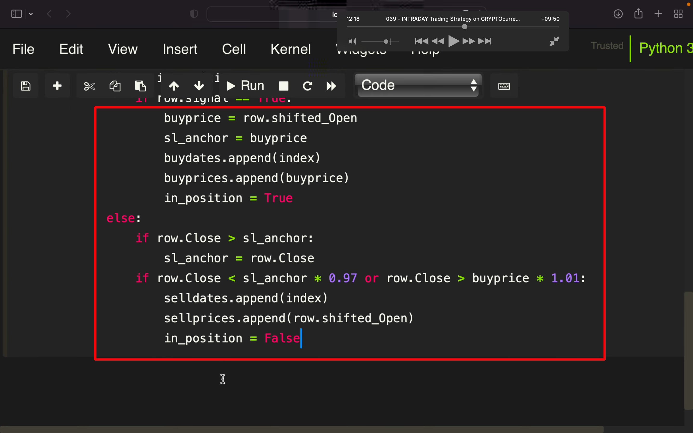</img>  
--= 策略，sl 是 stop loss 的意思

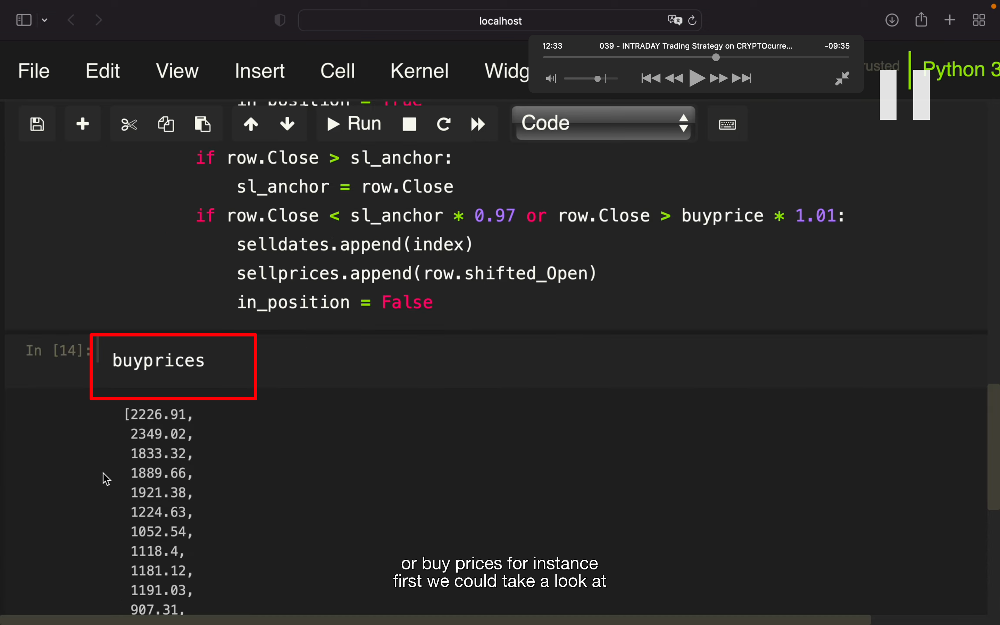</img>  
buyprices，sellprices，buydates 等都可以这样查看

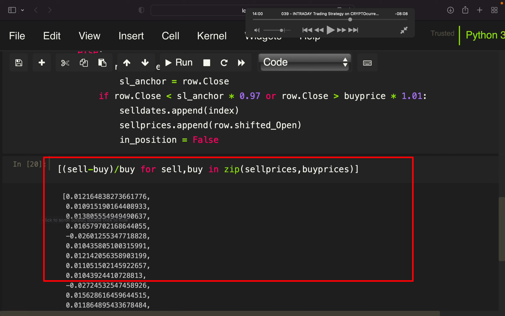</img>  
每笔卖出价减买入价，这样可以看到每笔交易的收益。aaat

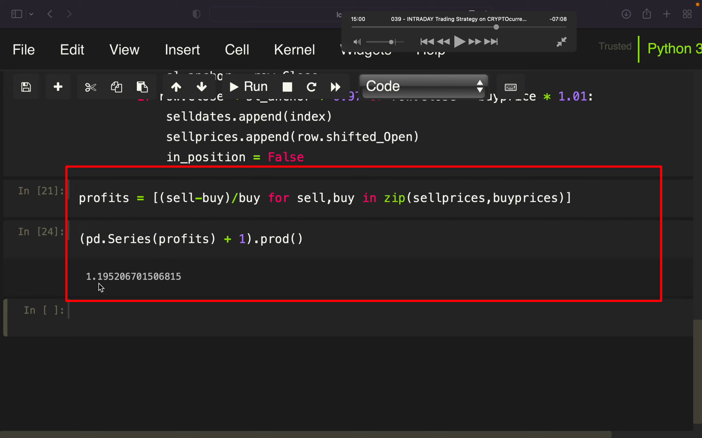</img>  
计算出了总的收益。

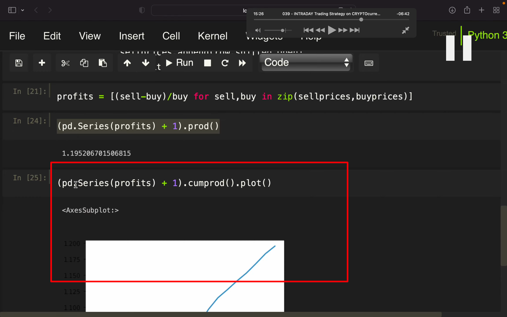</img>  
画出收益走势  
cumprod 函数和 prod 函数的区别：cumprod 函数是求累积乘积，结果中含有每一步计算的结果，而 prod 给出的则是最终乘积的结果。

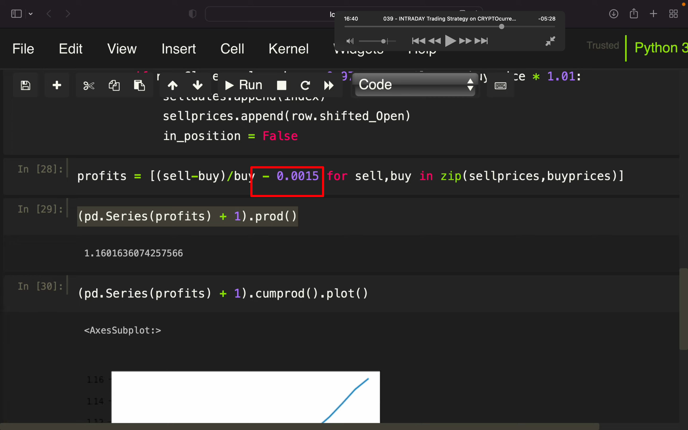</img>  
算上手续费

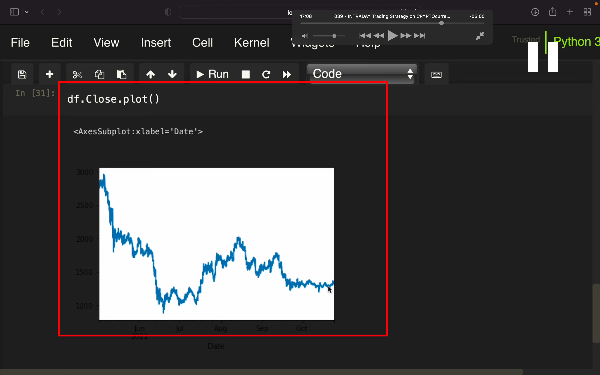</img>  
这样可以看出这段时间的 close 走势图 aaat

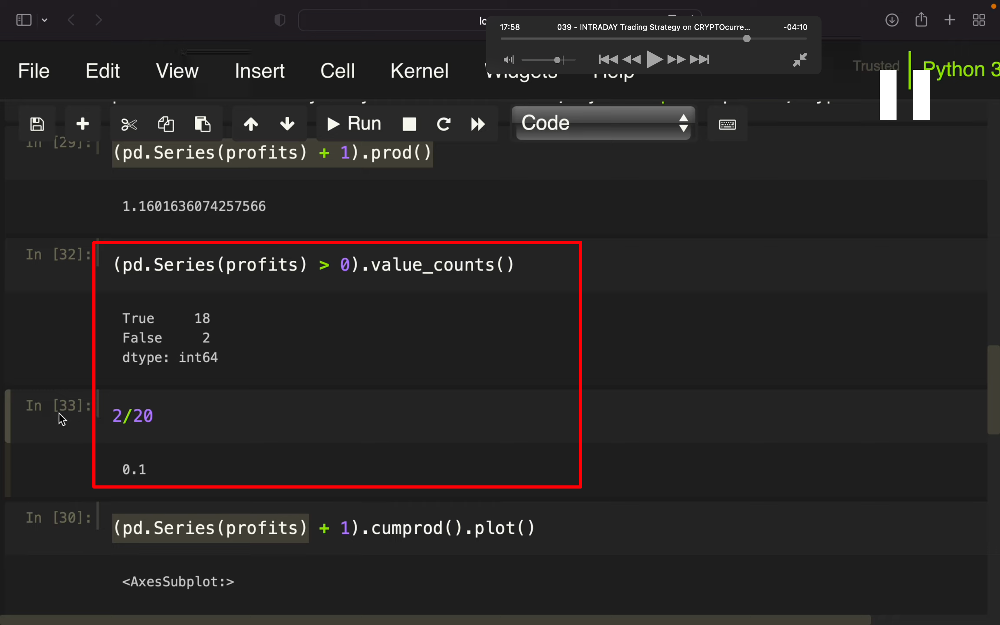</img>  
aaat  
value-counts 计算胜率

## 之后还有 tick 换为 day 的介绍，省略
