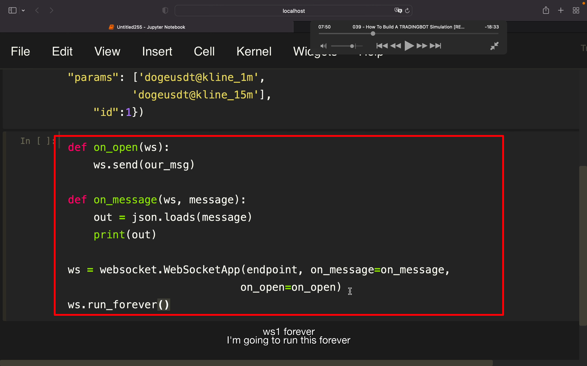
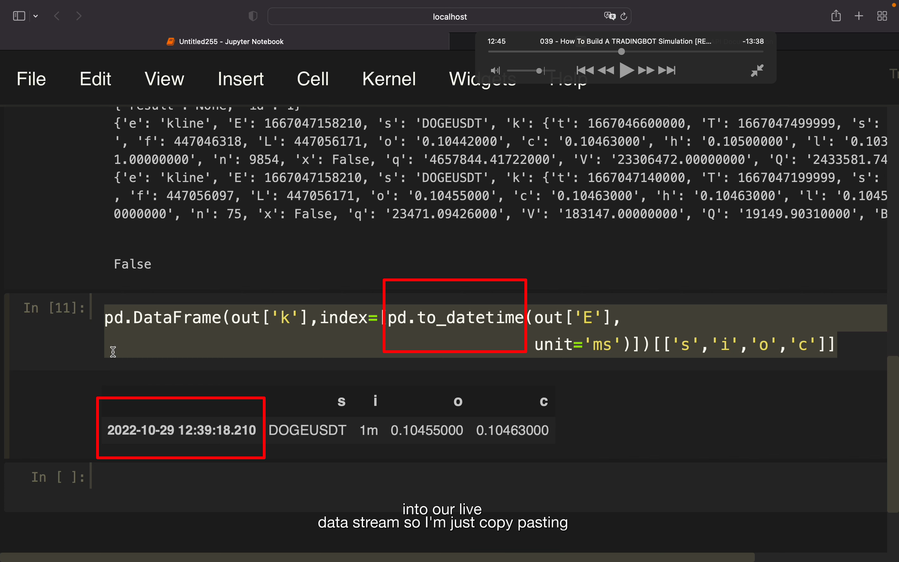

## 221211

</img>  
效果，没听太懂

</img>  
--=  
</img>  
aaap

</img>  
--=  
</img>  
获得 1m 和 15m kline data

</img>  
--=  
</img>  
--=  
</img>  
全局变量 global。知道一个 tick 是什么样，以及用 df 过滤包装 out

</img>  
继续过滤

</img>  
美化时间

</img>  
--=  
</img>  
美化后到代码和输出

</img>  
显示 return 信息

## 内容太繁琐，省略中间一些步骤，下面直接贴最终代码

</img>  
--=  
</img>  
--=  
</img>  
--=  
</img>
