## 230210

### 策略似乎不太靠谱，不过可以学一些 df 等的用法

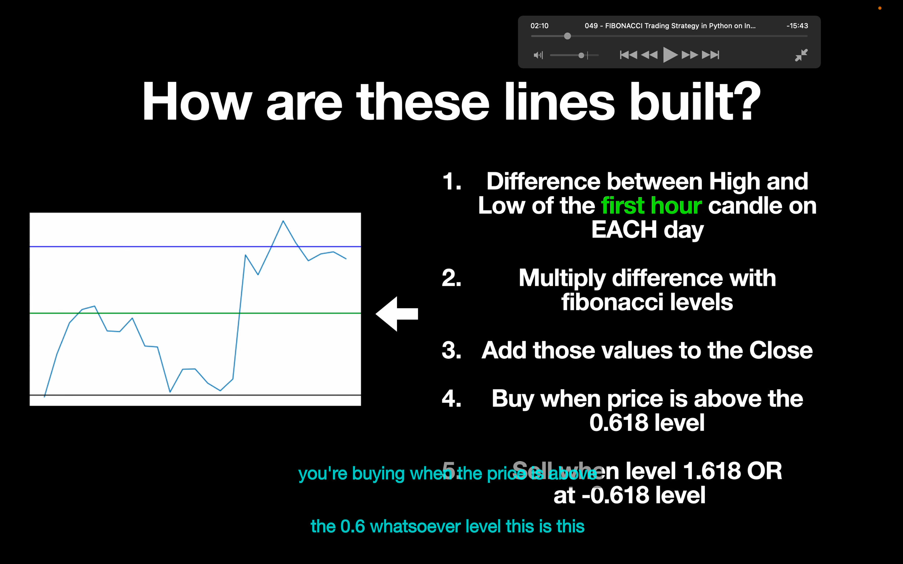</img>  
--=  
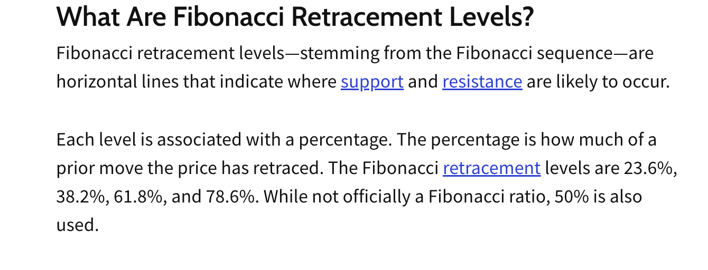</img>  
1，计算每天第一小时的最高价和最低价的差  
2，用斐波纳契回撤乘以 1 中得到的差值  
3，将 2 中的值加到 Close ？？？
4，当超过 0.618 level 时买入  
6，当达到 1.618 或-0.618 时卖出

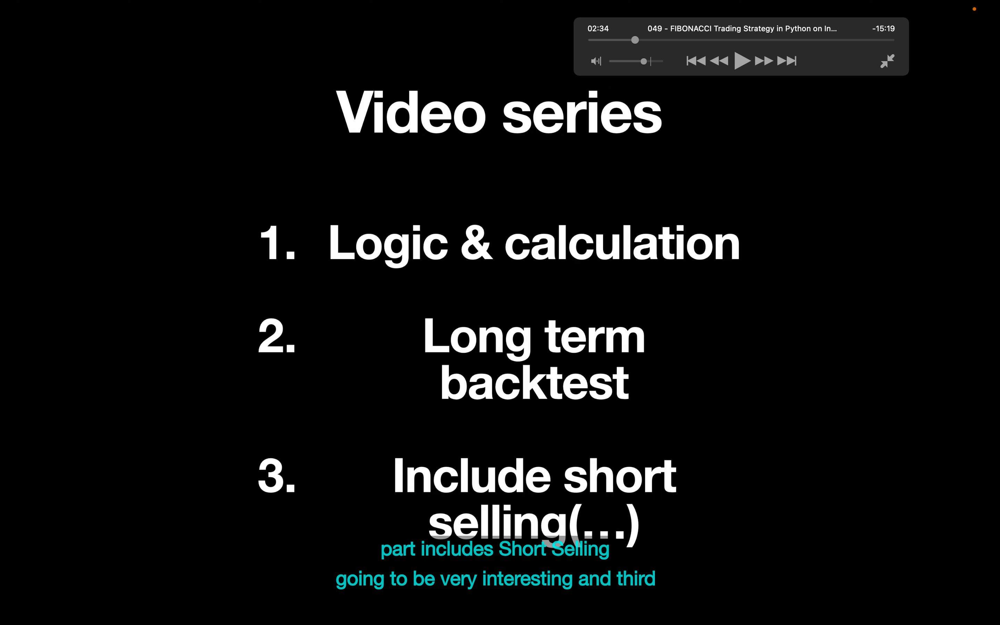</img>  
分为 3 个系列，此节课是第一节

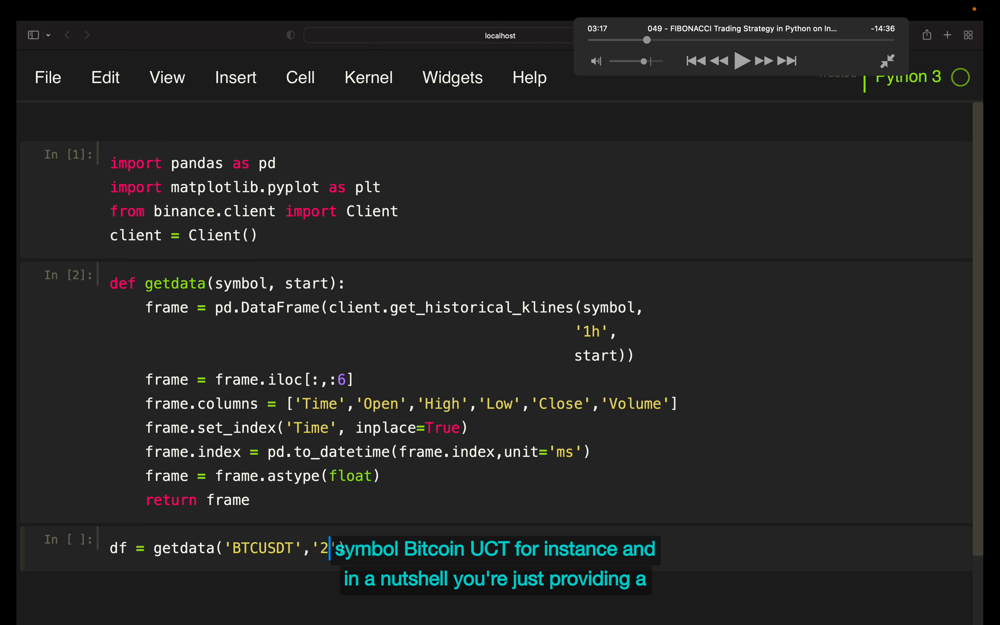</img>  
--=  
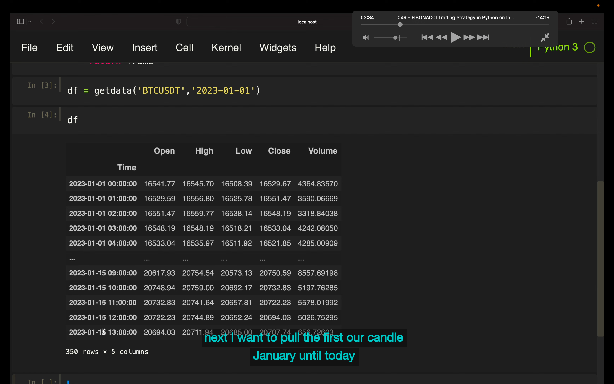</img>  
略

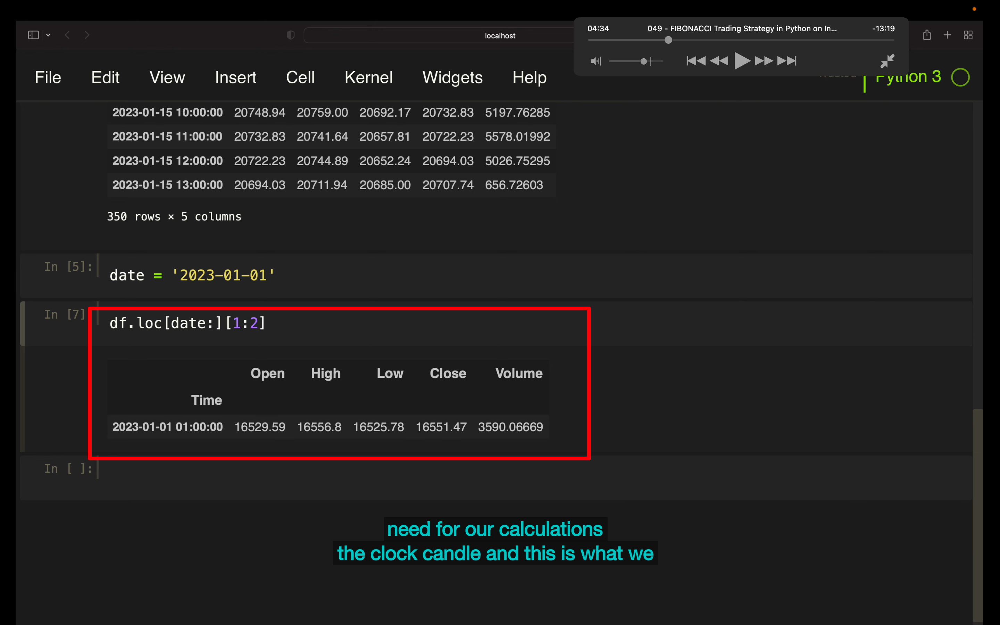</img>  
根据日期 date 来 loc 过滤到第二个 bar，（不要第一个 bar，因为第一个 bar 是前一天最后时刻的，这里需要当天第一个时刻的）

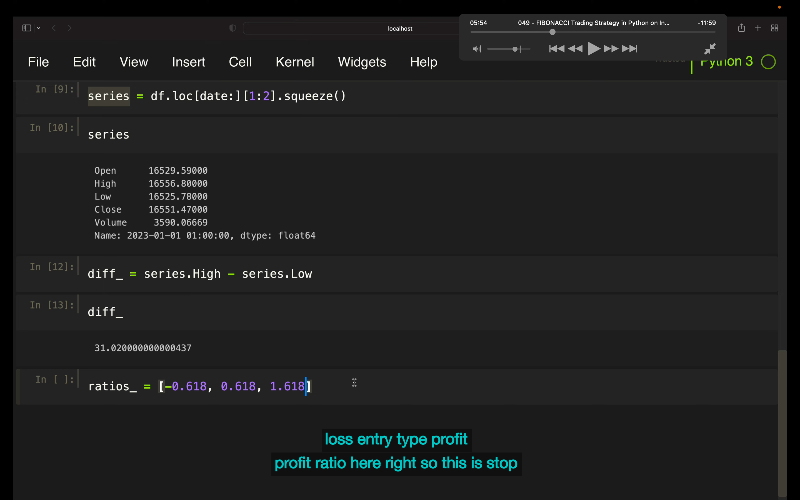</img>  
df 用 squeeze 转为 series。  
算出 diff  
保存止损，入场，止盈的 ratios

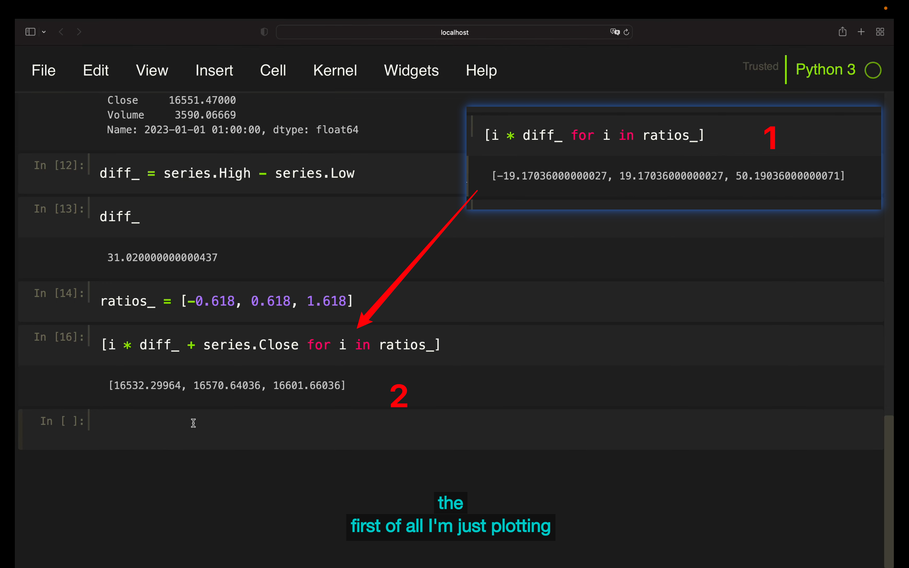</img>  
1，列表里每个值乘以一个固定值返回个新列表的写法  
2，列表里每个值加上一个固定值返回个新列表的写法

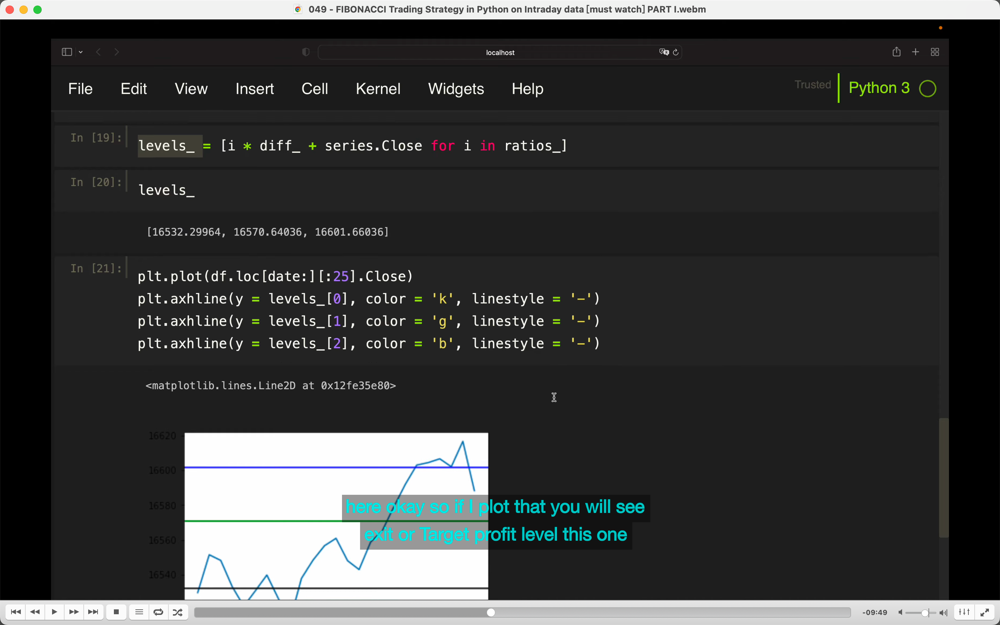</img>  
过滤到前 25 个 bar，即当天 24 小时的 bar。第一个 bar 是属于昨天的
用 axhline 画出三条水平线，分别代表止损，入场，止盈

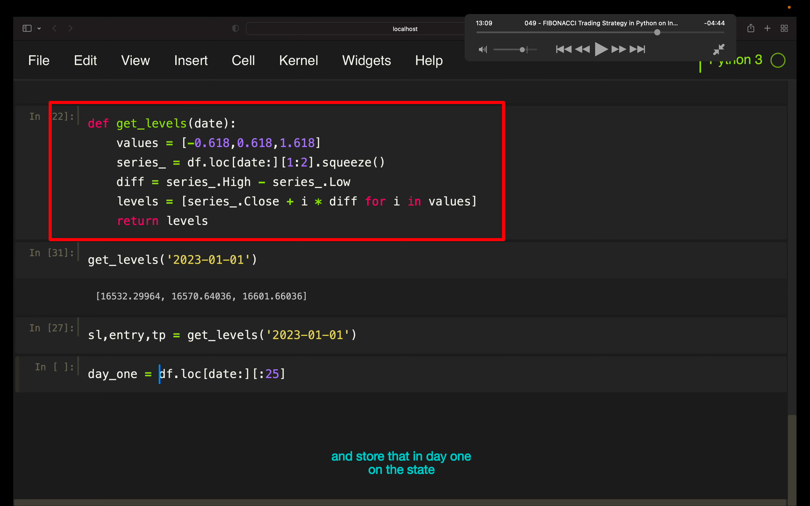</img>  
--=  
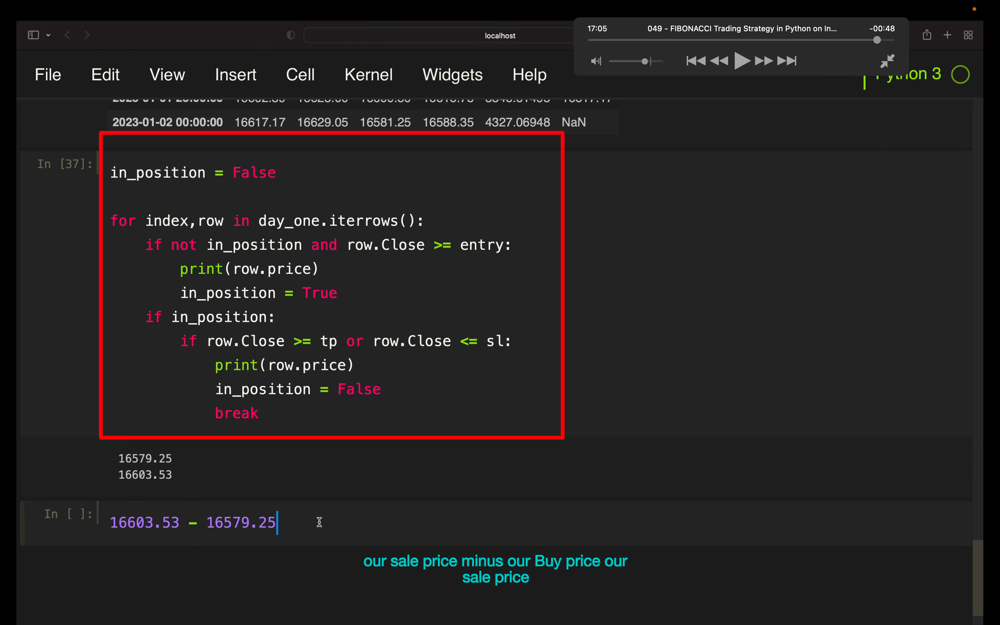</img>  
最终代码
