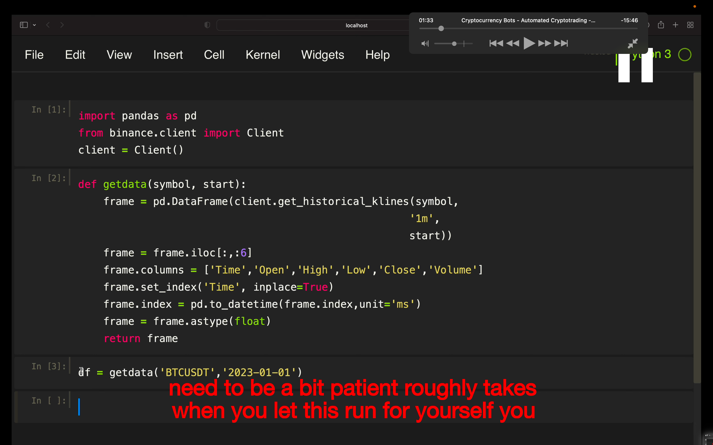
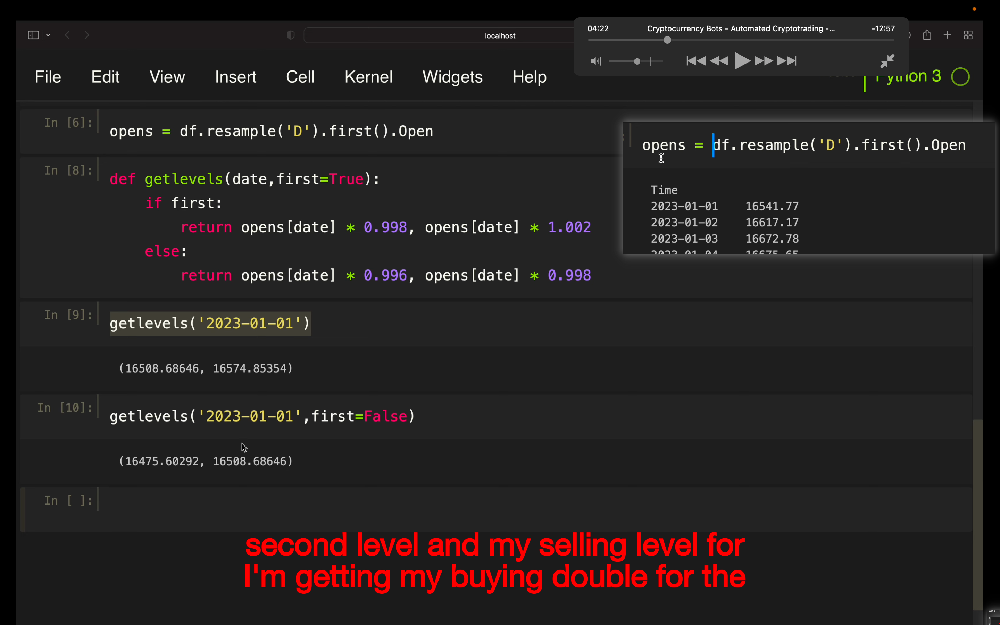
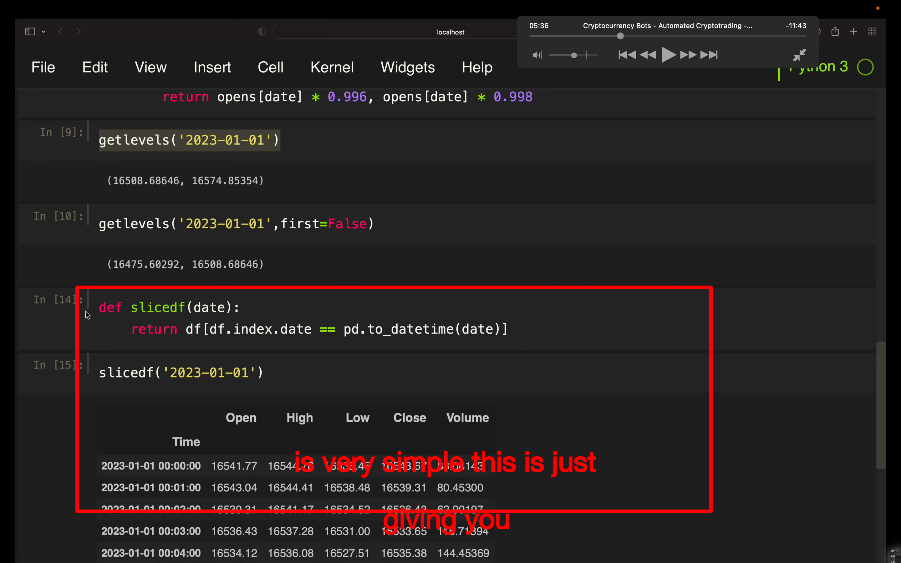
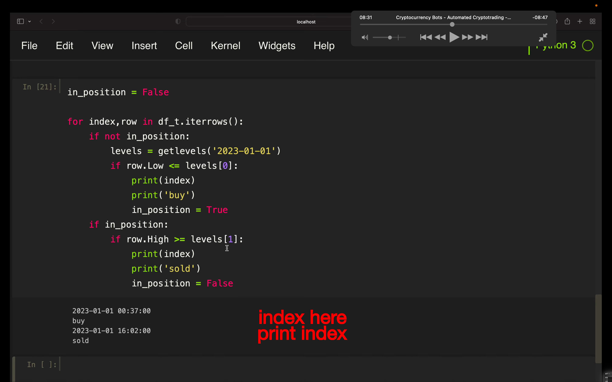
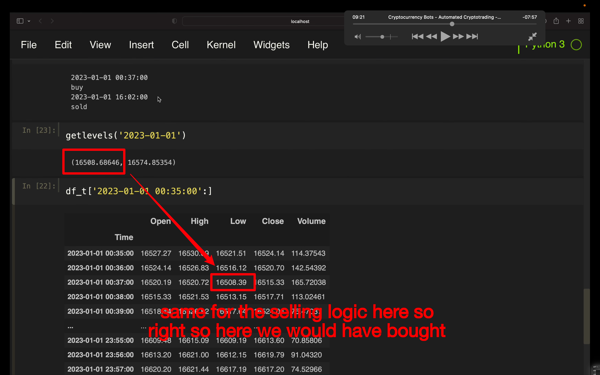
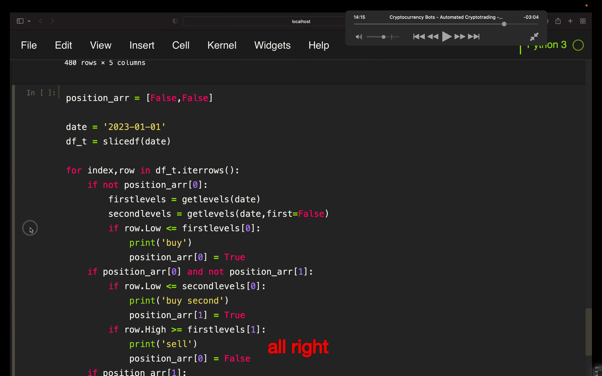
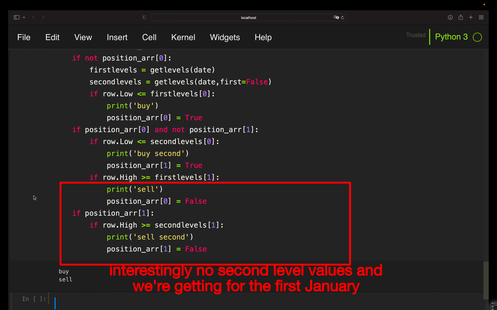
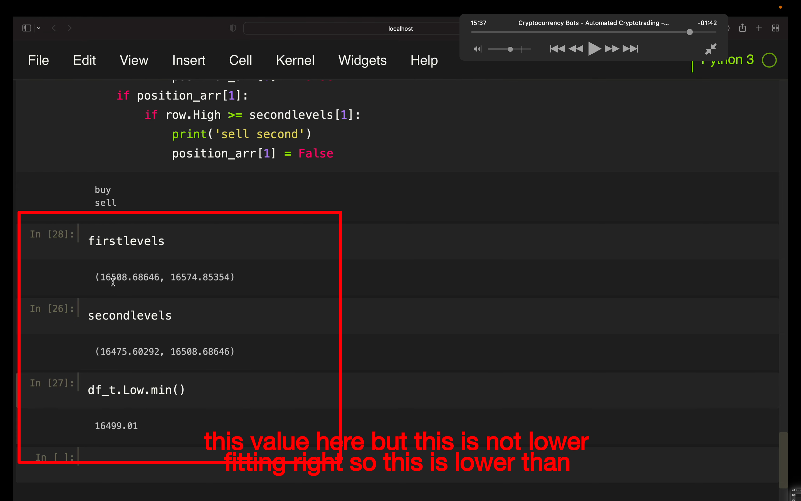
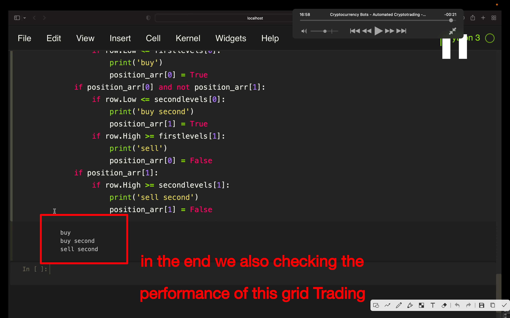

## 230707

</img>  
--=  
</img>  
--=  
</img>  
--=  
</img>  
--=  
</img>  
--=  
</img>  
--=  
</img>  
--=  
</img>  
--= 这里看出当天只有第一个 level 成交
</img>  
--= 时间改成 1-2 ，两级都有买卖，但改成 1-3，结果如图，二级有买卖，一级只有买。之后的处理再下一节视频讲。
