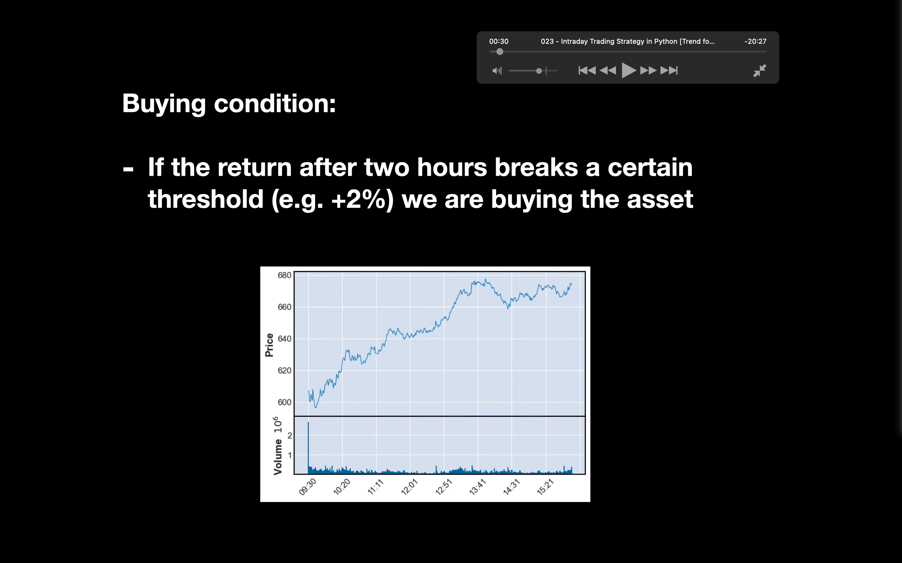
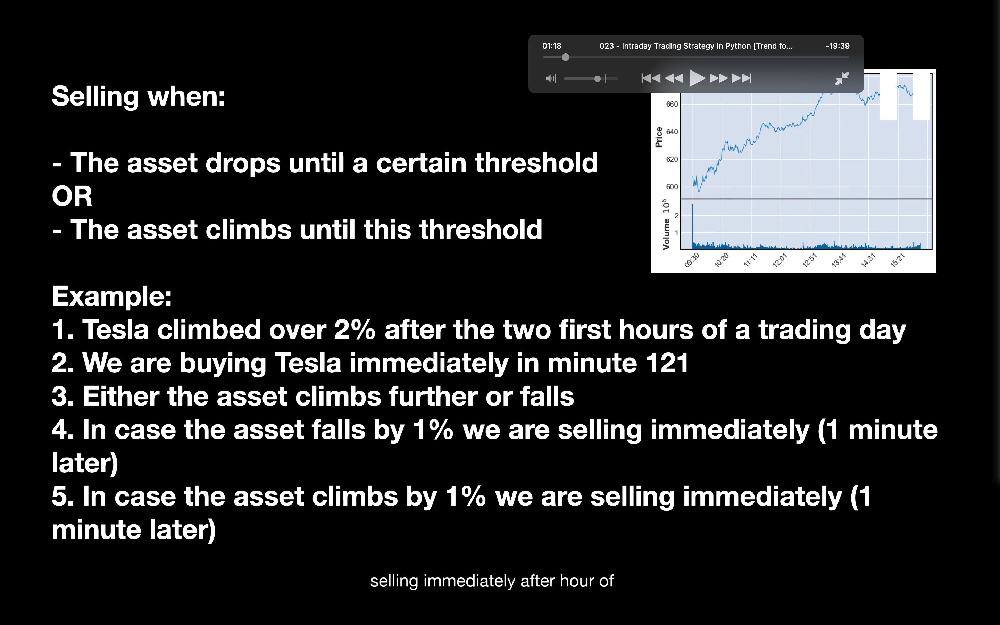
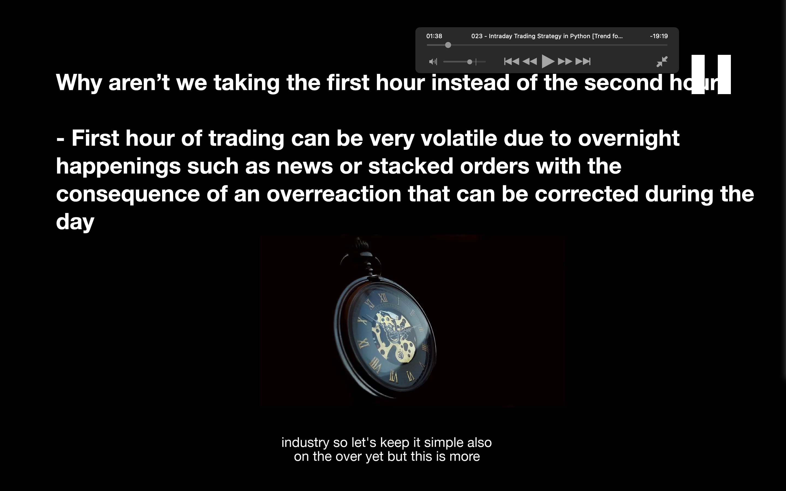
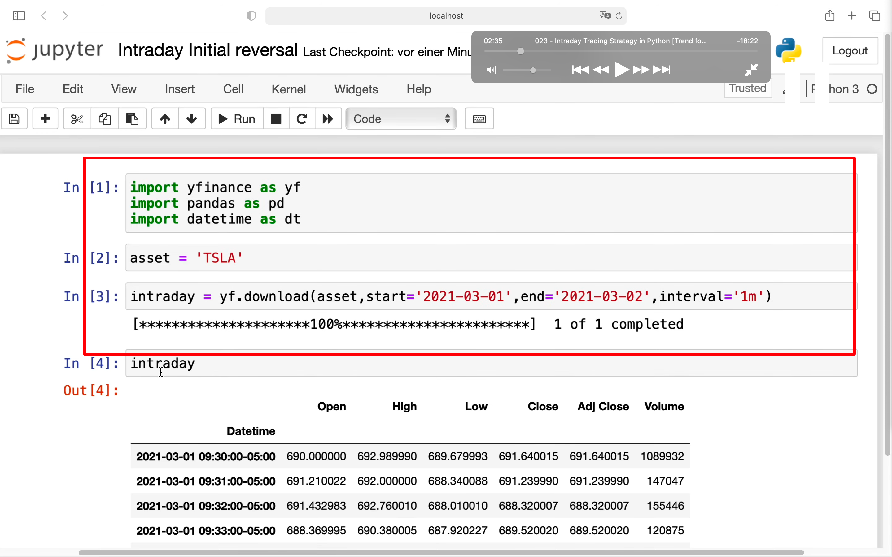
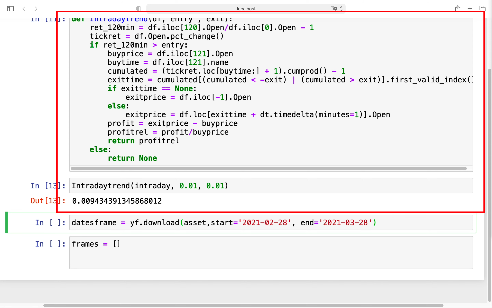
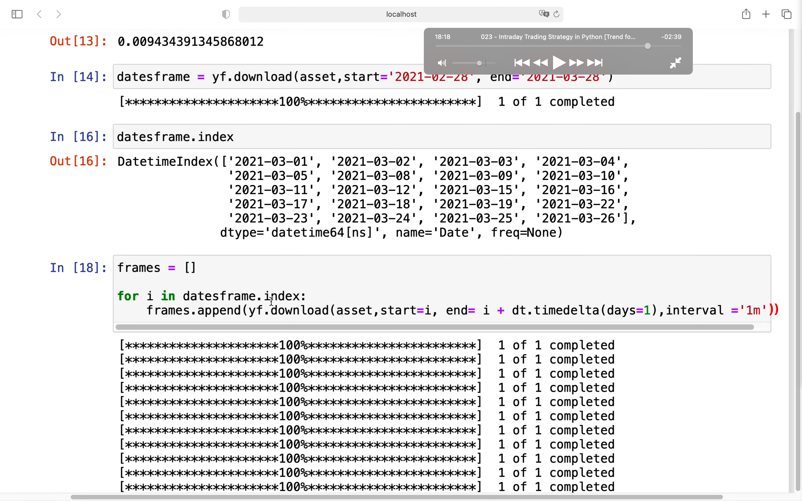
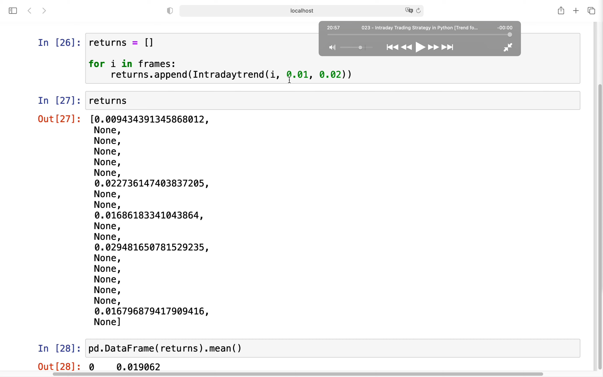

## 221218

</img>  
--=  
</img>  
买入条件，开盘 2 小时内涨幅超过如 2 趴时买入。第 121 分钟就买入  
卖出条件，买入后涨或跌 1 趴后卖出。

</img>  
因为是股市，开盘第一小时很混乱，所以选 2 小时而不是 1 小时作为标准

</img>  
--=  
</img>  
--=  
</img>  
--=  
</img>
