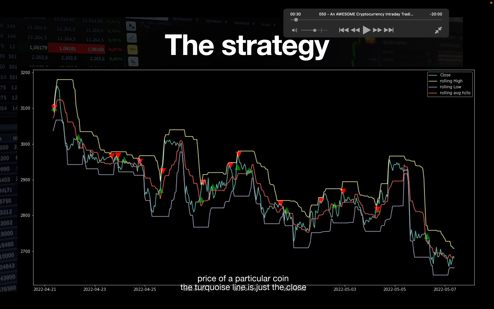
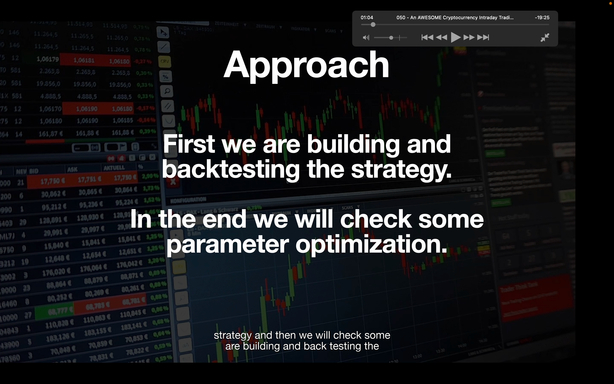
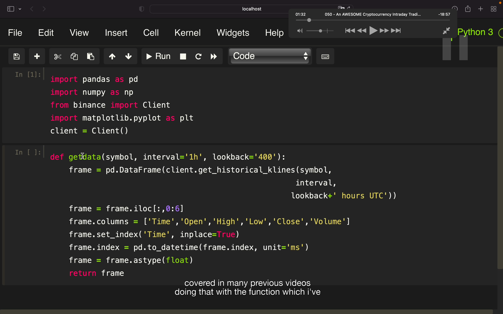
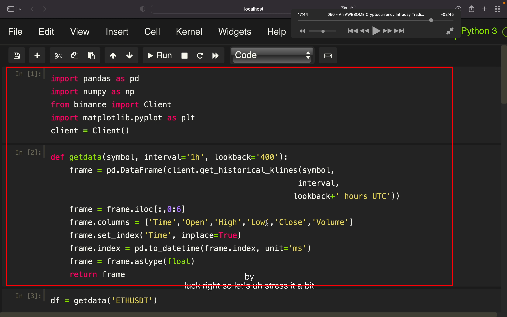
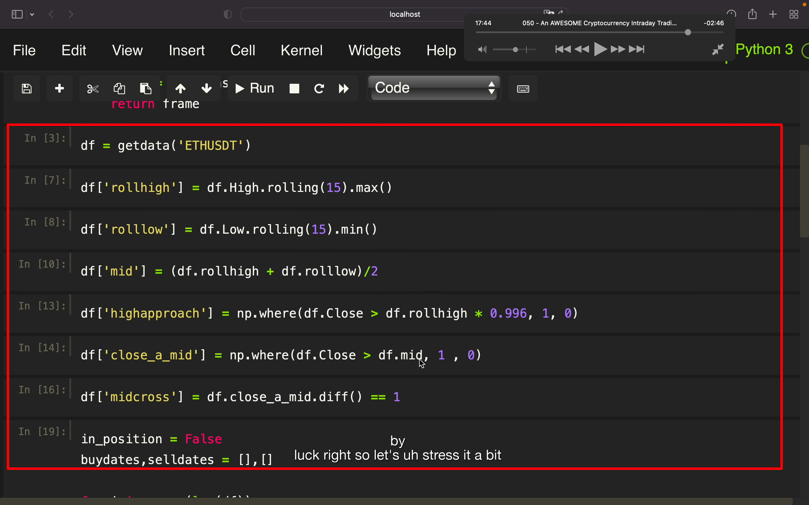
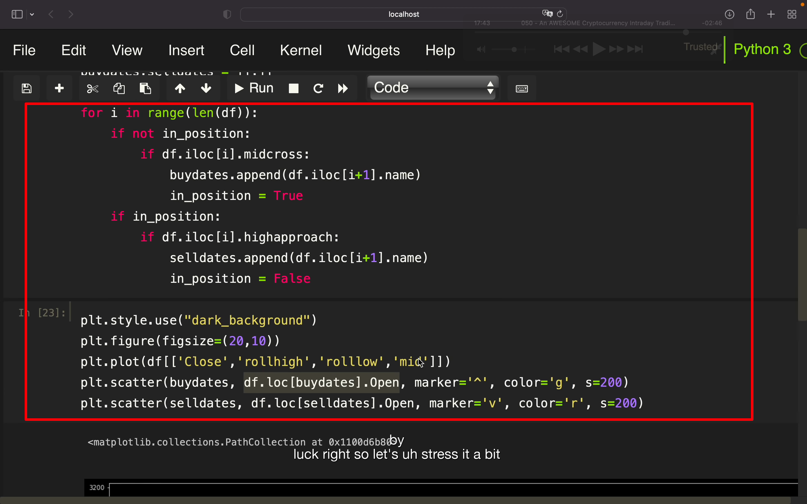
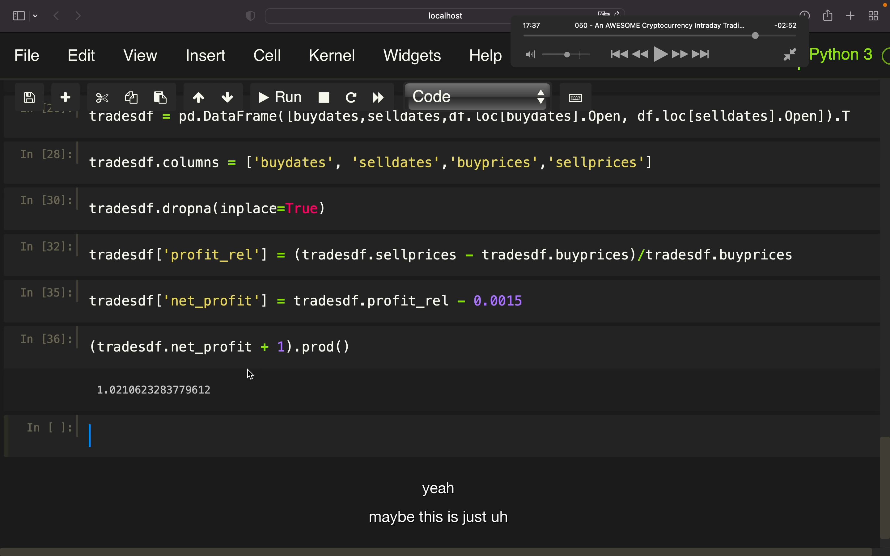

## 230110

## 跟 01 列表的第 27 课其实是一样的视频

</img>  
日内交易策略，建造一个有 rolling maximum high 和 rolling minimum low 的 channel。  
黄线事 RH，蓝线是 RL。红线是 RH 和 RL 的平均值。绿线是 close price。

当 Close 超过红线即平均线时买入。当 CLose 接近黄线即 RH 时卖出。

</img>  
目标是先创建并回测，最后还要调参。

</img>  
初始代码，matplotlib 是为了可视化交易策略

</img>  
--=  
</img>  
--=  
</img>  
--=  
</img>  
其实很简单，只截图完整代码，跟 01 列表的第 27 课其实是一样的视频
