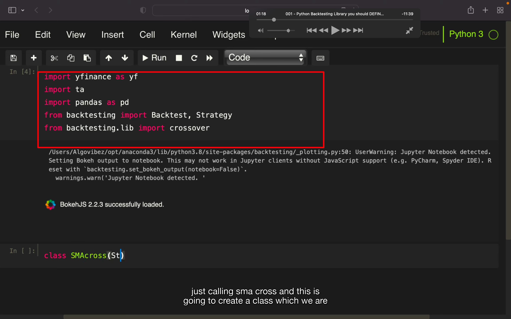
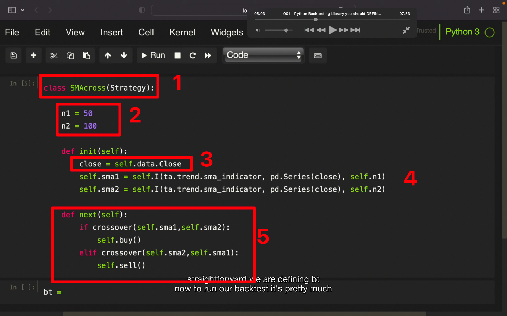
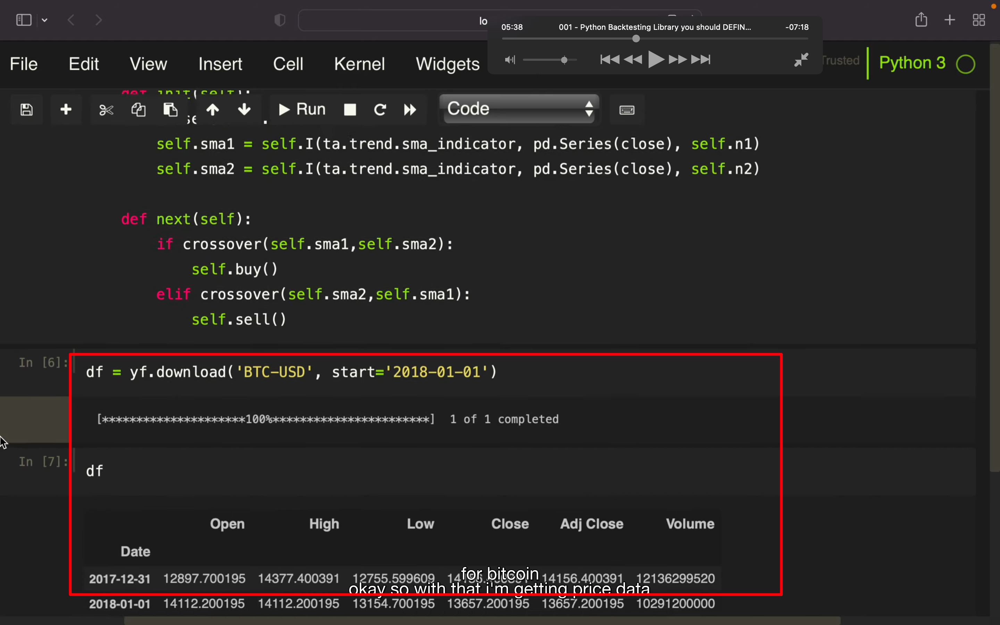
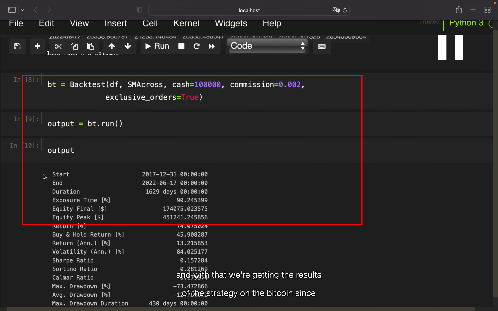
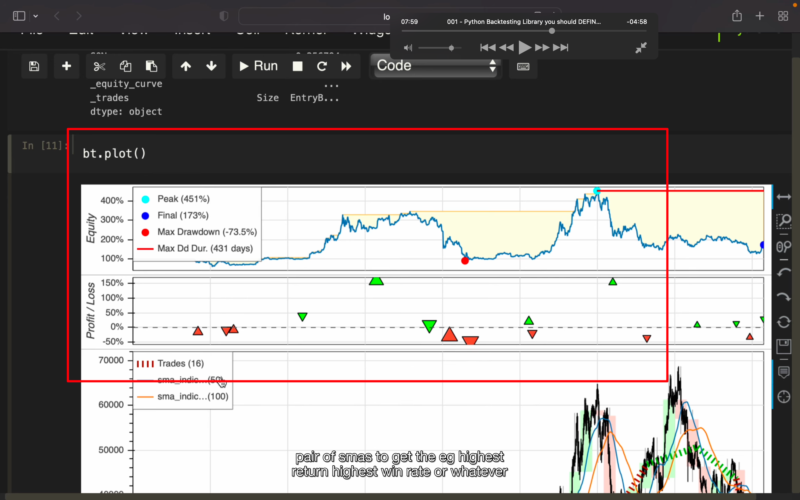
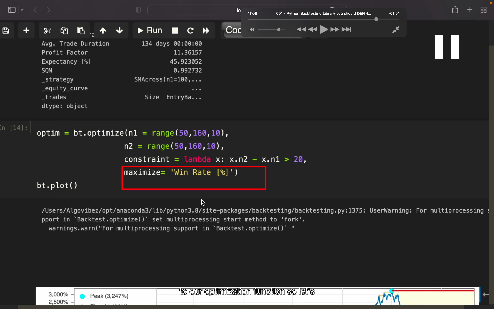

## 221113

## 此视频主要介绍回测工具 backtesting，以 002 的策略进行的实测。但此回测应该是仅针对固定的经典策略类型，如果是自己写的策略可能无法用 backtesting.py 来执行回测

</img>  
引入依赖，需要先安装以下依赖  
!pip install backtesting  
!pip install ta  
!pip install yfinance

## 221114

</img>  
1， SMAcross 这个 class 继承自 Strategy  
2，n1 短周期 tick 数，n2 长周期 tick 数  
3，close 代表 close price  
4，sma 是 simple moving average，i 代表提供计算 sma 的方法。pd\*代表需要被计算的 clm，需要用 Series 转换类型。  
5，next 是为了当有个金叉是就买，有个死叉时就卖

</img>  
获得 btcusdt 的 df

</img>  
如此就能得到结果了。  
comission 佣金的意思  
避免 overlapping orders，设置 exclusive-order=true。overlapping 重叠的意思

</img>  
bt.plot()画出图像

</img>  
optimize，应该是将 n1 n2 分别赋予 50，60，70。。。150 这样的数值，找出怎样的数值能产生最大回报

</img>  
这里修改一下，就变成胜率为最大化目标。
