## 221113

## 此策略被叫做 moving average 或者 crossover strategy

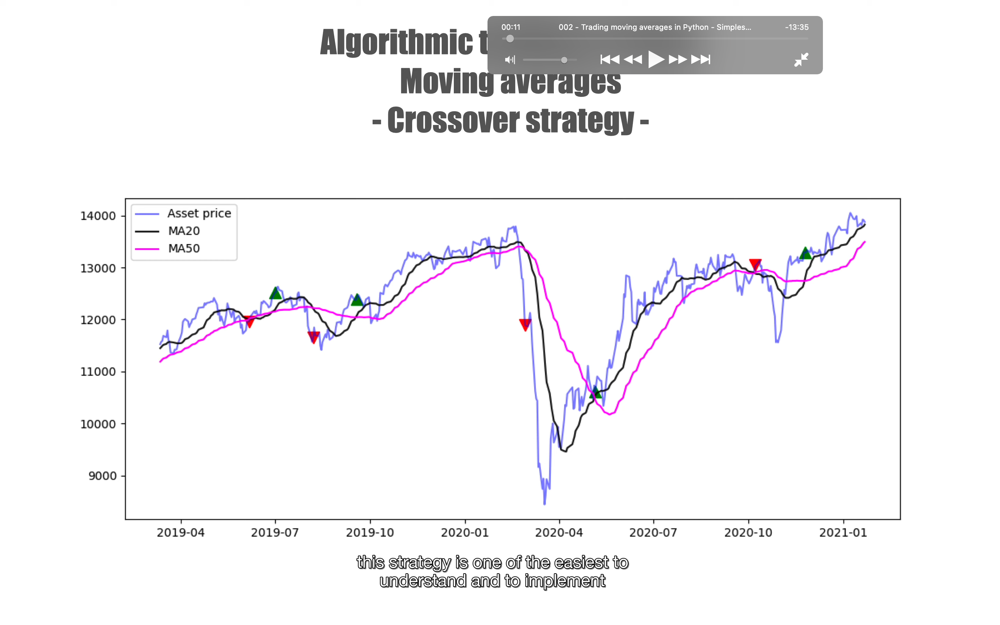</img>  
此策略被叫做 moving average 或者 crossover strategy  
较容易理解和操作  
蓝线是具体价格  
黑线是 20 天 moving average，应该是均线的意思，mean 有平均的意思
magenta，酒红色线是 50 天均线  
当 20 天均线超过 50 天均线时买入，反之卖出  
如果是 50 天和 200 天对比，50 天超过 200 天就被称为金叉。反之则为死叉。

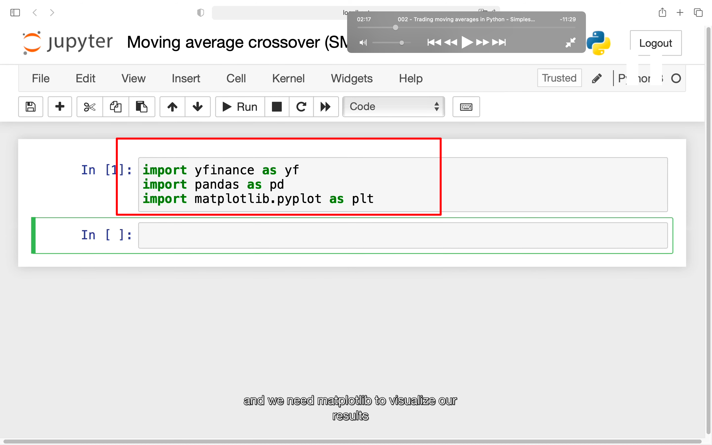</img>  
引入依赖，其中 matplotlib.pyplot 是为了可视化结果。

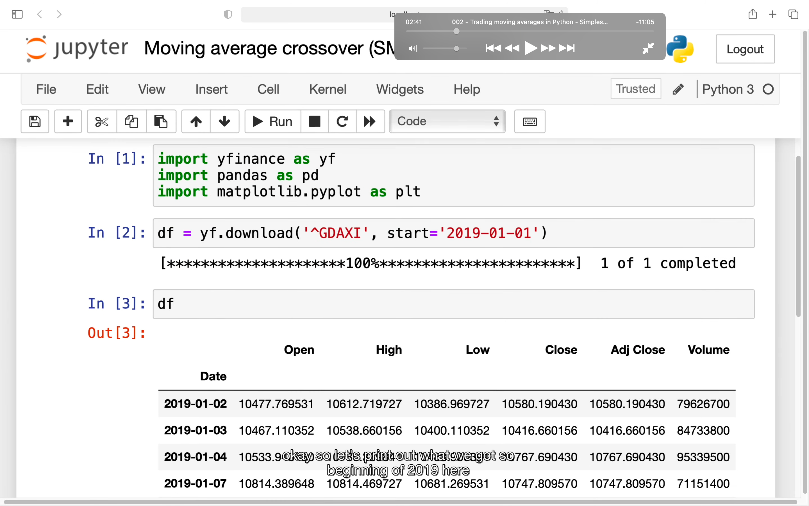</img>
获得 df  
gdaxi 是 german equity index 的缩写  
adj close 是 adjusted close 的意思，之后使用此 clm 的数据来得到 20 天均价和 50 天均价

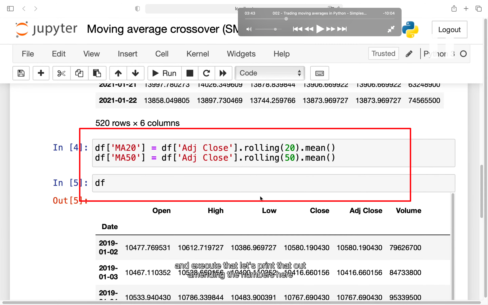</img>  
--=  
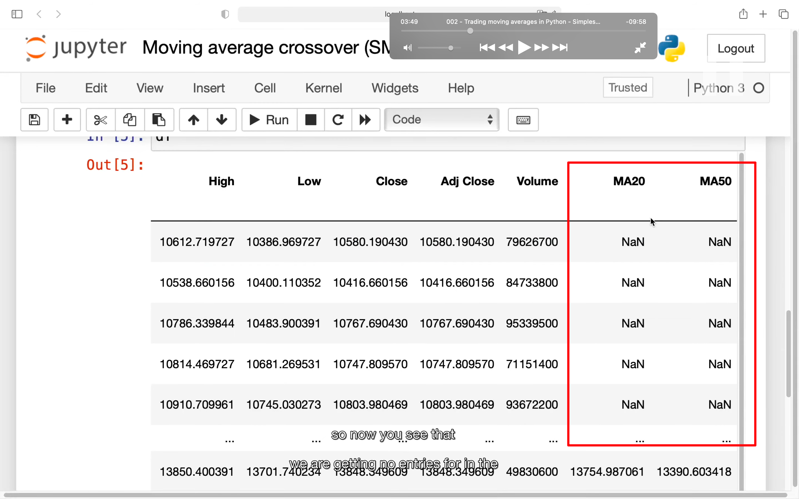</img>  
获得 20 天和 50 天的数据，它们前 20，50 都是 NaN。

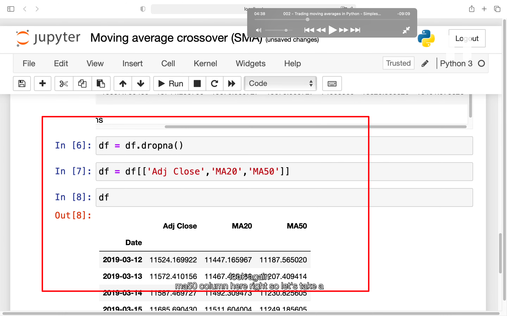</img>  
再次处理，得到如下数据
当 ma20 大于 ma50，但之前一天不是时，则买入。反之则卖出

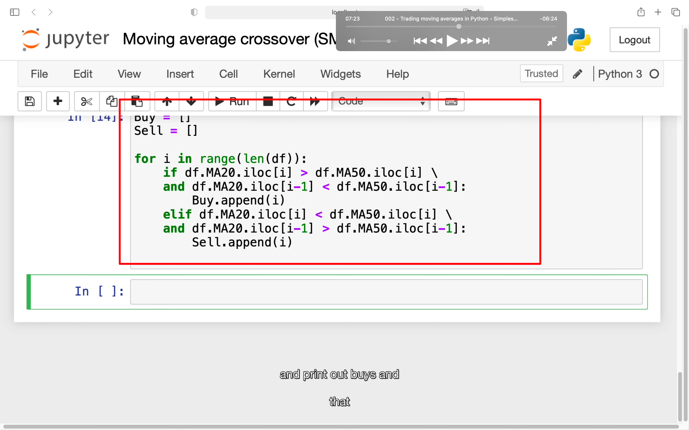</img>  
--=  
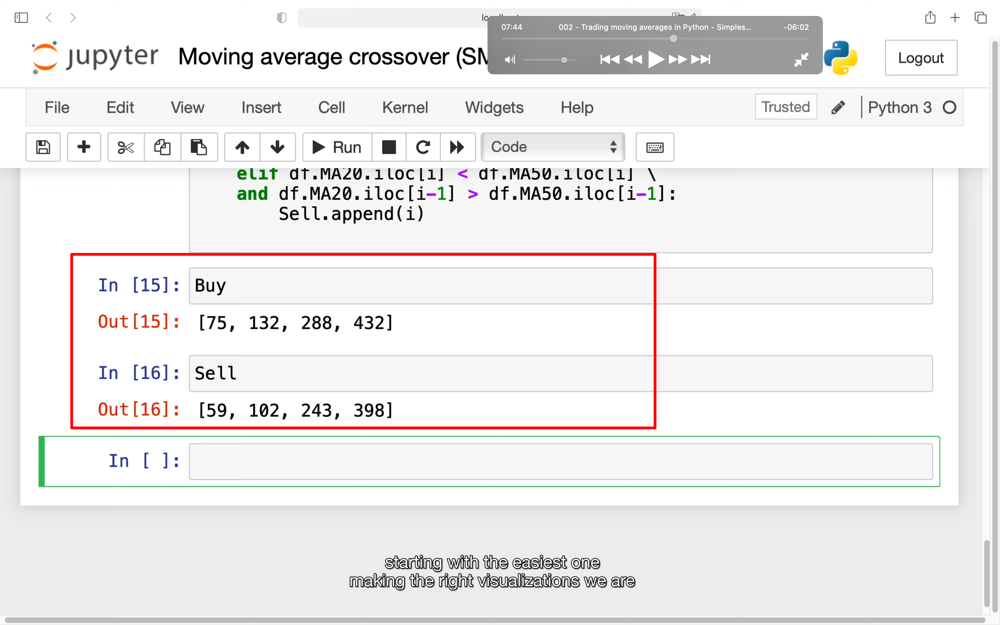</img>  
具体代码，算出买入点和卖出点

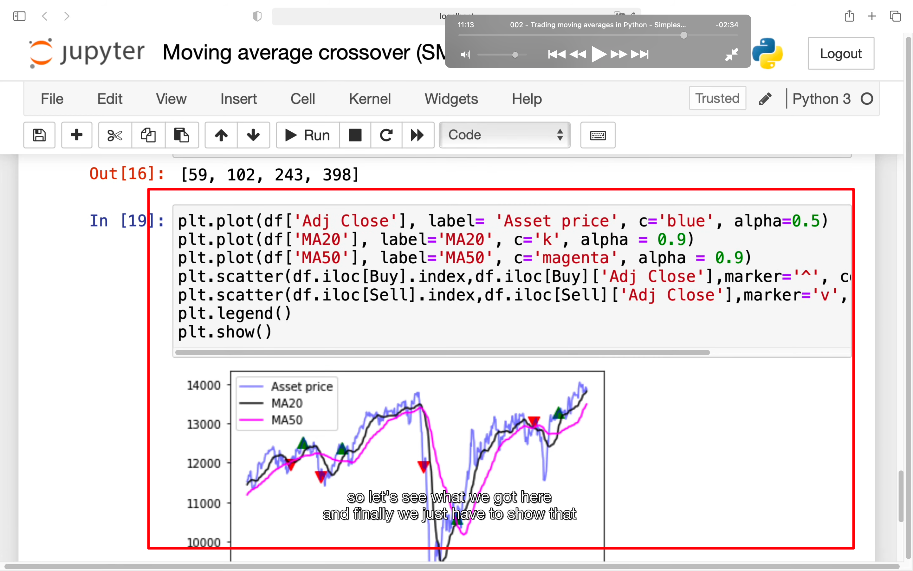</img>  
--=  
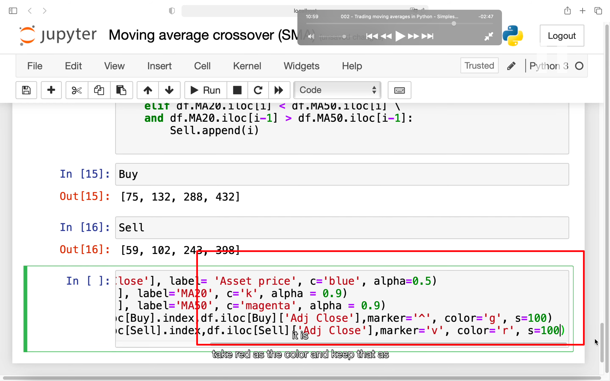</img>  
汇出走势图和买入卖出标志

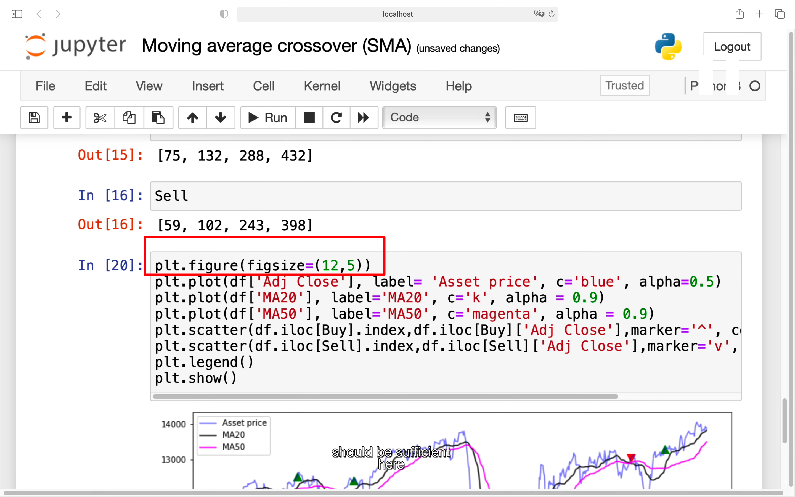</img>  
这段代码可以修改图片大小

## add230108

可能会出现 name 'figsize' is not defined 报错  
在脚本开头引入  
%pylab  
%matplotlib inline  
即可解决

## 最终是否赚钱不确定。有些 pair 适合这个策略，有些不适合
