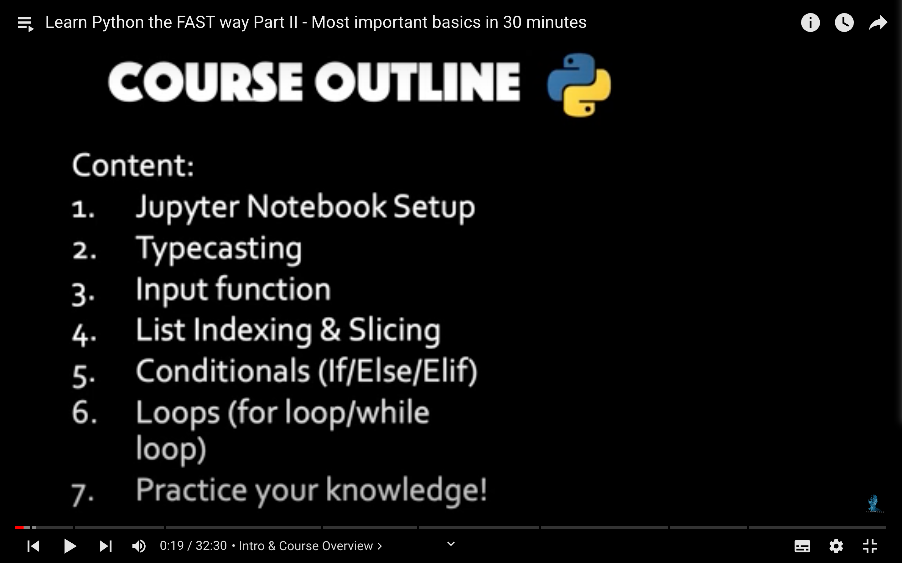
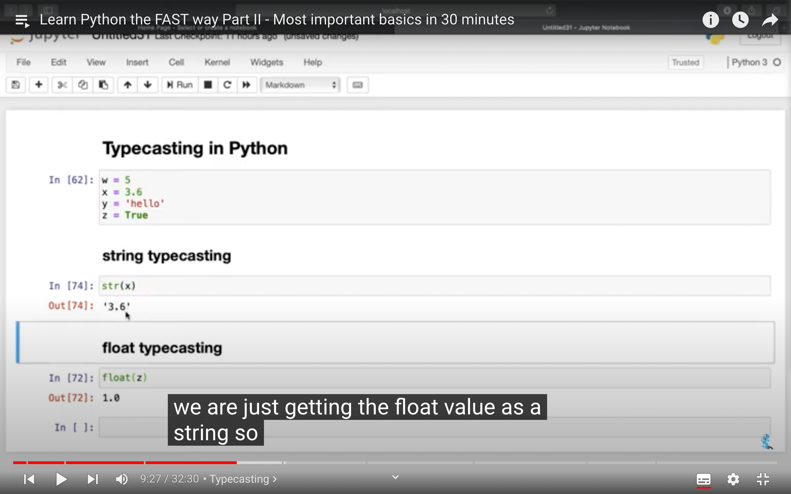
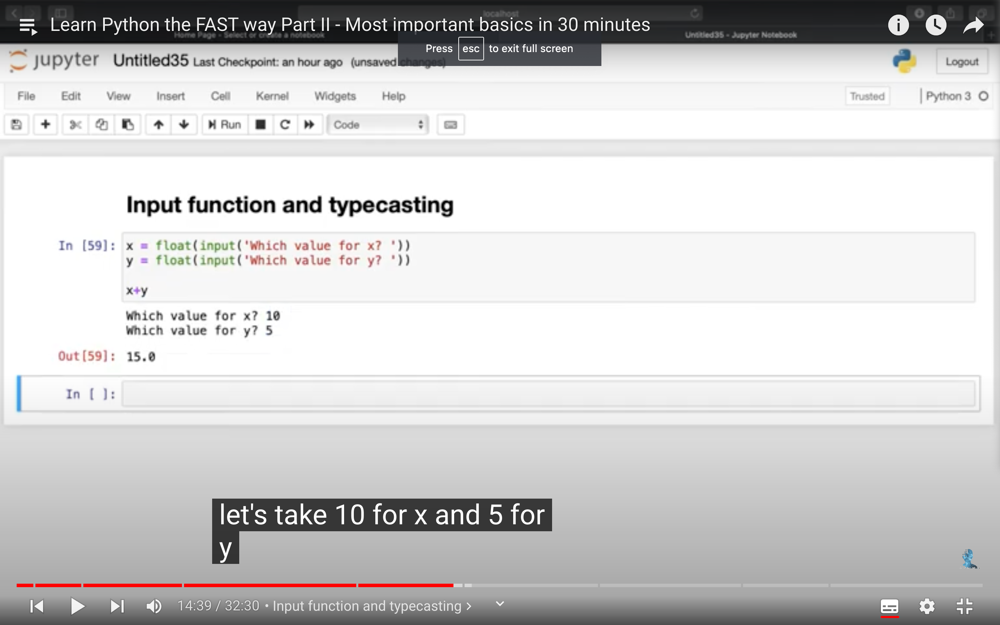
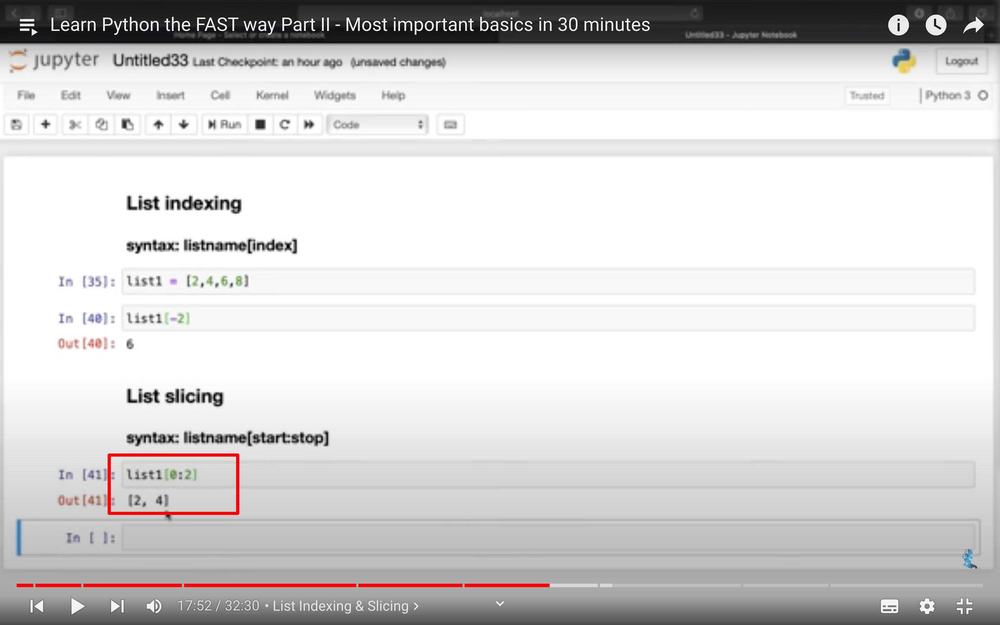
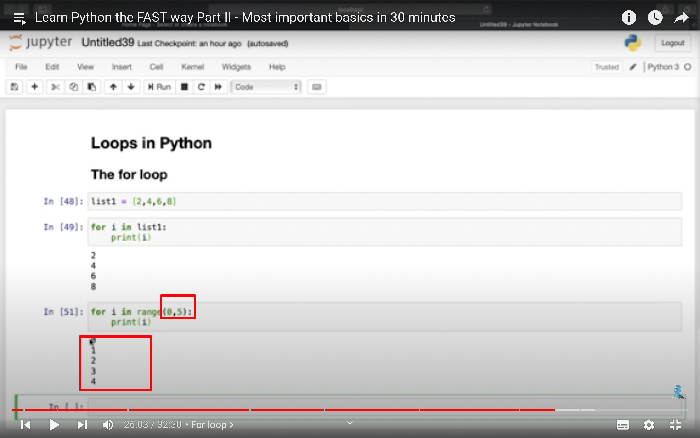
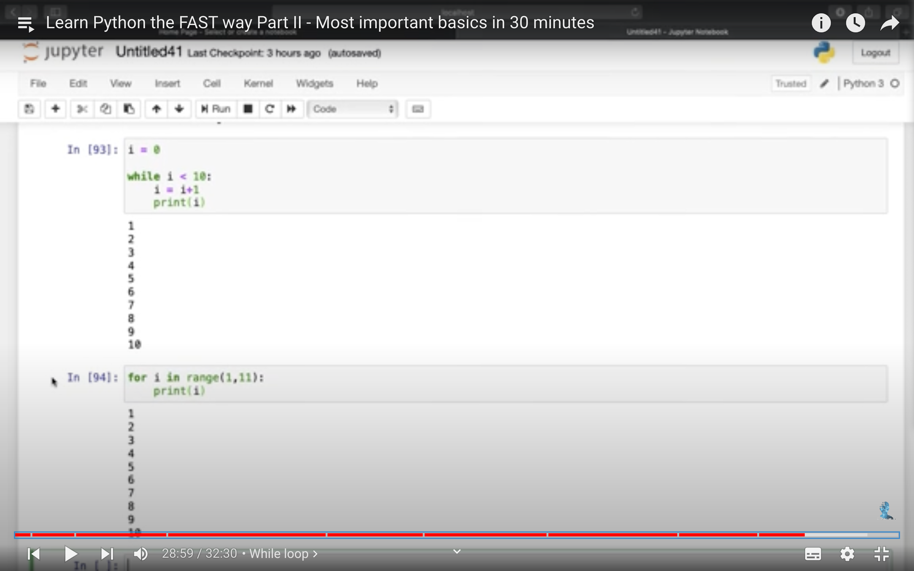

## 221223

</img>  
本节内容

## 221225

### 介绍了怎么安装 jupyter

## 221226

</img>  
typecasting 类型转换

</img>  
input function 弹出对话框，自己输入数据

## 221227

</img>
选取范围，冒号右侧的数据不包括数据本身，如这里 2 代表 6，但实际结果却刚好没包含 6。

</img>  
循环，一样的，包括开始值，不包括结束值。

</img>  
while 循环
