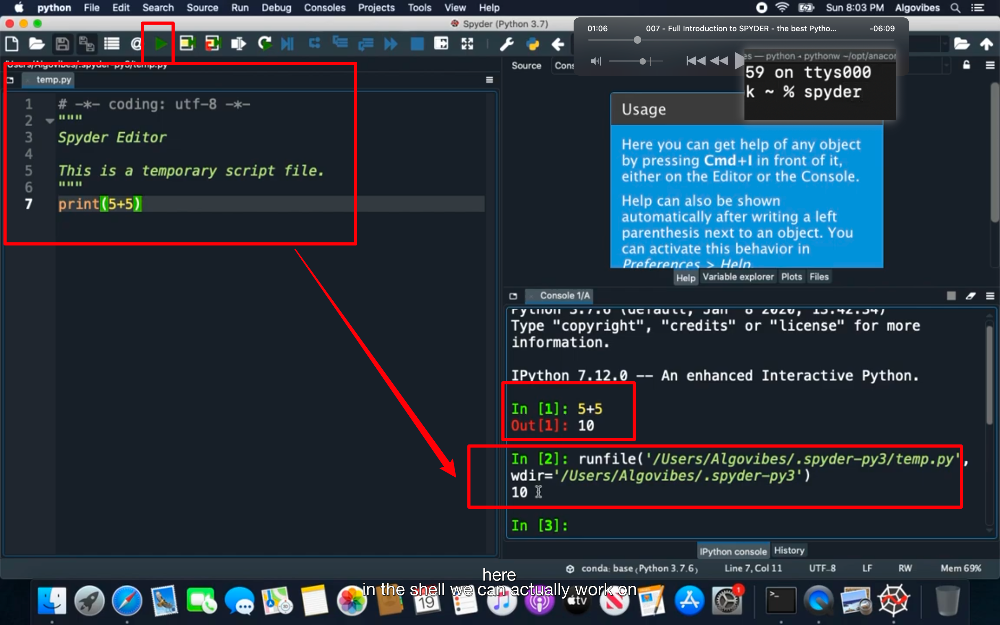
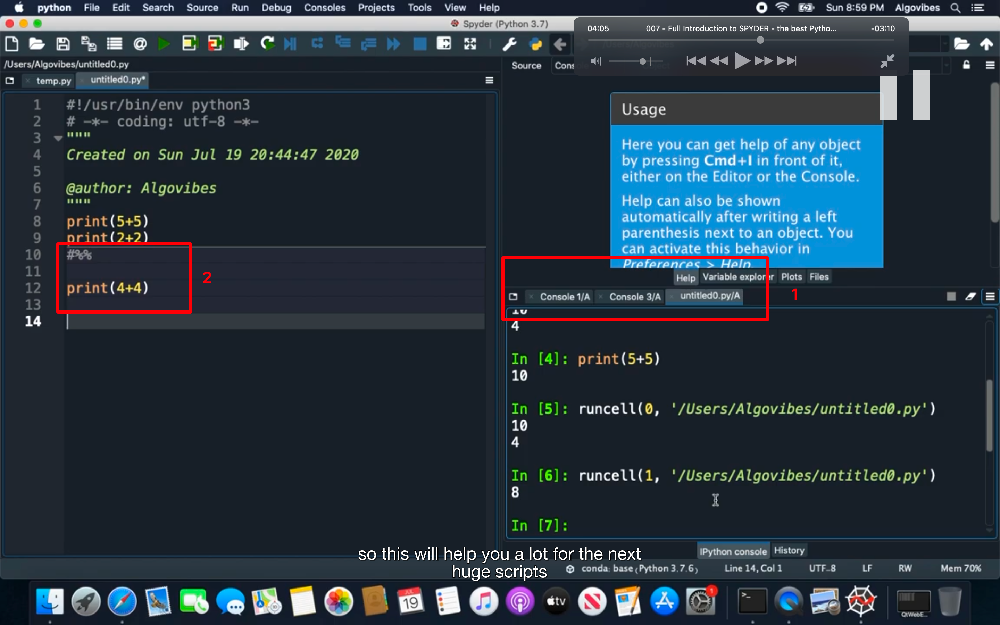
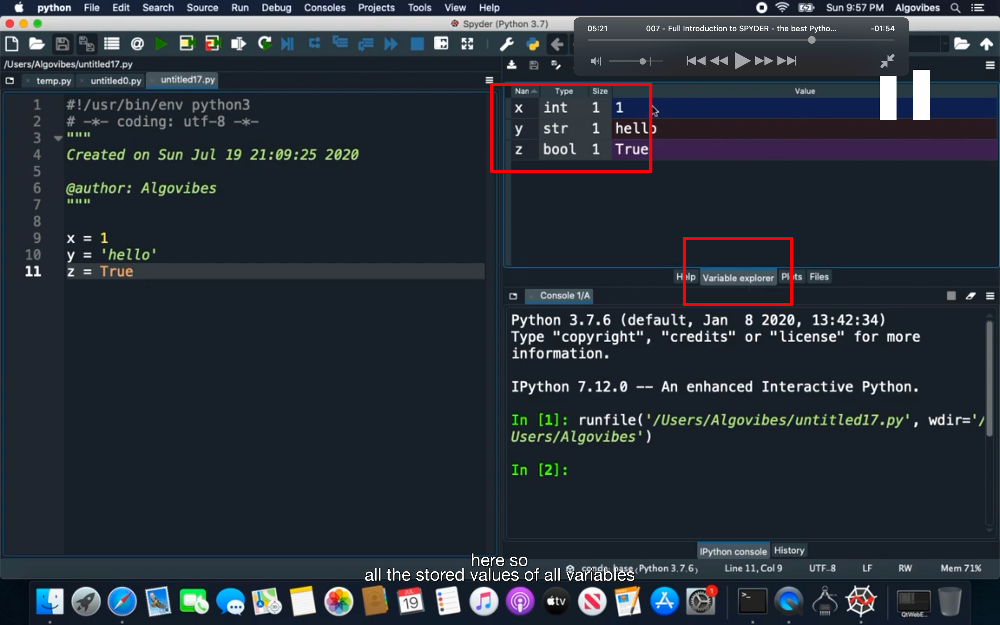
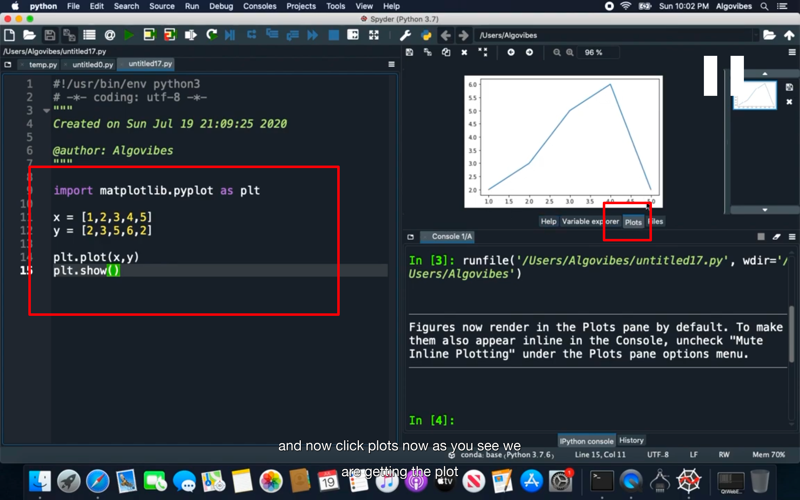
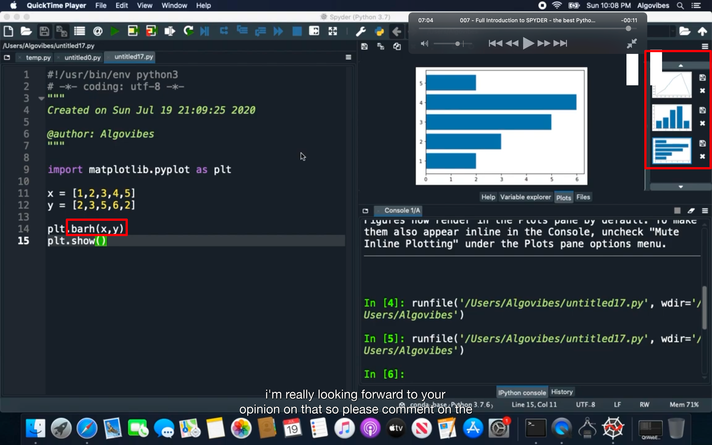

## 221231

## spyder 是一个很好的 data science ide

## 安装了 anaconda 后在命令行输入 spyder 即可打开

</img>  
右边是 shell 可以直接输入命令，也可以左边输入代码，点击运行，结果会显示在 shell 里。

</img>  
1，shell 可以创建不同的 tab，具体看视频  
2，可以设计 cell，分段执行代码和显示结果

</img>
variable explorer

</img>  
plot，数据图像化

</img>  
可修改为不同的图形，但之前的图形仍然保留着
