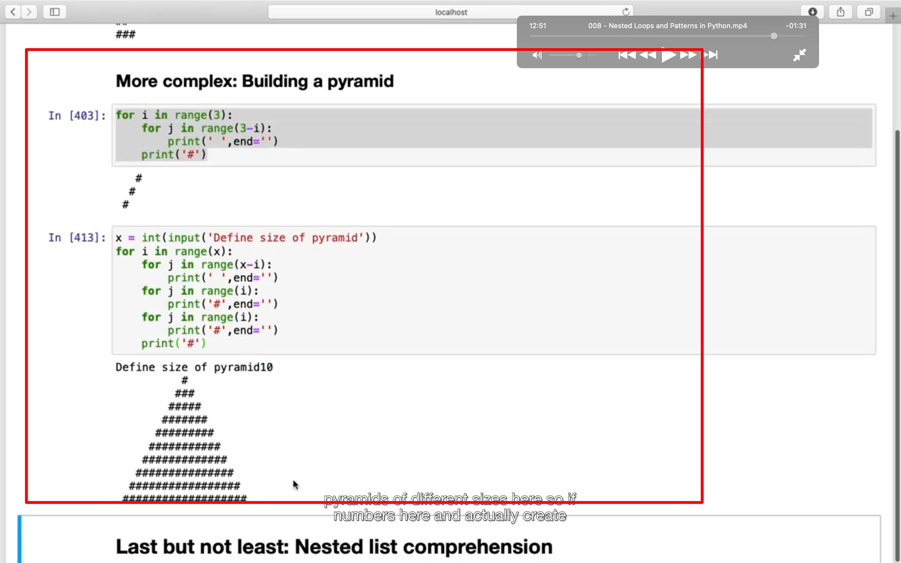

## 221231

</img>  
重复 3 次打印 0-2

</img>  
打印跨月日期

## 230102

</img>  
1, 默认 end 为'/n'会跨行，这里改为''，则结果不跨行  
2，打印出三角形

</img>  
打印出金字塔  
第一个循环打印出左侧空格，  
第二个打印出中线左侧的#，  
第三个打印出中线右侧的#。  
中线的#为最后一段代码

</img>  
nested list comprehension  
嵌套列表理解 字面翻译  
嵌套列表推导式？ 固定翻译
