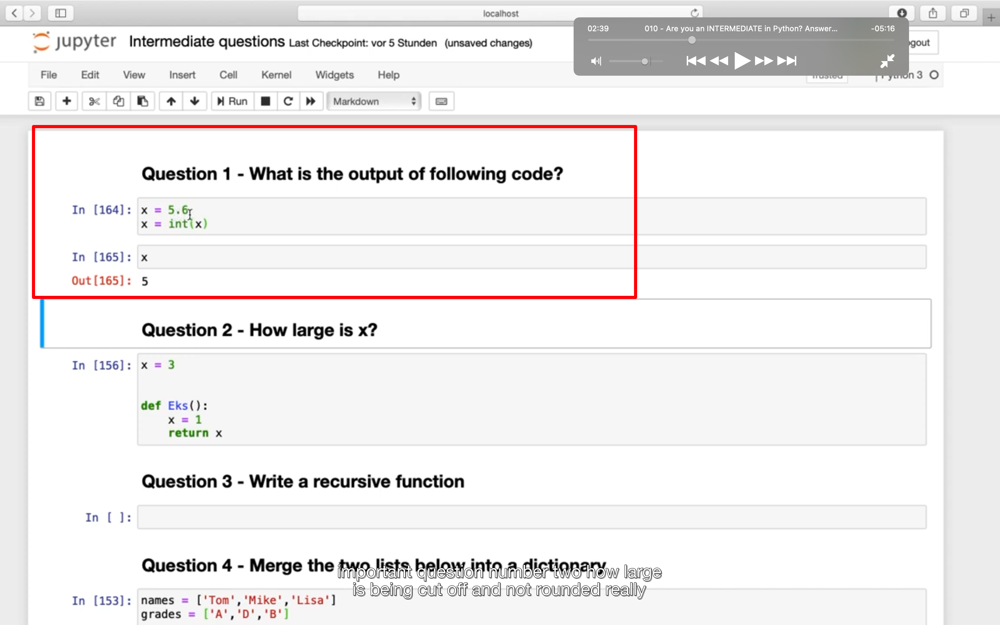
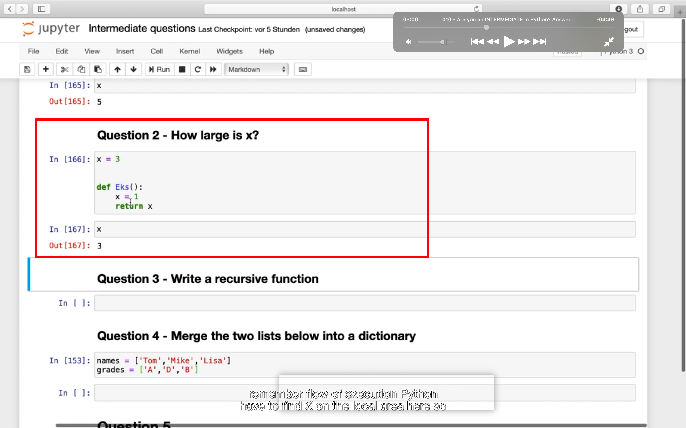
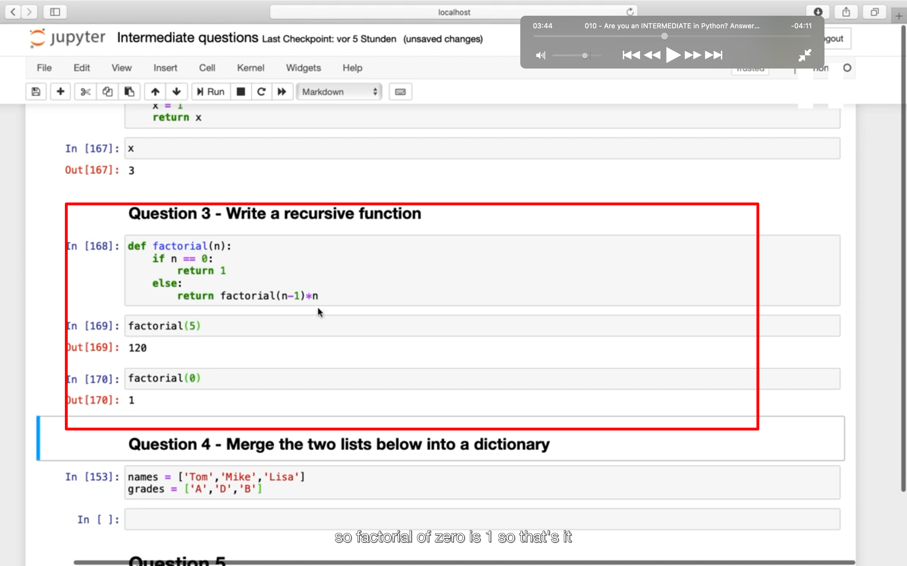
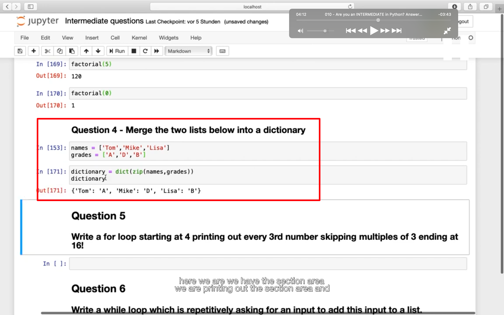
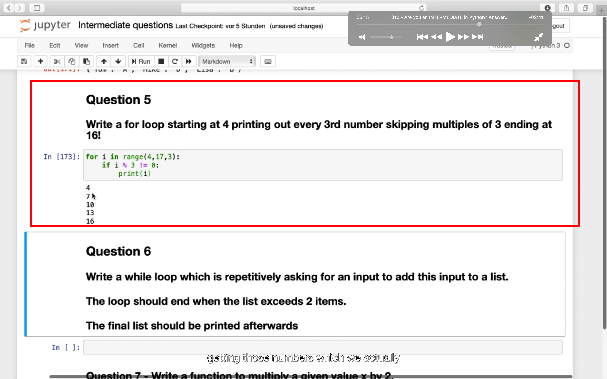
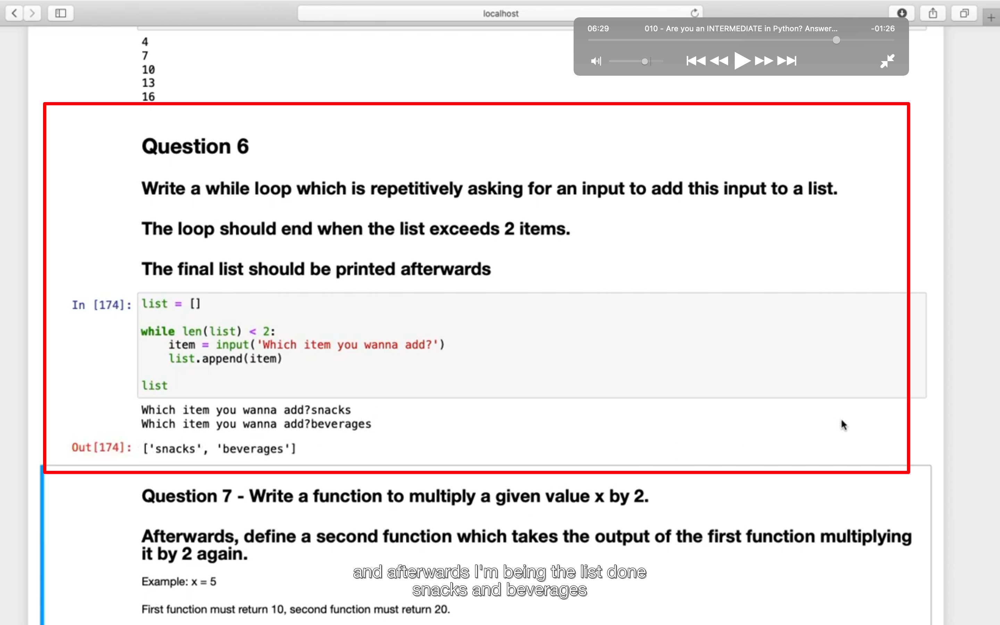
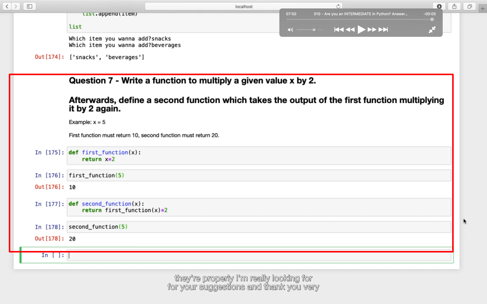

## 230105

</img>  
int 去掉小数点而不是四舍五入

</img>  
函数内和全局有相同变量名时，使用全局变量

</img>  
recursive function，递归函数  
recursive， 递归的，循环的。  
编程语言中，函数 Func(Type a,……)直接或间接调用函数本身，则该函数称为递归函数。

</img>  
连接两个 list 成为 dictionary  
zip dict

</img>  
用 range 写循环

</img>  
input，手动输入，最终输出一个 list

</img>  
一个函数调用另一个函数的结果        

