## 230208

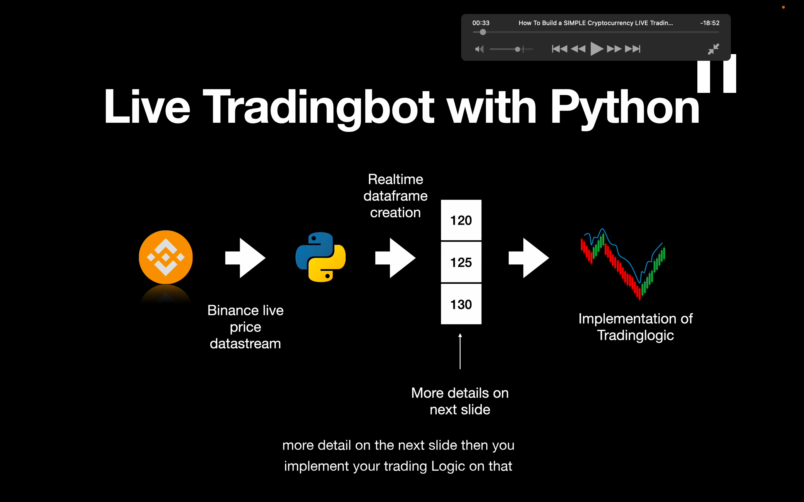</img>  
实施实时交易策略的脚本。最新标准写法  
从币安获得实时数据，将其实时转换为实时 df 或 array。再这 array 的基础上实施策略

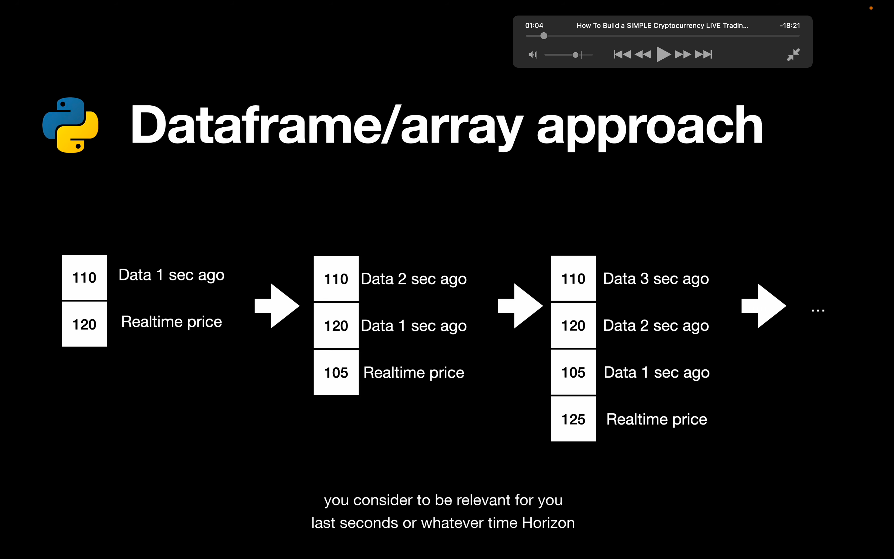</img>  
实时 df 的大概结构

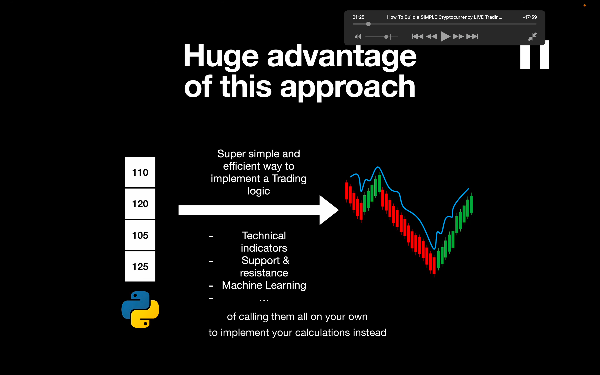</img>  
优势是可以很简单的执行策略。因为可以使用 array methods 来执行，而不是亲自每一步执行（大概跟回测一样的原理）

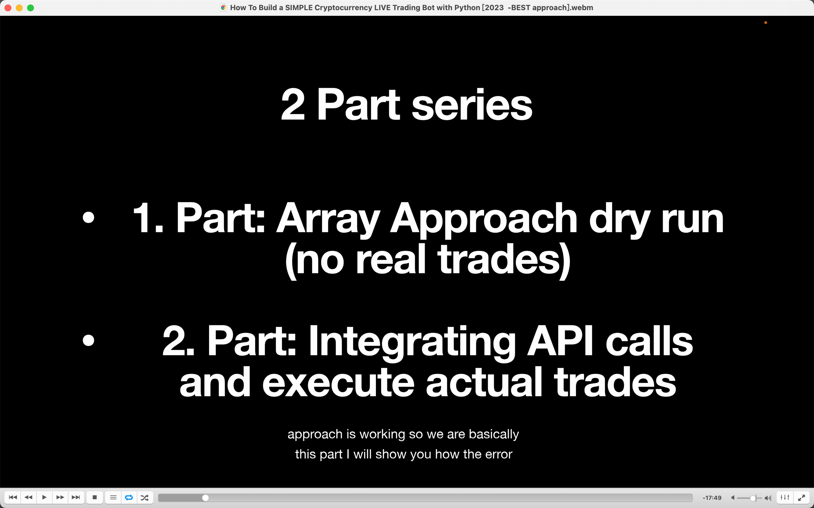</img>  
两个 part  
这节课是虚拟交易，下节课才进行实际交易

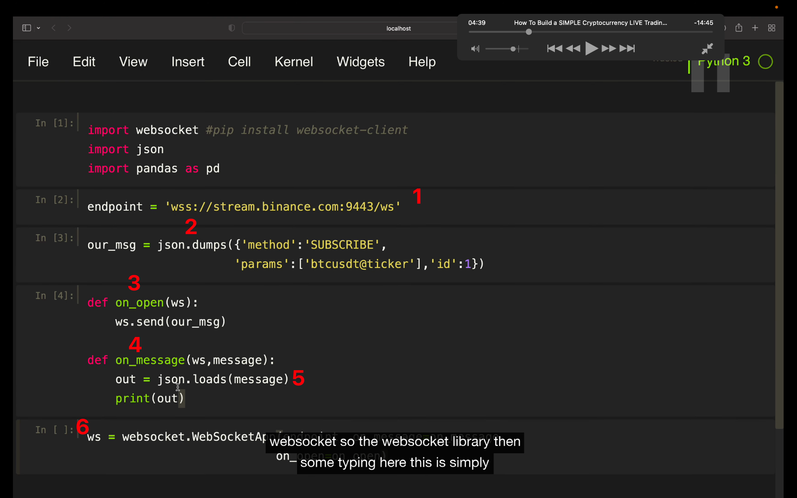</img>  
--=  
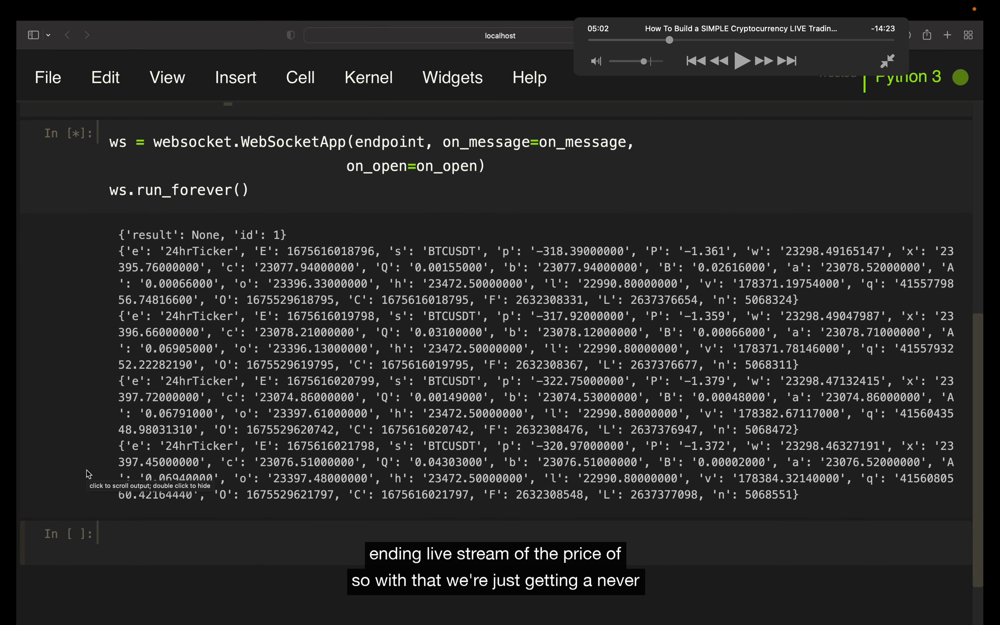</img>

1，binance websocket server：  
https://github.com/binance-us/binance-us-api-docs/blob/master/web-socket-streams.md 有介绍
2，json.dumps 将 python 字典转换为 json object。
3，whenever open a stream， sending a message to the server。  
4，defining what is happening when receive a message from the server。  
5，json.loads 将 json 转换为 python 字典。  
6，websocket 的标准写法

这样就持续实时从币安获得 btcusdt 的价格数据来。

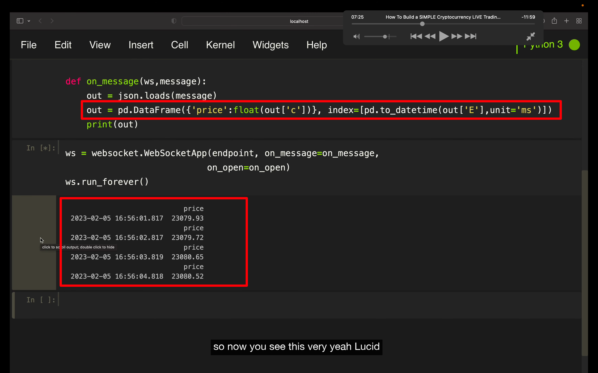</img>  
之前的数据这样处理下就过滤为了 df。但目前只是单行的 df，只是因为在持续打印，看起来像一个很多行的 df。

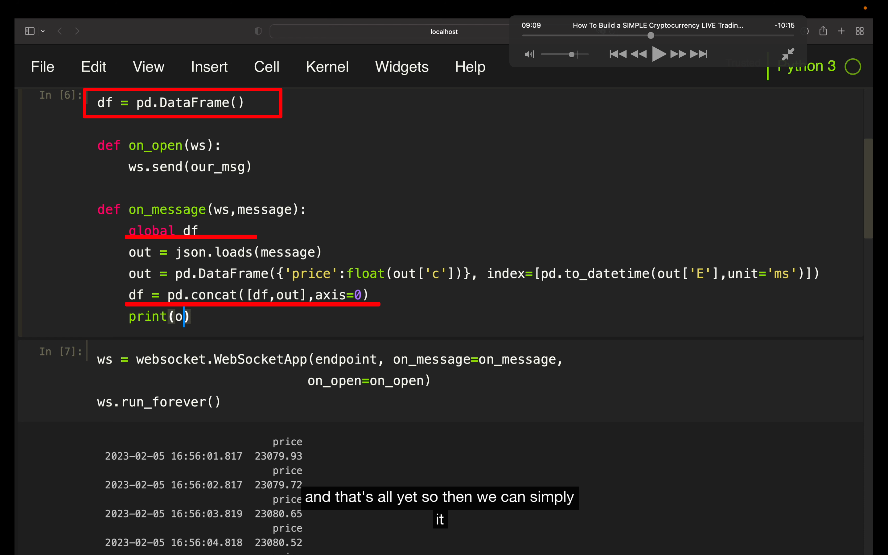</img>  
--=  
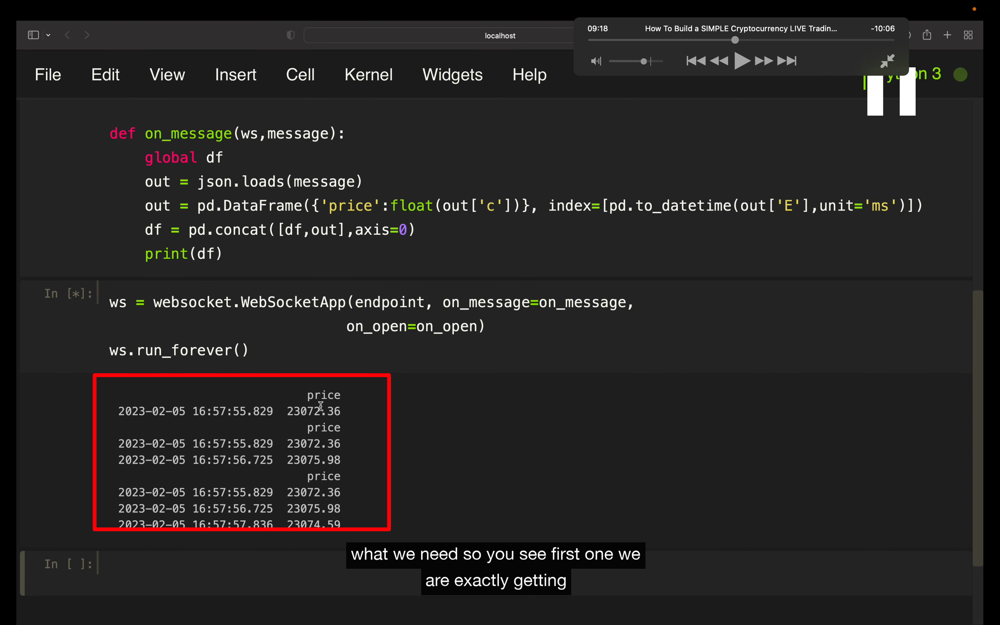</img>  
这样处理下就得到了一个持续增加行的 df 了。  
注意 python 里函数内使用全局变量似乎要这样加个 global

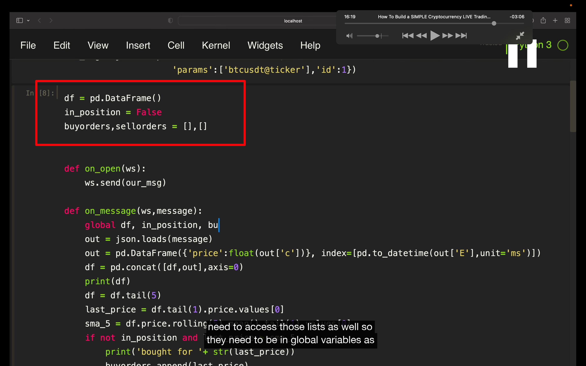</img>  
--=  
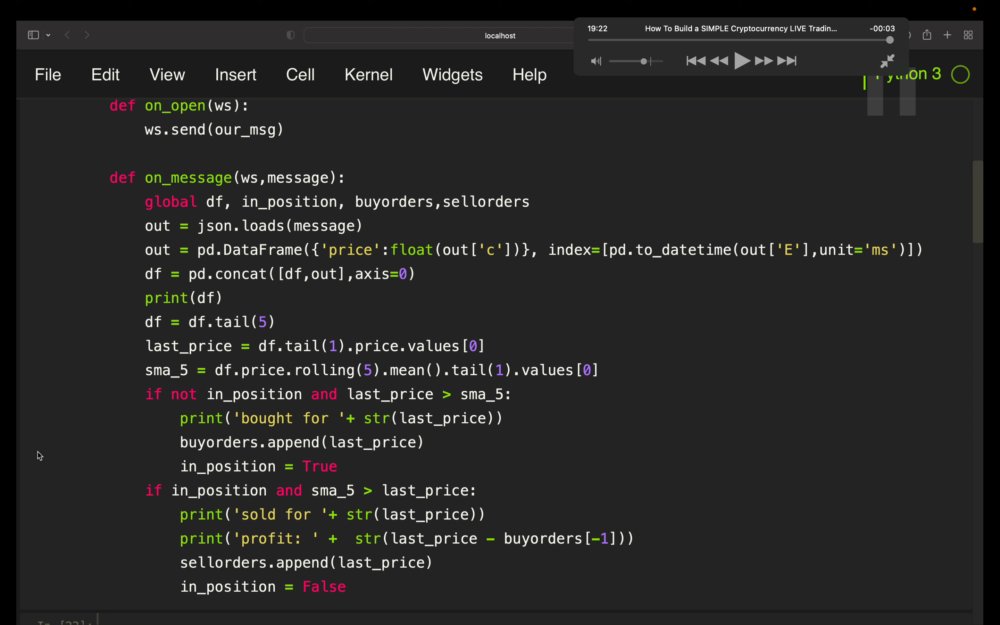</img>  
最终代码，图一只看红框部分。注意 df = df.tail[5] 可以一直限制 df 长度。这节课是虚拟交易，下节课才进行实际交易
