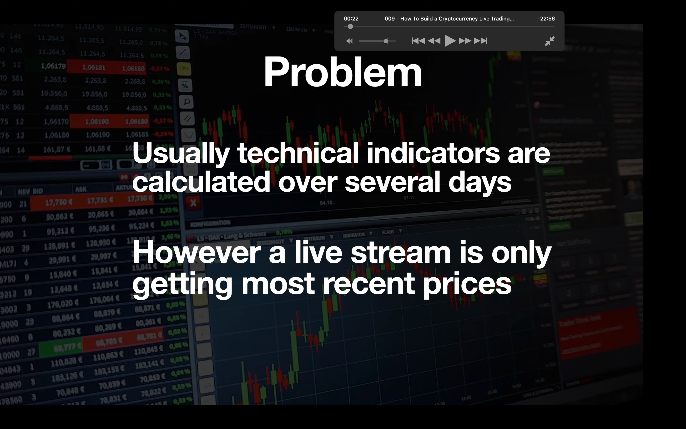
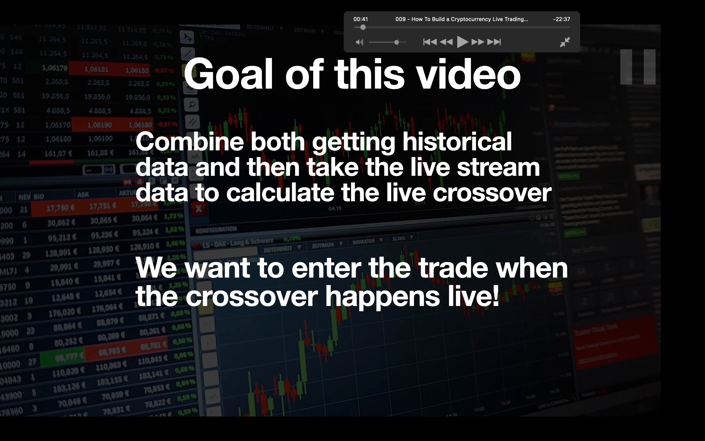
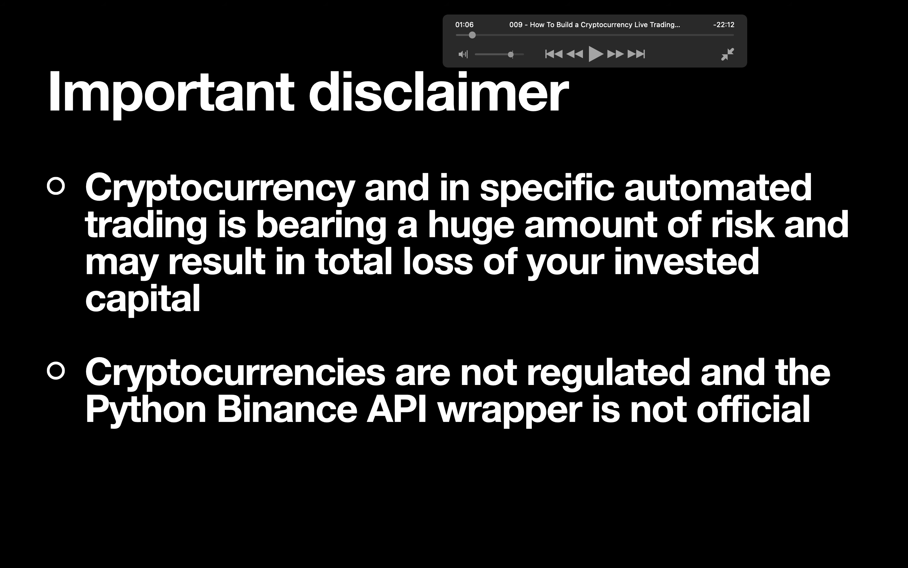
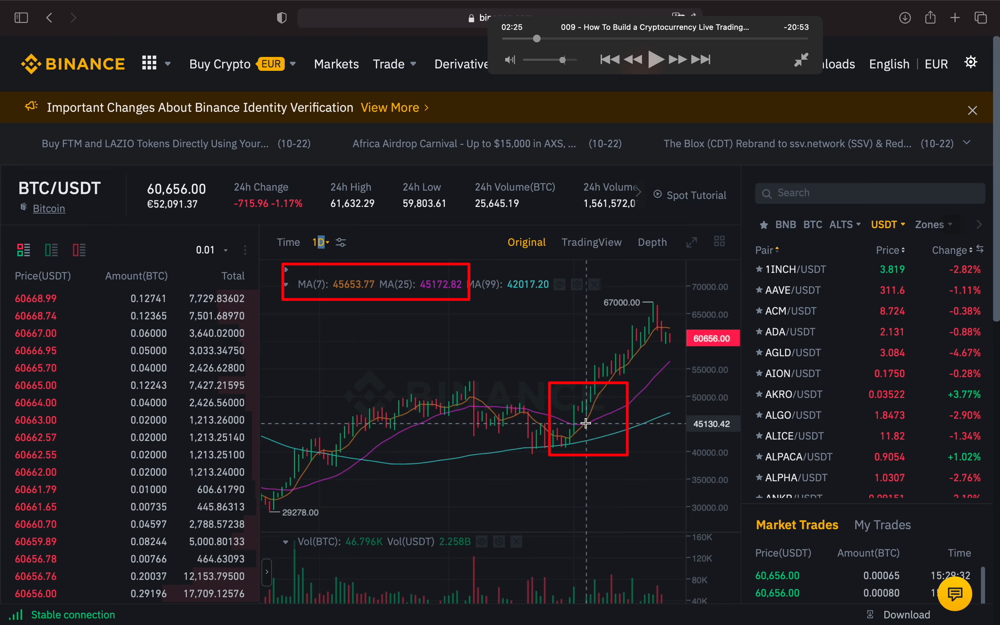
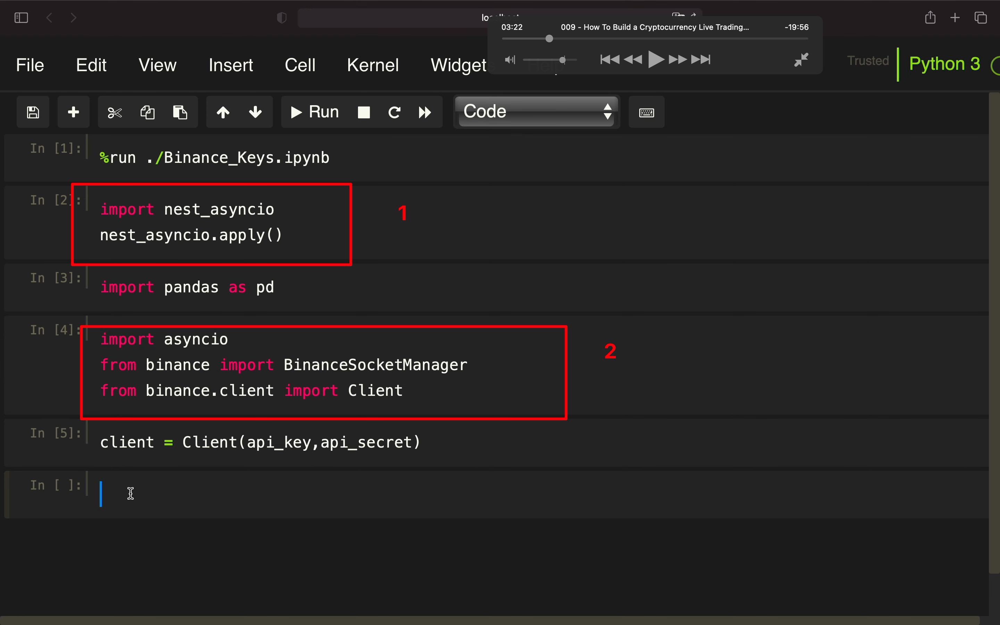
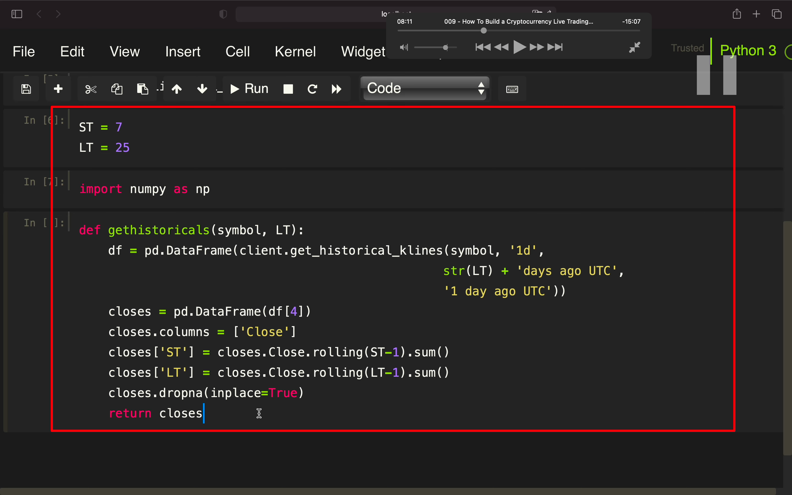
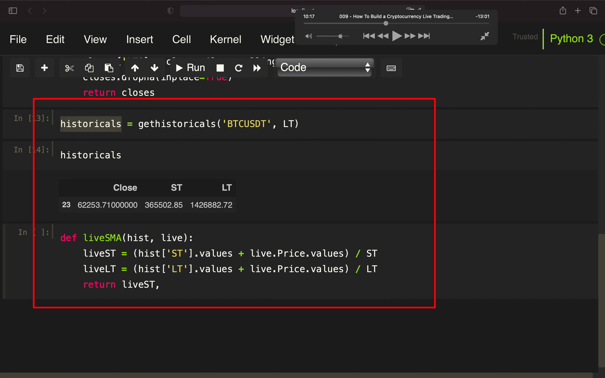

## 221116

</img>  
问题，策略大多需要很多天的数据，但 live stream 只能获取近期数据

</img>  
本集目标，结合历史数据和 live stream 来计算 live 金叉  
当金叉发生时及时进入

</img>  
提示，python binance api wrapper 不是官方的

</img>  
黄线是 7 天短 sma，紫线是 25 天长 sma。  
我们的策略是当金叉发生时及时买入

</img>  
1，nest_asyncio，这个在纯 py 环境不需要，但 jupyter 需要。  
2，asyncio 运行 event loops which to get live prices

add221127  
jupyter 的 asyncio 需加以下代码，不然可能遇到 This event loop is already running 报错

```
import nest_asyncio
nest_asyncio.apply()
```

</img>  
代码 aaav

</img>
