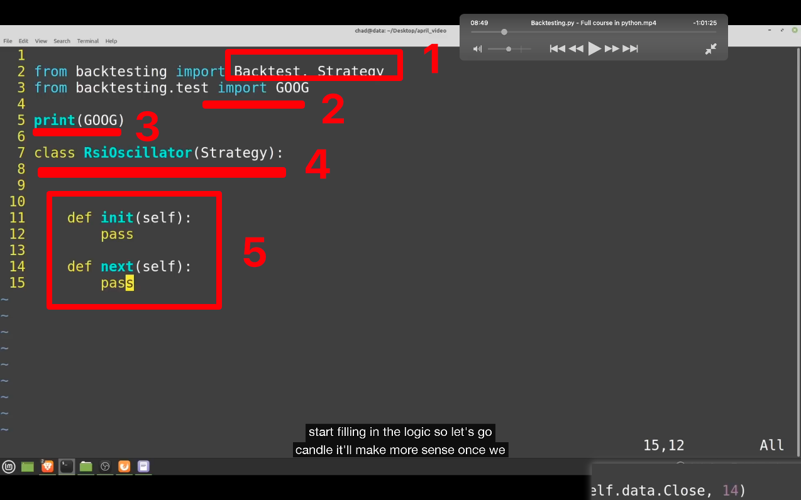
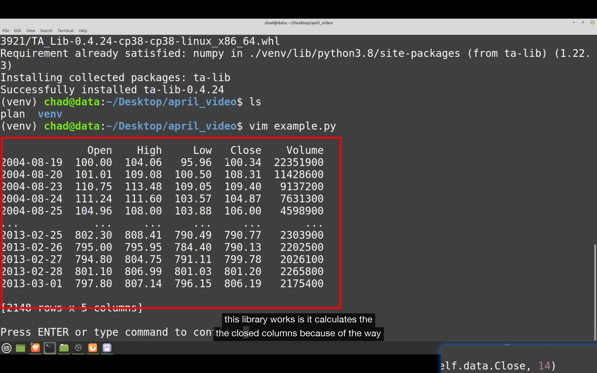

## 230112

### backtesting 是很轻量的回测库，相比其它主流的库，它没有 indicator library，不用连接到 telegram 等。所以很轻量，也很易懂。是 event driven backtester。缺点是无法交易多资产等

### 安装

pip3 install backtesting
pip3 install ta-lib，非必需，只是此节教程需要。

</img>  
--=  
</img>  
1，引入 backtest，但暂时不需要用，要运行回测的时候才用？引入 strategy，用来定义交易逻辑，如什么时候买，什么时候卖等。跟 backtrader 很像，但是更轻量。  
2，引入一些 bt 内置的数据，如这里是 google 2006-2013 的数据。  
3，打印出来，如图 2。实际测试时需要引入自己的数据，但需要数据像图 2 这样的格式  
4，一个叫 rsi\*，继承自 Strategy 的策略  
5，定义策略时大多数时候都要使用的两个 function，可能少数情况只需要使用 init 一个就行。init function 是刚开始就运行一次。next function 是在每个蜡烛/k 线都运行一次。evaluate the criteria/评估标准，决定是否在下一个蜡烛买入。
