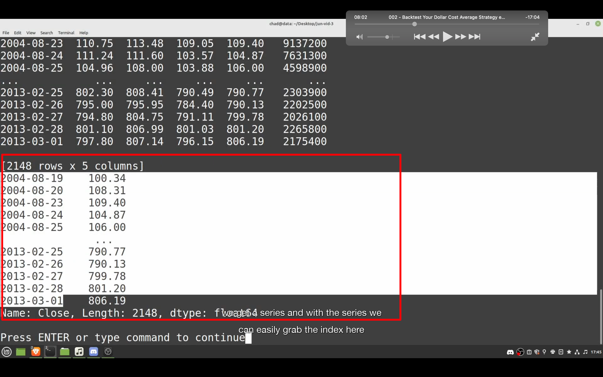
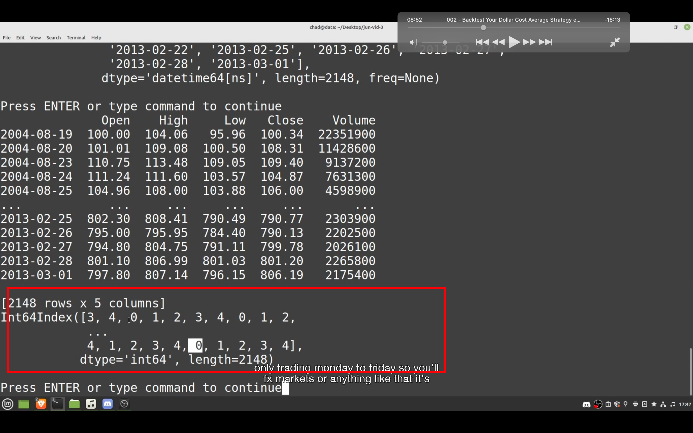

## 230117

</img>  
--=  
</img>  
为防止已安装的一些包的干扰等问题，可以用 virtualenv venv 创建一个纯净的环境。  
https://www.cnblogs.com/freely/p/8022923.html

</img>  
--=  
</img>  
这段代码只是为了证明 self.data.Close 是一个 numpy array

## 230118

</img>  
上图的 self.data.Close 加上.s 后就是 self.data.Close.s，结果是一个 panda series，含有 index，也即是日期。

</img>  
当改为 self.data.Close.s.index.week.dayofweek。即可获得是星期几的数据

### 之后的内容看不太懂，需要重学第一课。
