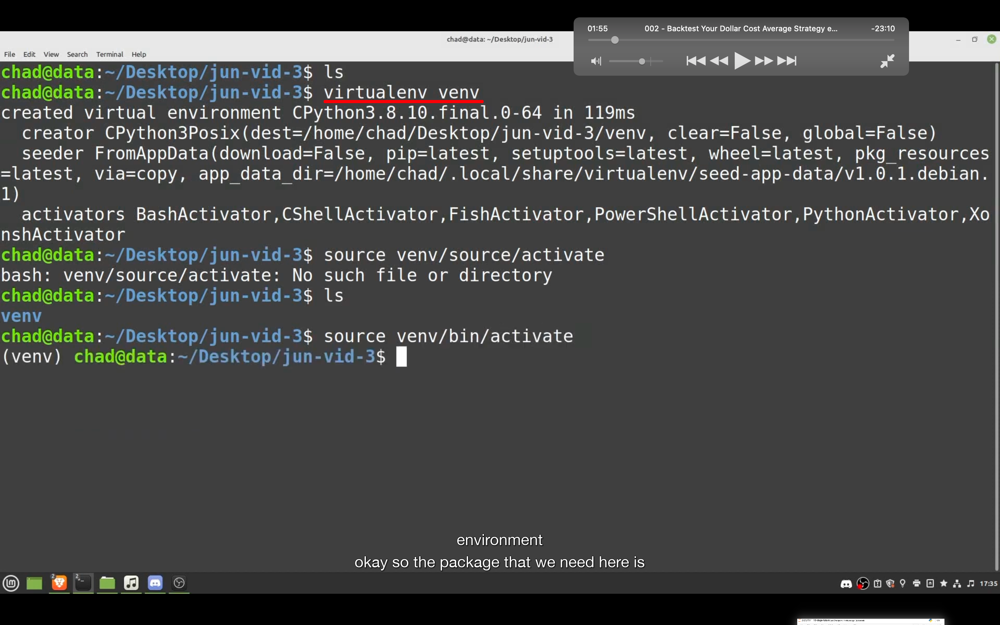
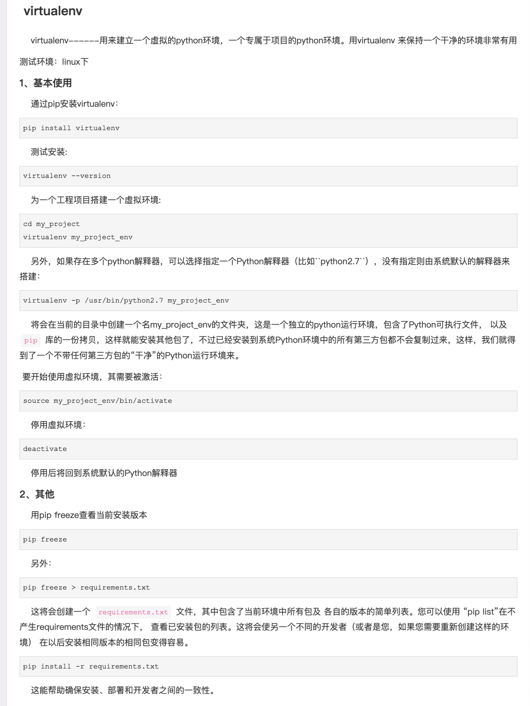
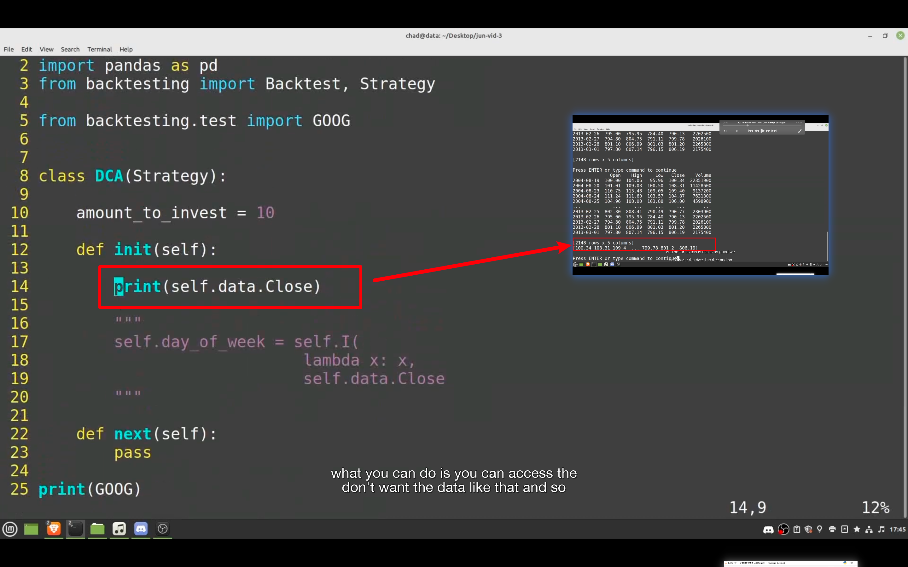
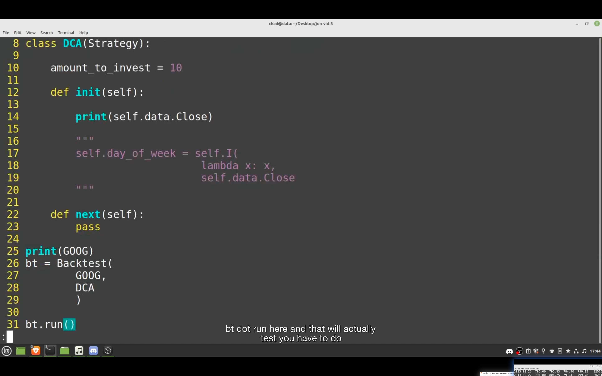

## 230117

</img>  
--=  
</img>  
为防止已安装的一些包的干扰等问题，可以用 virtualenv venv 创建一个纯净的环境。  
https://www.cnblogs.com/freely/p/8022923.html

</img>  
--=  
</img>  
这段代码只是为了证明 self.data.Close 是一个 numpy array
