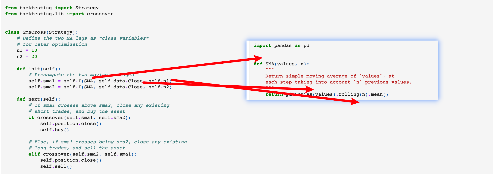
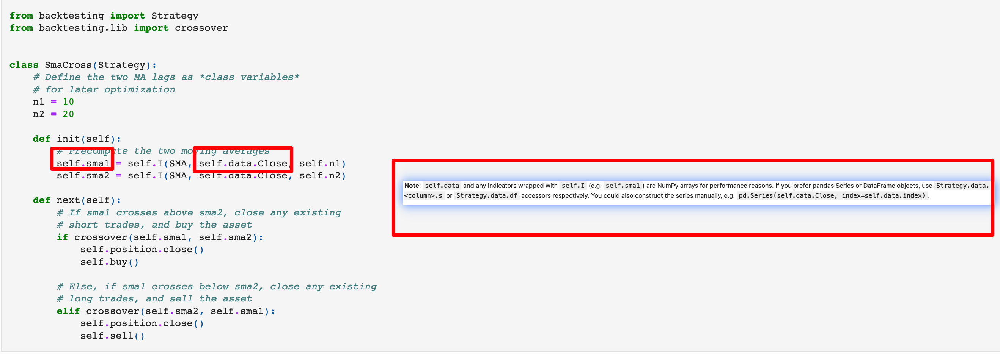

## 220119

https://kernc.github.io/backtesting.py/doc/examples/Quick%20Start%20User%20Guide.html

### Backtesting.py Quick Start User Guide

有轻量化等优势，但不适合多资产

### data

data 用典型的 ohlc pandas.dataframe 数据。也可增加 volume，也可自定义添加列。DataFrame should ideally be indexed with a datetime index (convert it with pd.to_datetime()), otherwise a simple range index will do.

### Strategy

只记录还未掌握的知识点。

1，如需以目前行而不是下一行作为价格计算，使用 trade_on_close=True。

写法如下，crypto 交易最好开启 trade_on_close=True，因为不加很麻烦且 crypto 是 24 小时制，加了对数值影响不大。
bt = Backtest(df, myStrategy, cash=10_000, commission=.002,trade_on_close=True)

</img>  
2，小图为自己定义的方法（跟引用策略库的方法一致），看图即可理解 self.I 里各变量的作用。解决视频教程中很多没说太清楚的问题。  
相当于时 self.I(a,b,c)中 a 为调用的 function，b,c 为此 function 依次使用的函数

3，self.position.close()既可以 close 多单，即卖出已买的资产。也可以 close 空单，应该是平掉空单的意思。

4，用 backtesting.lib.crossover()方法就可以方便对比前后值大小，省去很多代码。前提是需要引入 from backtesting.lib import crossover。

5，In init(), the whole series of points was available, whereas in next(), the length of self.data and all declared indicators is adjusted on each next() call so that array[-1] (e.g. self.data.Close[-1] or self.sma1[-1]) always contains the most recent value, array[-2] the previous value, etc. (ordinary Python indexing of ascending-sorted 1D arrays).

</img>  
6，Note: self.data and any indicators wrapped with self.I (e.g. self.sma1) are NumPy arrays for performance reasons. If you prefer pandas Series or DataFrame objects, use Strategy.data.<column>.s or Strategy.data.df accessors respectively. You could also construct the series manually, e.g. pd.Series(self.data.Close, index=self.data.index).

这里的 self.data 指的应该不是 self.data.Close 中的 self.data。而是指的 self.sma1 这样的 self.I(\*)的结果。

7，We might avoid self.position.close() calls if we primed the Backtest instance with Backtest(..., exclusive_orders=True).

大概意思是回测时使用 Backtest(..., exclusive_orders=True)就可以在策略中省略掉 self.position.close()？？？

## backtesting

```
from backtesting import Backtest

bt = Backtest(GOOG, SmaCross, cash=10_000, commission=.002)
stats = bt.run()
stats
```

```
bt.plot()
```

## Optimization

```
%%time

stats = bt.optimize(n1=range(5, 30, 5),
                    n2=range(10, 70, 5),
                    maximize='Equity Final [$]',
                    constraint=lambda param: param.n1 < param.n2)
stats
```

注意浮点数不能用此例的 range 方法，要改为如 benchmark_rate = np.arange(0.960, 0.981, 0.01).tolist(),这样

```
stats._strategy
```

```
bt.plot(plot_volume=False, plot_pl=False)
```

do take steps to avoid overfitting.
大概是参数选择的 steps 设置大点可以降低过拟合风险。

## Trade data

In addition to backtest statistics returned by Backtest.run() shown above, you can look into individual trade returns and the changing equity curve and drawdown by inspecting the last few, internal keys in the result series.

除了上面显示的 backtest .run()返回的回测统计数据外，您还可以通过检查结果系列中的最后几个内部键来查看单个交易回报和不断变化的股权曲线和下降。
