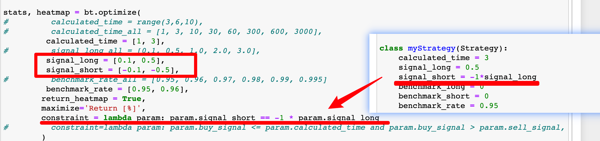
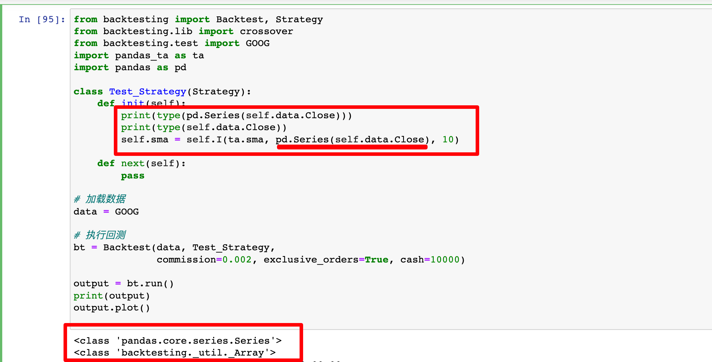
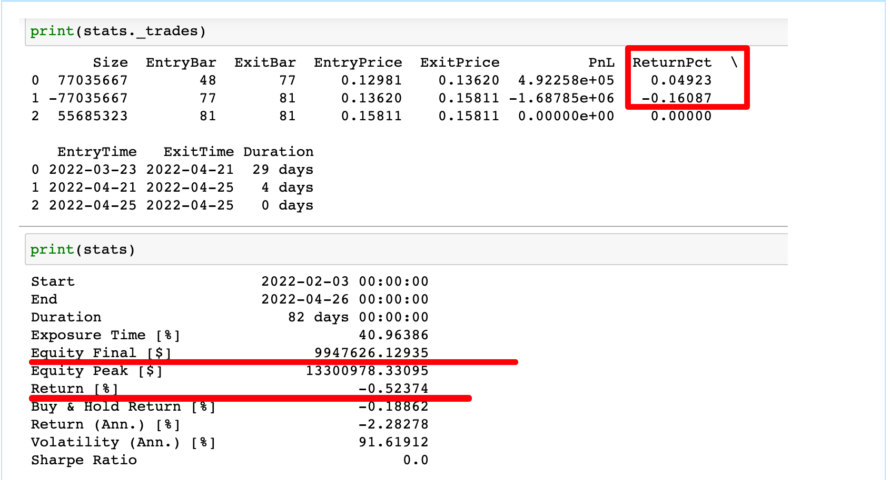

## 230210

### RuntimeWarning: divide by zero encountered in double_scalars

np.seterr(divide='ignore')

https://github.com/kernc/backtesting.py/issues/584

```
I am getting the same error on v.0.3.3. You can use: np.seterr(divide='ignore')
This won't fix the problem, but it will turn off the error warning. In addition, as I understand it, this only affects the final result of the "'Sortino Ratio" so if you dont use this indicator, then its not so critical
```

### 禁止 FutureWarning 和 UserWarning

import warnings

warnings.simplefilter(action='ignore', category=FutureWarning)  
warnings.simplefilter(action='ignore', category=UserWarning)

注意在当前 cell 不生效，只对以后的 cell 生效

### optimize 时，有相连关系的两个变量都要写在 optimize 里。

</img>  
optimize 时，有相连关系的两个变量都要写在 optimize 里。还要加上 constraint 限制条件即可。  
如此例 optimize 里没有 signal_short，就会默认为固定的-1\*0.5

### 在用不是自己写的 indicator，而是引用其它如 pandas_ta 的时候，需要再一些参数前加 pd.Series 转换格式

</img>

### bt.plot()无效，看不到图像

pip uninstall -y bokeh && pip install bokeh==2.4.3  
重启 notebook

add:  
以上方法仍可能无效，用以下方法：  
bt.plot(filename='./plot_results/ramdomname.html')

### 杠杆交易，如 50 倍杠杆设置 margin 为 0.02

```
class Backtest
(
data, strategy, cash=10000, commission=0.0, margin=0.02, trade_on_close=False, hedging=False, exclusive_orders=False)

```

margin is the required margin (ratio) of a leveraged account. No difference is made between initial and maintenance margins. To run the backtest using e.g. 50:1 leverge that your broker allows, set margin to 0.02 (1 / leverage).

</img>  
设置每笔交易固定金额，而不是每笔 all in。

## 230310

### 回测数据对不上的问题

</img>

有时会发生这种回测数据对不上的问题，是因为数据截止时，有交易还在进行中，上方的数据只显示完整按策略执行的策略，下方的 equity fianl 会自动在最后一个 bar close，计算出 fianl。而且 peak 也不是按所有 close 中的最高值来算，而是在开单过程中产生的最高值来算。
