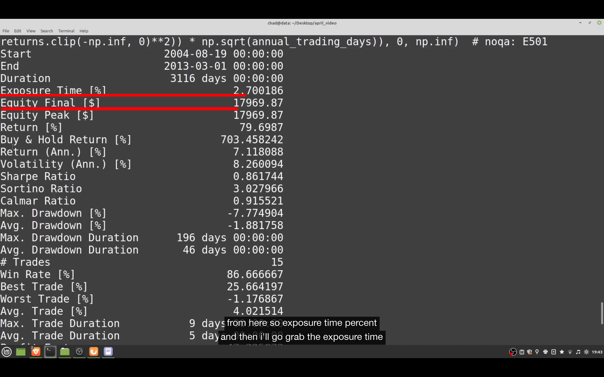

## 230112

### https://www.youtube.com/watch?v=e4ytbIm2Xg0&list=PLnSVMZC68_e48lA4aRYL1yHYZ9nEq9AiH

### backtesting 是很轻量的回测库，相比其它主流的库，它没有 indicator library，不用连接到 telegram 等。所以很轻量，也很易懂。是 event driven backtester。缺点是无法交易多资产等

### 安装

pip3 install backtesting
pip3 install ta-lib，非必需，只是此节教程需要。

</img>  
--=  
</img>  
1，引入 backtest，但暂时不需要用，要运行回测的时候才用？引入 strategy，用来定义交易逻辑，如什么时候买，什么时候卖等。跟 backtrader 很像，但是更轻量。  
2，引入一些 bt 内置的数据，如这里是 google 2006-2013 的数据。  
3，打印出来，如图 2。实际测试时需要引入自己的数据，但需要数据像图 2 这样的格式  
4，一个叫 rsi\*，继承自 Strategy 的策略  
5，定义策略时大多数时候都要使用的两个 function，可能少数情况只需要使用 init 一个就行。init function 是刚开始就运行一次。next function 是在每个蜡烛/k 线都运行一次。evaluate the criteria/评估标准，决定是否在下一个蜡烛买入。

</img>  
1，引入 talib ，没听太懂，可能是因为 bt 库本身没有策略，所以要引入 talib 库的策略。（也可以自己写策略，会在之后介绍方法）  
2，第一个参数是策略名，第二个是获取的 data 的 close 数据，第三个是时间窗口？  
3，引入 crossover  
4，如果第一个参数大于第二个参数，卖出。  
5，如果第一个参数大于第二个参数，买入。

</img>  
--=  
</img>  
上图基础上新增图一代码即可完成回测，结果如图 2。

</img>  
以上代码最后加上 bt.plot() 即可看到如图效果

</img>  
绿色斜线代表盈利的交易，红色的代表亏损的交易

</img>  
自动找到最好的参数。maximize 表示想要最大化哪个结果。constraint 表示参数的限制条件。  
注意需要在之前代码基础上 from backtesting.test import GOOG。并定义 rsi_window 变量。也许还有其它修改忘了记录。

</img>  
--=  
</img>  
--=  
</img>  
有时不仅只针对一个结果优化，针对多个结果优化可以这样写

</img>  
没听太懂，大概是回测期间少于 10 笔交易就不算

</img>  
--=  
</img>  
产生的统计图结果会生成网页，这里可以对网页进行如取消名字，放进指定文件夹等设置。

</img>  
如果每种组合都回测会耗费太多时间。则可以设置 max_tries，如此例，随机选择 100 种参数组合，回测出最佳结果。  
这也降低了 overfitting 的可能性

</img>  
--=  
</img>  
heatmap  
add 230121
注意是 return_heatmap，有下滑线。  
range 里包含第一个数，不包含第二个数，如此例里的 upper_bound，包含 55，但不包含 85。

</img>  
--=  
</img>  
heatmap.groupby

</img>  
--=  
</img>  
matrix 显示 heatmap

</img>  
可以弄出这种 seaborn 图来，但觉得意义不大，需要时再视频看具体操作方法

</img>  
之前的是两个参数的，这里掩饰的是三个参数时。但觉得意义不大，需要时再视频看具体操作方法

## 以上讲解了所有 bt 库的东西？以下讲解更多策略，如 multi-time frame 策略。如 weekly 用 rsi，hourly 用 sma。感觉较难，需要时再学。
