## 230117

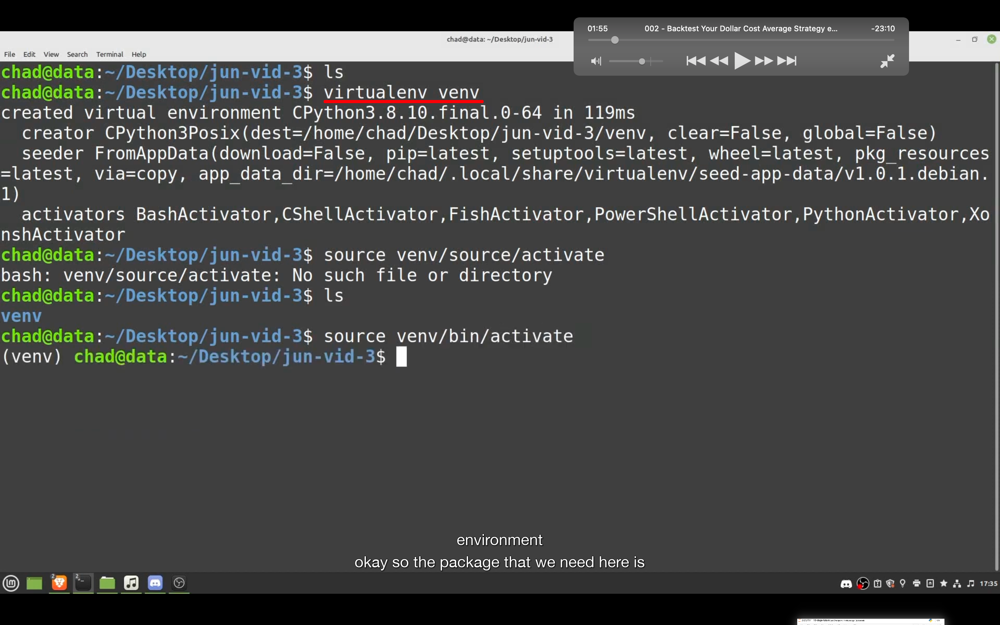</img>  
--=  
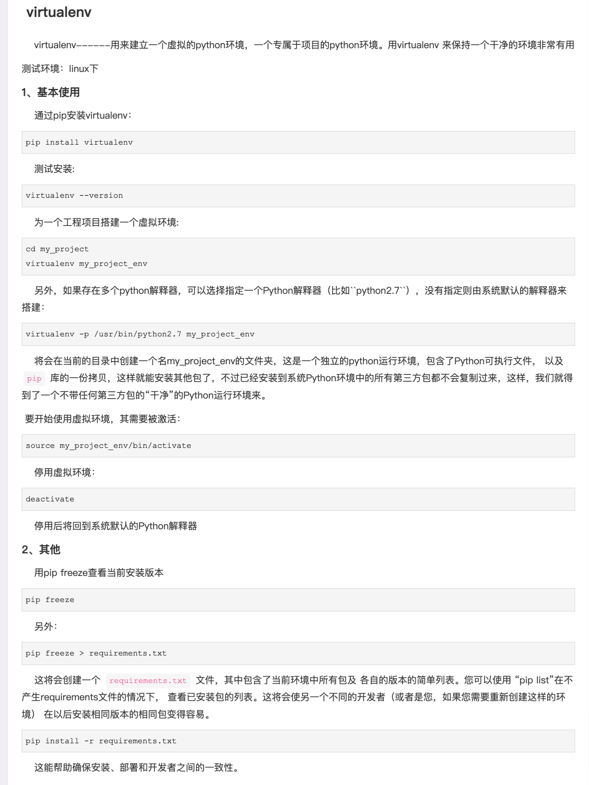</img>  
为防止已安装的一些包的干扰等问题，可以用 virtualenv venv 创建一个纯净的环境。  
https://www.cnblogs.com/freely/p/8022923.html

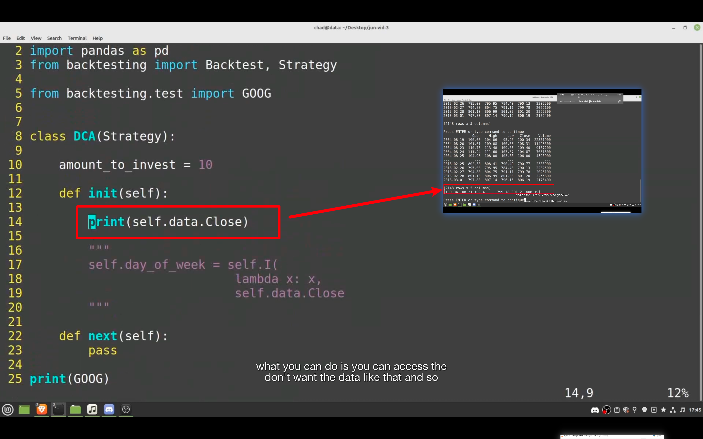</img>  
--=  
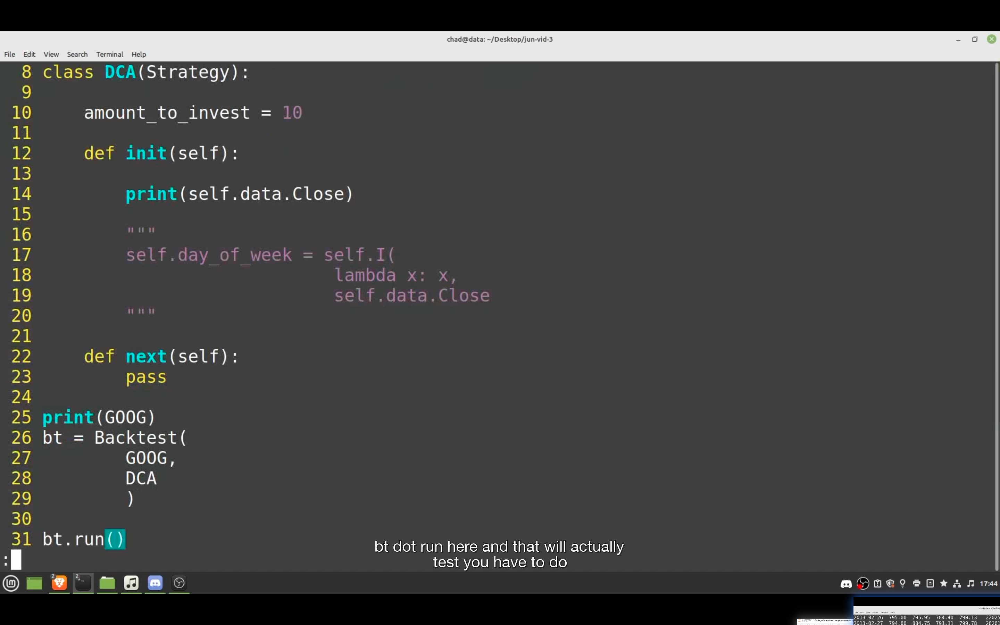</img>  
这段代码只是为了证明 self.data.Close 是一个 numpy array

## 230118

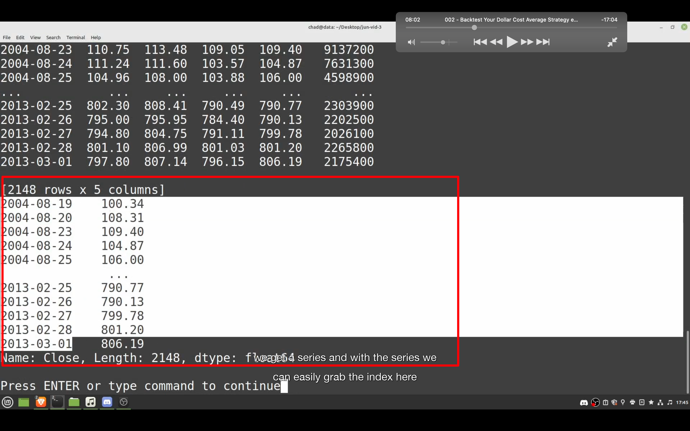</img>  
上图的 self.data.Close 加上.s 后就是 self.data.Close.s，结果是一个 panda series，含有 index，也即是日期。

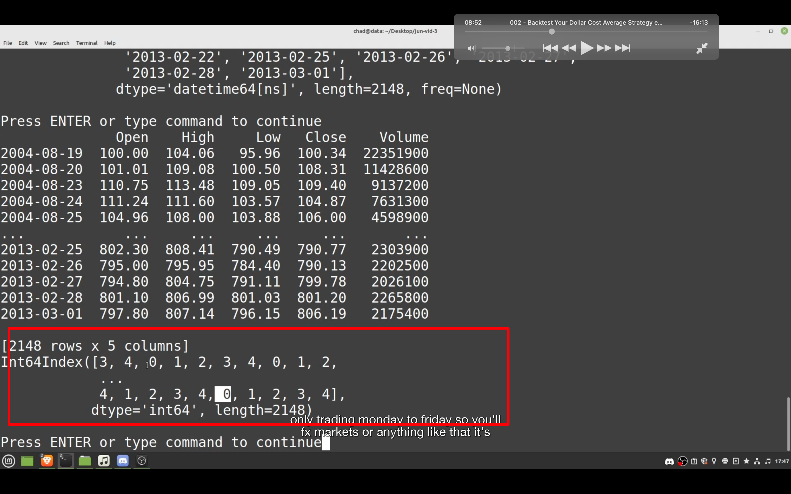</img>  
当改为 self.data.Close.s.index.week.dayofweek。即可获得是星期几的数据

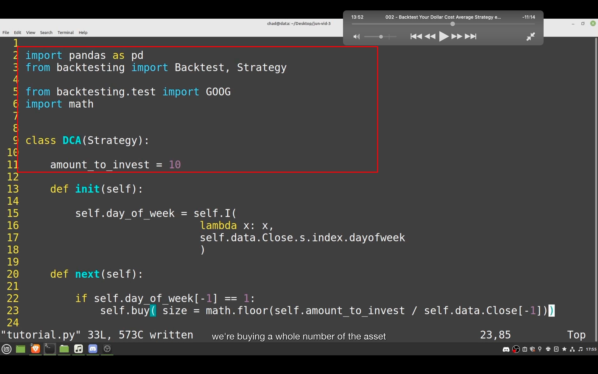</img>  
--=  
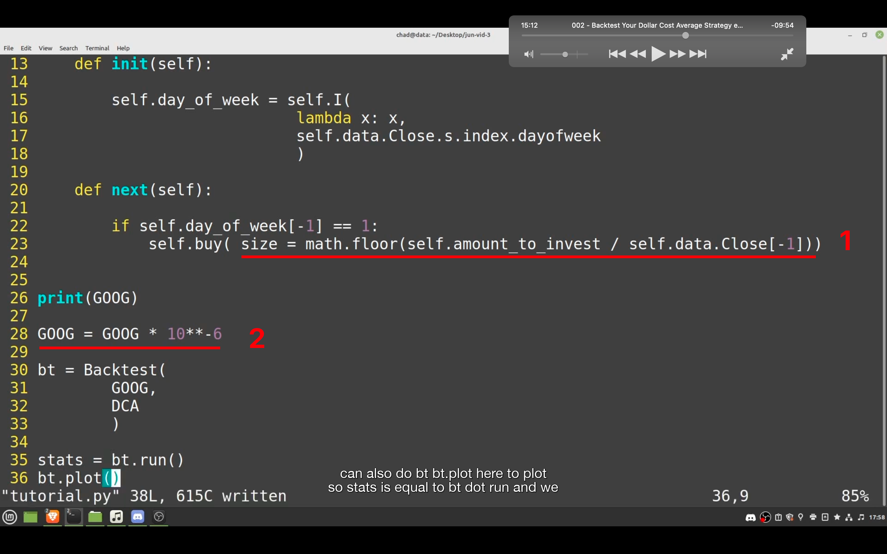</img>
1,如果是 0-1 之间的小数，代表可用钱数的比例，如果是整数，如 1，2，3 等，则是买那么多股。这里用此方法实现了买尽量多的整数股。  
2，如果投资金额少，或者标的物价格低，一次一股都买不到，可以用此方法。

这里的意思是每周二都 trigger the bar（index 为 1 代表周二），在周三以 open 买入。注意 amout_to_invest 是每次都投入的资金，这段代码里没有总投资资金限制。

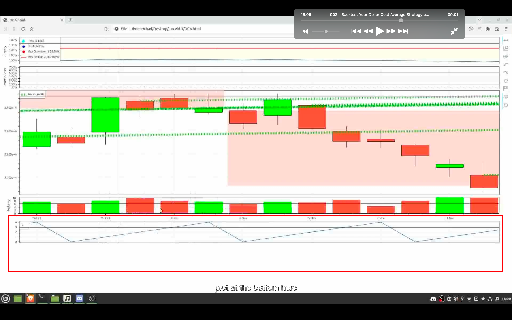</img>  
--=  
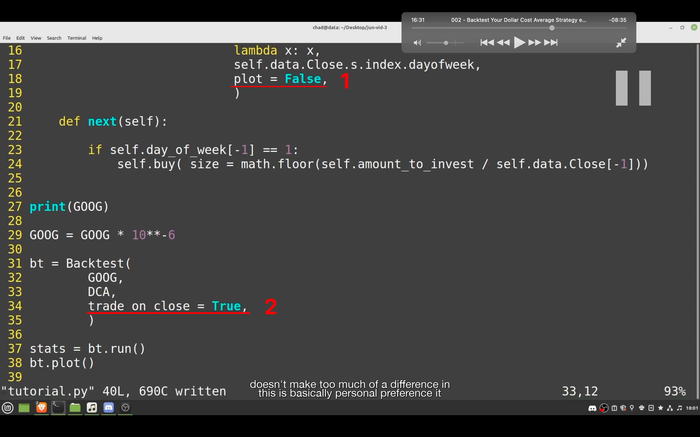</img>  
1，图一下方的图表显示的是 indicator 的值，具体在此例子中是星期几的意思。想取消显示这个，就加入此段。  
2，想以触发 bar 的 close 买入，而不是触发 bar 下一次的 open 买入，则加入此段。

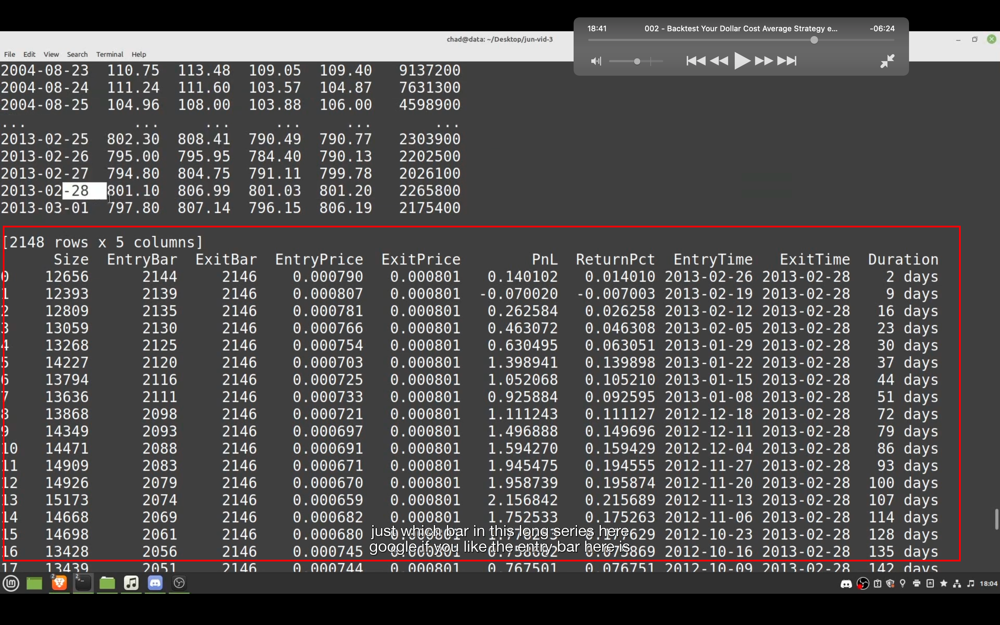</img>  
print(stats)改为 print(stats["_trades"])或 stats["_trades"].to_string() 就可以看到每次交易的详细信息。size 是买的股数，注意这里因为之前的\*10\*\*-6，是百万分之一股。

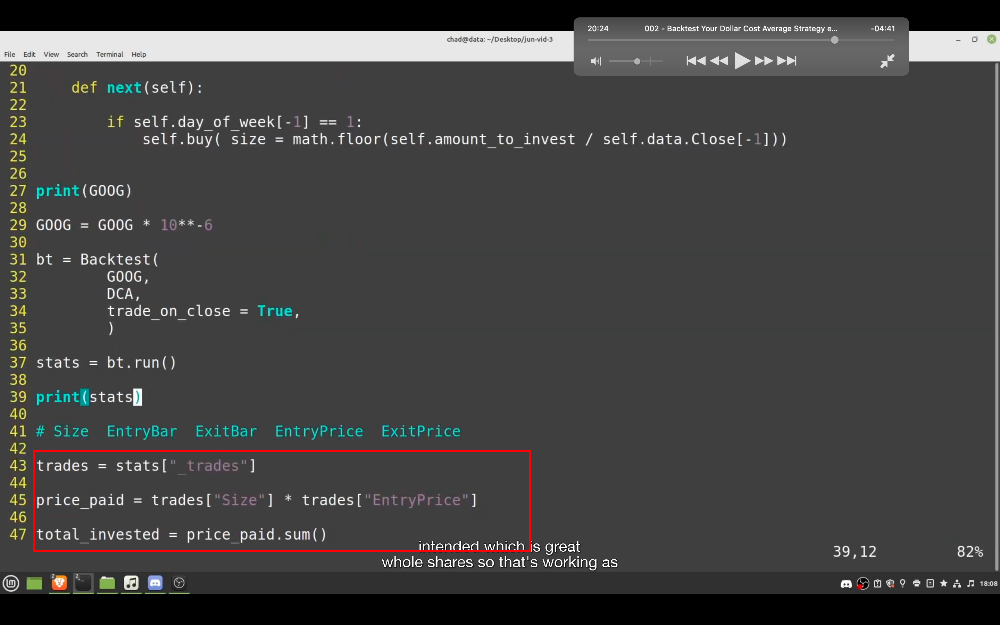</img>  
这样就能看到每次投入的资金额度以及总共投入的资金额度  
同理 current_shares = trades["Size"].sum()  
current_equity = current_shares \* GOOG.Close.iloc[-1]

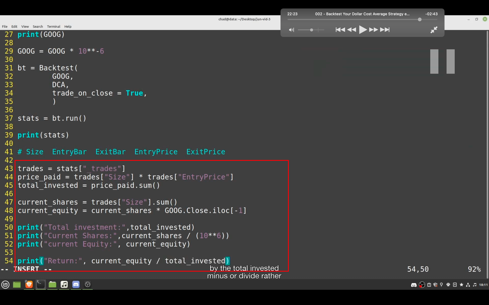</img>  
--=  
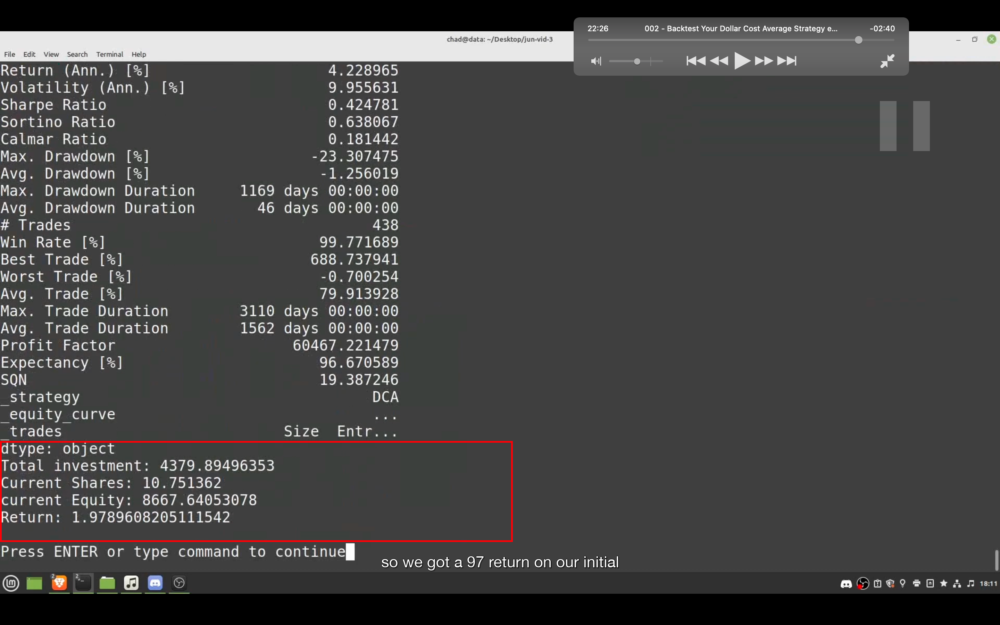</img>  
最终代码

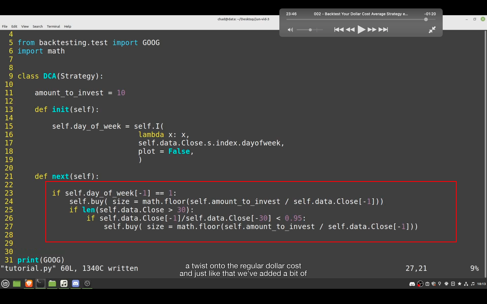</img>  
--=  
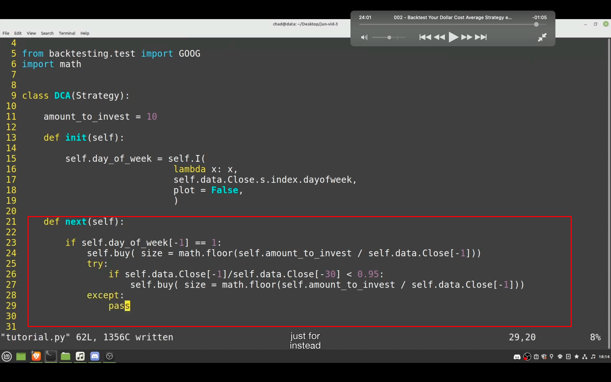</img>  
稍微加了一点逻辑，图一会报错，图二就对了。所以注意遇到报错可以试试用 try except 方法。

### 之后的内容看不太懂，需要重学第一课。
