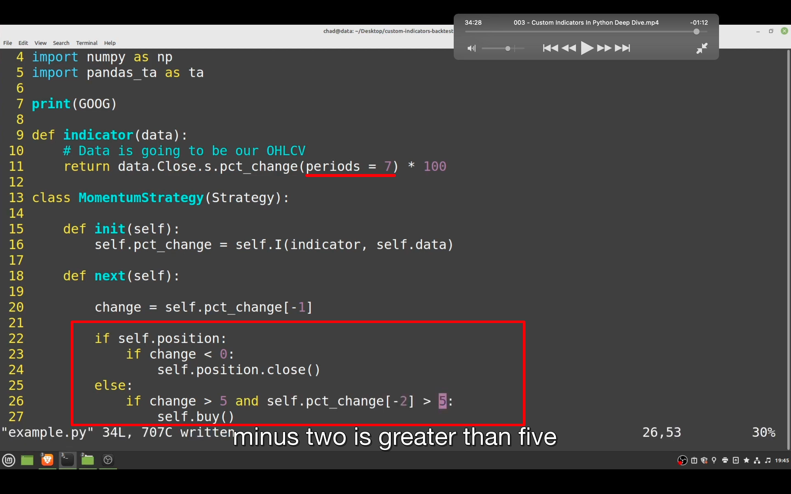

## 230113

### 此节讲 custom indicator。应该是不用策略库，回测自己写的策略的意思。3 个例子，可以覆盖绝大多数你的 indicators。

</img>  
add230114  
后两种用 indicator 的策略不是太懂。但根据此测试，原理应该是跟方法一一样。都是类似给原始 df 新增一列 signal，用 signal 列判断是否交易。所以如果是自己写的策略，不需要用方法三，直接用方法一可能更简单。甚至可以在方法一层面上更简化，直接引用已经创建好信号的 df。只有当需要用到策略库里的策略时，才需要用方法二的 indicator。

add230120  
视频有些地方比较难懂，看官方文档../docs/01.md 就好懂了。用 indicator 的好处是可以设置变量为参数，而以上说的直接在 df 里加一列的方法只能设置固定数值。无法快速 optimize 参数，所以最好还是用 indicator 的方法。

### 第一个是用你已经在外部 python 生成的信号，把它引入 bt。

### 第二个是用 pandas ta。

### 第三个是创造个 momentum 策略，这样能学到光用纯 python 怎么做自己的 indi。

pandas_ta

</img>  
1,假设已有外部生成的信号，这里为了简化，就随机生成信号。  
2,策略代码，目前还没写  
3，运行代码。  
还没写具体策略，还只是个模版

</img>  
1，可以接.is_long 等后缀 1030，True if the position is long. position size is positive  
这样就直接可以回测了，还会生成回测图。stupid easily。很适合机器学习给出的信号，直接跑就是了  
在一个行有信号，其实是用下一行的 open 价格来实际买卖。

</img>  
1，这下要写 init，因为可以预先根据价格信息计算 bollinger bands 的值。  
2，self.I 是一个定义在 Strategy Class 里的 function。它会将返回的数据运用到 next function 的每次循环中，你可以传入 pd.df 或 pd.series，它都返回 np.array。还有很多内容，没听太懂。 视频 2030e  
3，pandas_ta，一个很好的策略库。 https://github.com/twopirllc/pandas-ta

</img>  
data.Close.s 作用是 grab the data as panda series，as opposed to a numpy array/获取为 pd series 数据，而不是 numpy 数组。 如果只有 data.Close 的话，获得的就是 numpy array（注意跟 python 原生数组不一样）

</img>  
--=  
</img>  
上节的代码打印出图一，看不太懂。因为不懂具体策略。可以在 python 终端使用图二命令，就可以看到帮助信息。

### 2930 之前继续介绍方法二，但较难，需要时再学

</img>  
--=  
</img>  
方法三，初期代码，只是打印出图二
pct_change 是基础 pandas function

</img>  
--=  
</img>  
根据 pandas 官方文档：https://pandas.pydata.org/docs/reference/  
更改 period，  
最终实施策略  
indicator(data)中的 data 永远等于 bt = Backtest(GOOG \*）中的 GOOG。此例中（或所有情况都是？）data 是 OHLCV open high low Close volume 数据
