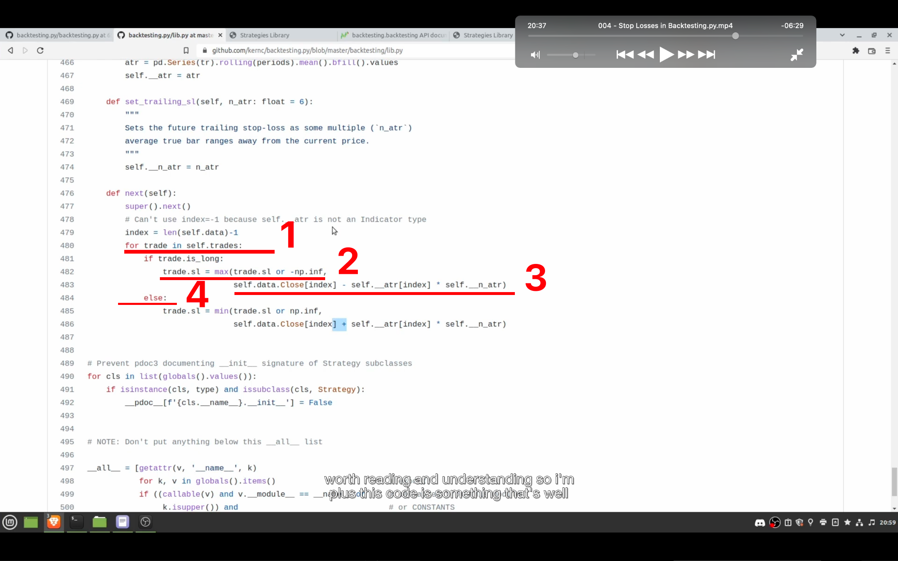
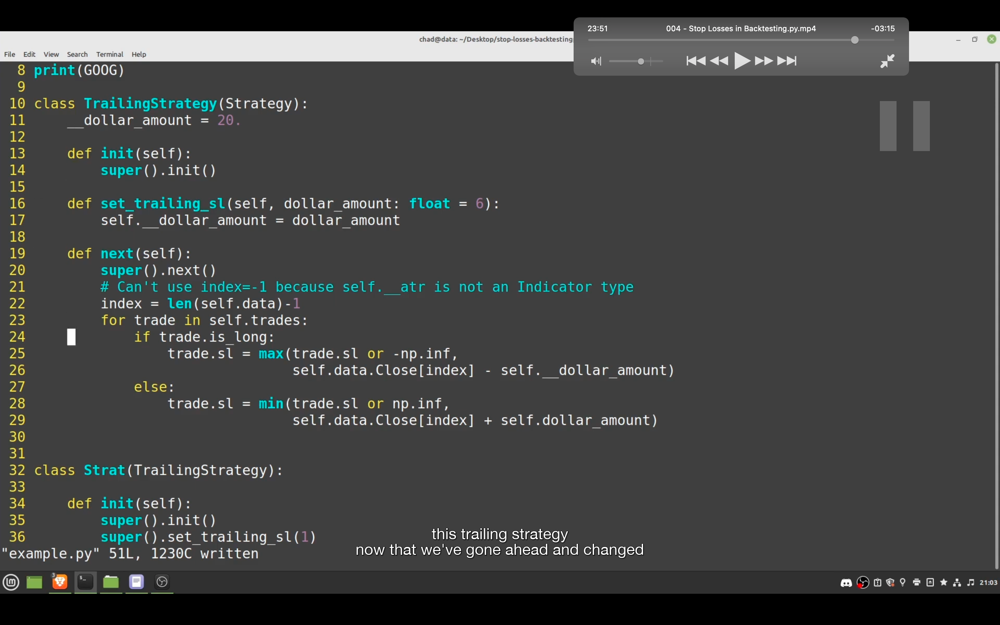
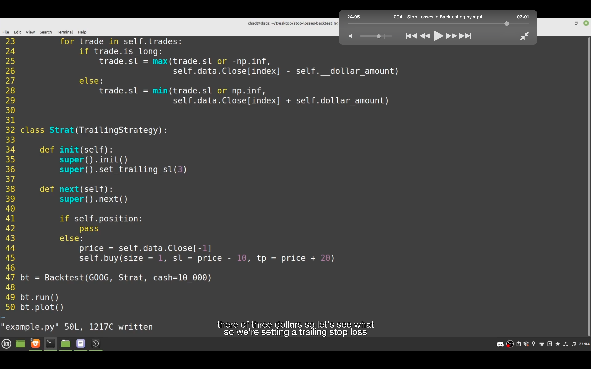
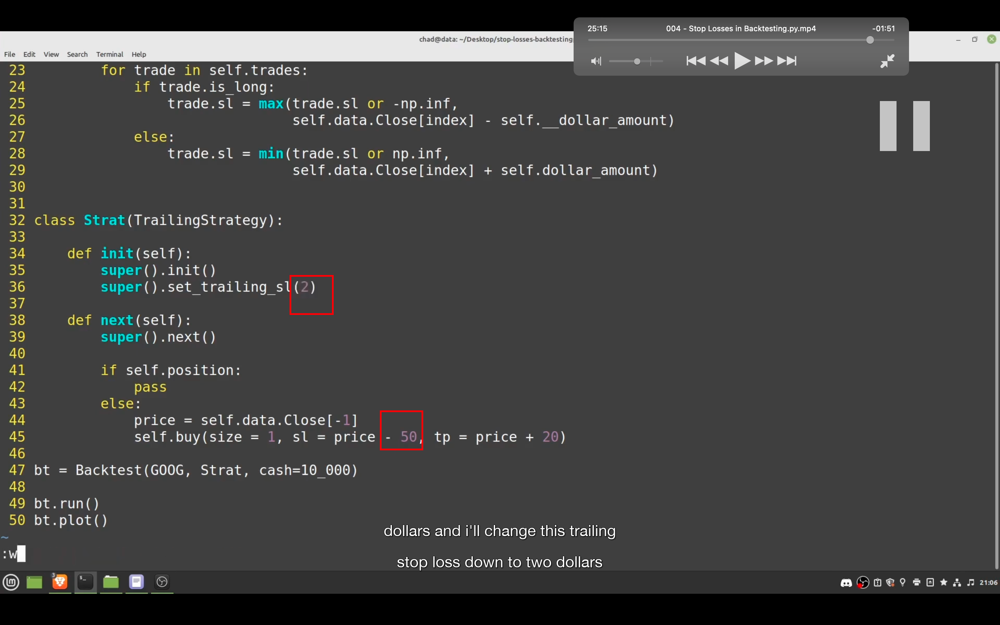

## 230121

### 此节学习 stop loss，使用渐增难度的三个例子。理解后就能所有 bt 的 sl 相关了。最先例子是使用一个 buy function。之后会 extending strategy class。

</img>  
--=  
</img>  
--=  
</img>  
一个简单的 stop loss 例子。可能出现图三这种奇怪情况，特别是股票这种非 7\*24 市场。

</img>  
如果一个 bar 很高，可能同时触发止损和止盈。backtesting 默认选择止损

</img>  
--=  
</img>  
create a class witch extends Strategy and includes some special code for adjusting our stop loss. and then you can inherit from that class use it whenever you want in your future backtests.

1，super().init()意思是调用 Strat 继承自的 TrailingStrategy 的 init function。  
2，此时 super 已可以替换为 self。it's sets the trailing stop loss at 5 times the average true range，which is just a technical indicator。average true range，ATR/平均真实波幅，是一个技术指标。见 tradeTerm.md
3，on every single iteration, it will make sure our stop loss is set at 5 average true ranges below the current price value. 意思大概是如果跌幅过大，超过 5 天内的 ATR，则止损。

此时结果止损应该不是原代码设置的跌 10 就止损，而是根据 ATR 来止损了。

## 230125

</img>  
https://github.com/kernc/backtesting.py/blob/master/backtesting/lib.py  
1，trades 定义，目前不确定具体啥意思，可能只是 short 和 long 两种交易类型的意思

```

    @property
    def trades(self) -> 'Tuple[Trade, ...]':
        """List of active trades (see `Trade`)."""
        return tuple(self._broker.trades)

```

2，让 trade.sl 等于现在的 trade.sl 和 负无限大 之中的最大值。其实就是如果 trade.sl 不存在，止损就设计为负无穷大，即不止损。  
3，这里的值应该就是对应上行的 trade.sl  
4，之前的是 long/多，现在的是 short/空

</img>  
--=  
</img>

将 bt 库里的 class \*\*\* 代码复制到自己的脚本下，再做些修改，就变为了固定数值的止损。  
变量前加\_目的是让人知道这是个内部变量，只在函数内部使用，只是个习惯。

</img>
之后还有些内容，讲两种不同止损设置以及止损 bar 细节的，没听太懂。
