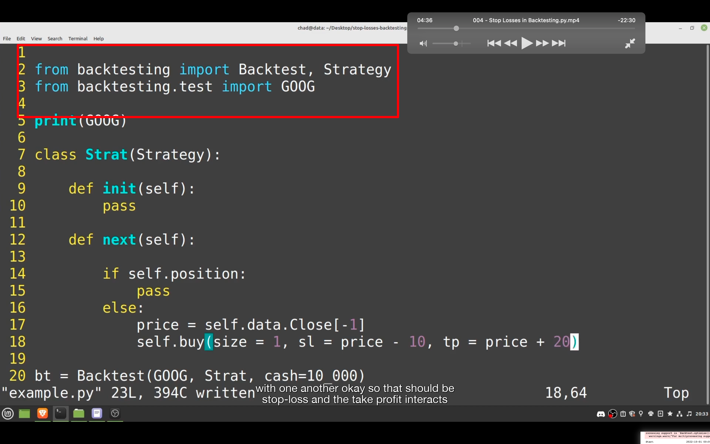
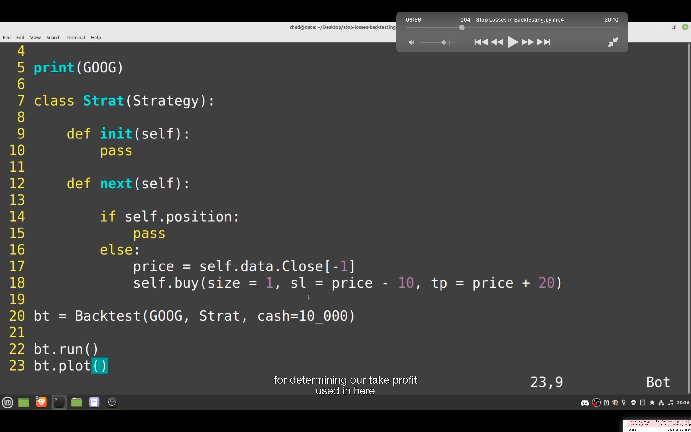
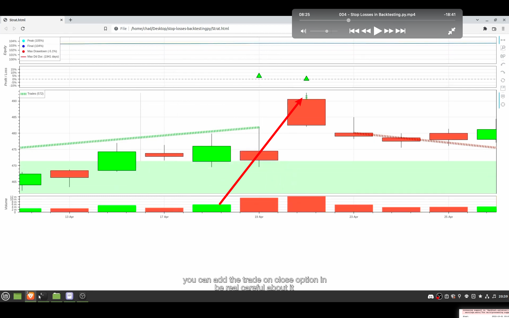
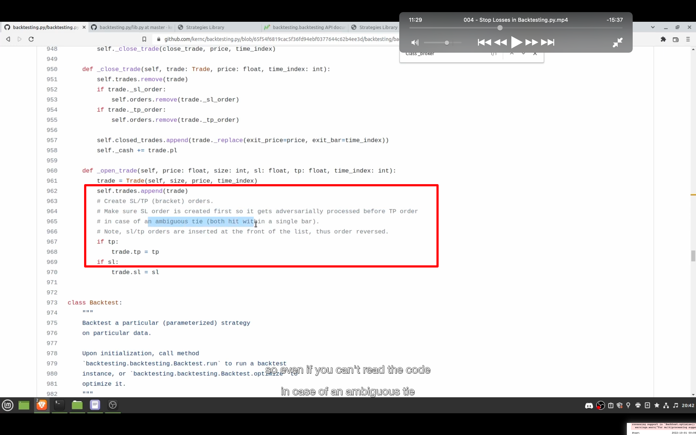
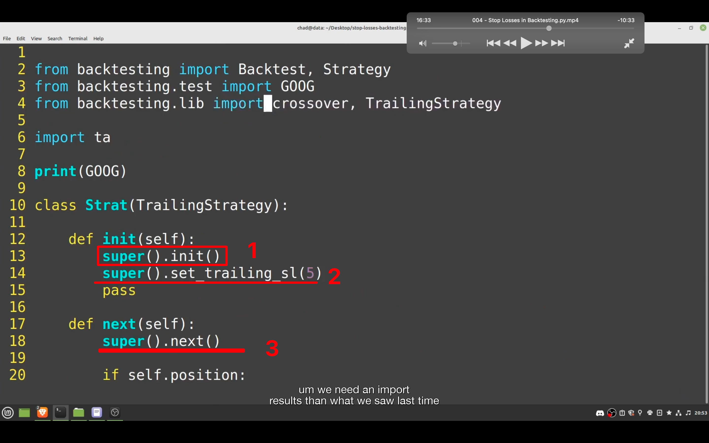
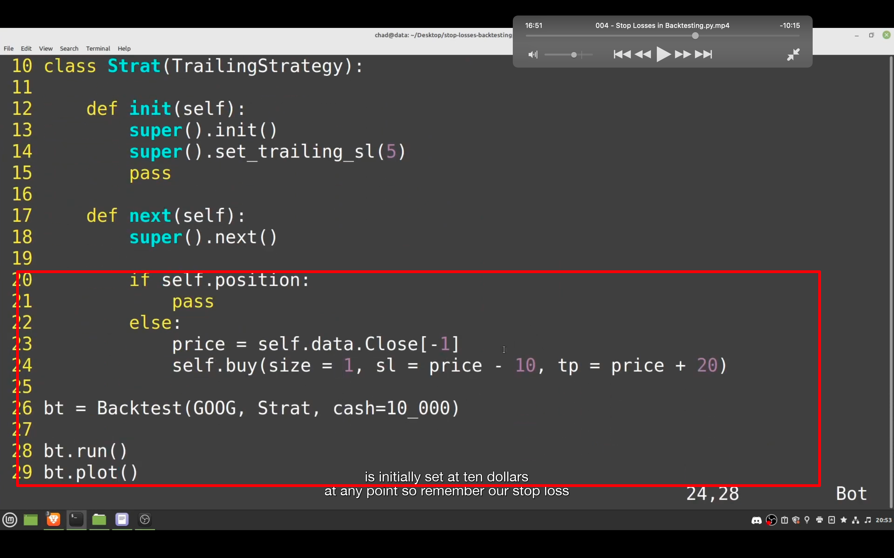

## 230121

### 此节学习 stop loss，使用渐增难度的三个例子。理解后就能所有 bt 的 sl 相关了。最先例子是使用一个 buy function。之后会 extending strategy class。

</img>  
--=  
</img>  
--=  
</img>  
一个简单的 stop loss 例子。可能出现图三这种奇怪情况，特别是股票这种非 7\*24 市场。

</img>  
如果一个 bar 很高，可能同时触发止损和止盈。backtesting 默认选择止损

</img>  
--=  
</img>  
create a class witch extends Strategy and includes some special code for adjusting our stop loss. and then you can inherit from that class use it whenever you want in your future backtests.

1，super().init()意思是调用 Strat 继承自的 TrailingStrategy 的 init function。  
2，此时 super 已可以替换为 self。it's sets the trailing stop loss at 5 times the average true range，which is just a technical indicator。average true range，ATR/平均真实波幅，是一个技术指标。见 tradeTerm.md
3，on every single iteration, it will make sure our stop loss is set at 5 average true ranges below the current price value. 意思大概是如果跌幅过大，超过 5 天内的 ATR，则止损。

此时结果止损应该不是原代码设置的跌 10 就止损，而是根据 ATR 来止损了。

## 230116

https://greyhoundanalytics.com/blog/stop-losses-in-backtestingpy/  
不看视频，看文字教程

从哲学上讲，backtesting.py 在执行时是敌对的。也就是说，它尽可能地悲观。这同样适用于止损。如果一个止损和一个获利在同一条内被触发，它会假设止损是先被触发的，从而减少我们的利润。
