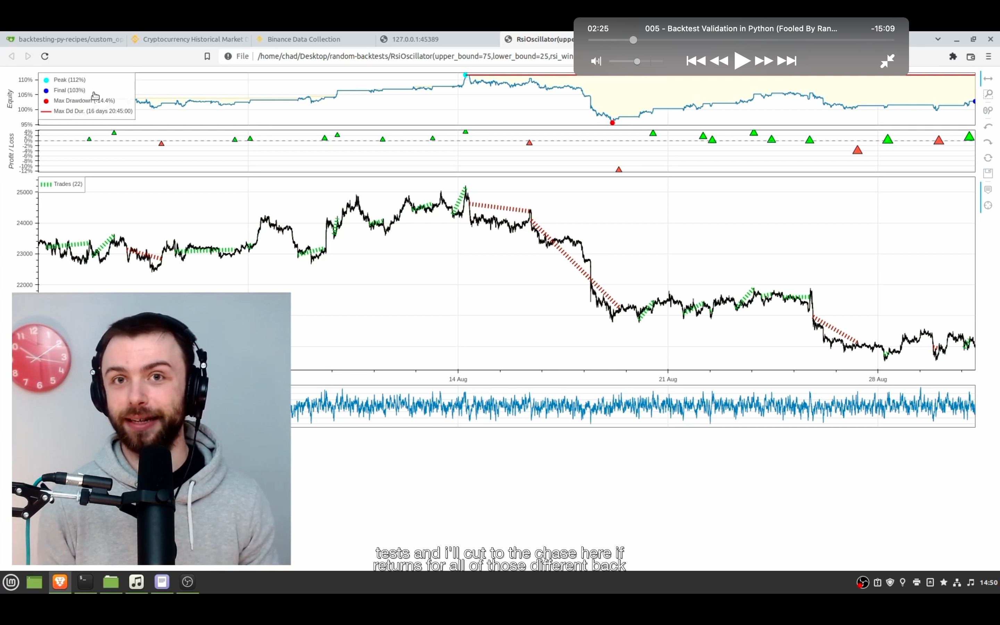
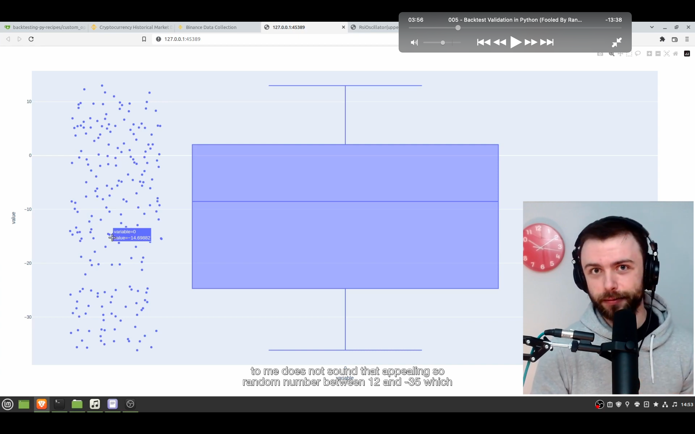

## 230126

### in the video, show you a strategy that you can use to combat against overfitting,

</img>  
rsi 高时卖，低时买低策略  
虽然期间币价跌了 15%，但 final 却是 103%，所以感觉这是个在熊市的好策略  
但难点是很难分辨此策略是真的找到了好的信号还是凑巧碰到了幸运的参数组合  
解决此问题是增加时间跨度。此例只测了 30 天，但视频准备测此年的每个 30 天。然后图像化回报的分布。

</img>  
先直接看结果  
左侧的点显示的是一年内每个 30 天的回报率，中间的数据 q 为 quartile，4 分位数的意思 如 q3 大概是最大的 3/4 的数值的意思。可以看出此策略并不好，之前的回报率只是刚好运气好而已。

## 230127

### 价格数据可以通过以下链接获得

https://data.binance.vision/?prefix=data/spot/monthly/klines/BTCUSDT/1m

### 之后视频内容为讲解以下实现需求的代码，注意 chrome 浏览器可能无法正常显示结果，将 safari 设置为默认浏览器即可正常显示

```
import datetime
from pstats import Stats
import pandas_ta as ta
import pandas as pd

import plotly.express as px

from backtesting import Backtest
from backtesting import Strategy
from backtesting.lib import crossover

df = pd.read_csv(
    "BTCUSDT-1m-2022-YTD.csv",
    usecols=[0, 1, 2, 3, 4],
    names=["Date", "Open", "High", "Low", "Close"]
)

df["Date"] = pd.to_datetime(df["Date"], unit="ms")
df.set_index("Date", inplace=True)
print(df)


class RsiOscillator(Strategy):

    upper_bound = 25
    lower_bound = 75
    rsi_window = 23

    def init(self):
        self.rsi = self.I(ta.rsi, self.data.Close.s, length=self.rsi_window)

    def next(self):

        if crossover(self.rsi, self.upper_bound):
            self.position.close()

        elif crossover(self.lower_bound, self.rsi):
            self.buy()


returns = []
minutes_in_day = 24*60
for x in range(30*minutes_in_day, len(df)+1, minutes_in_day):

    bt = Backtest(df.iloc[x-30*minutes_in_day:x],
                  RsiOscillator, cash=10_000_000, commission=.002)

    stats = bt.run(upper_bound=75, lower_bound=25, rsi_window=23)

    print(stats["Return [%]"])
    returns.append(stats["Return [%]"])

fig = px.box(returns, points="all")
fig.update_layout(
    xaxis_title="Strategy",
    yaxis_title="Returns (%)",
)
fig.show()

```
