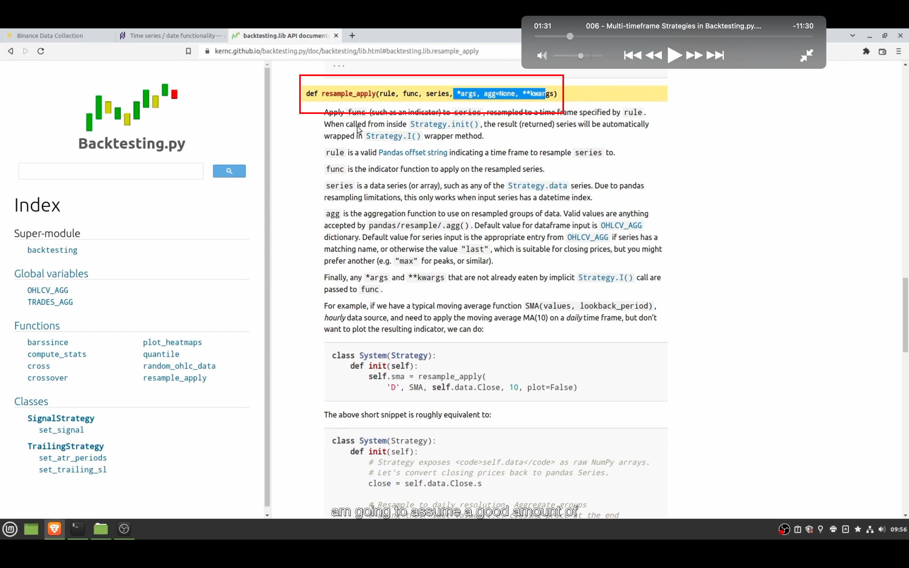
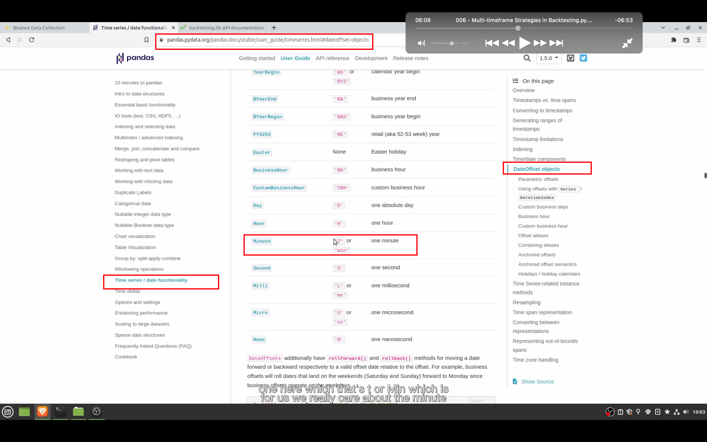
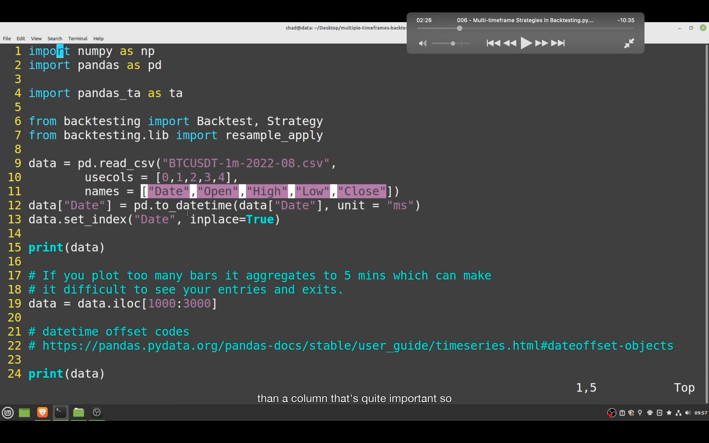
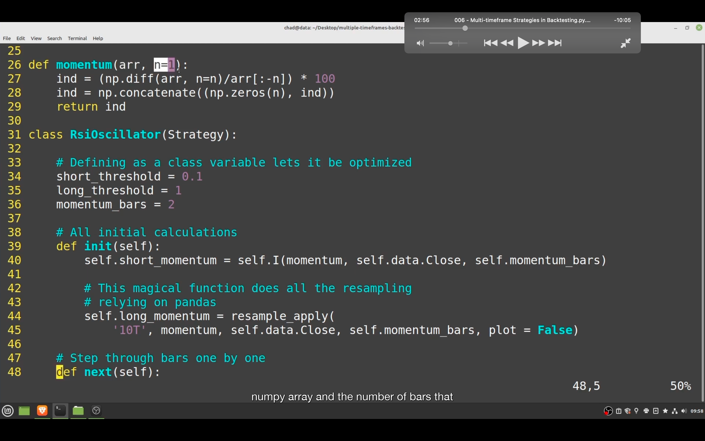
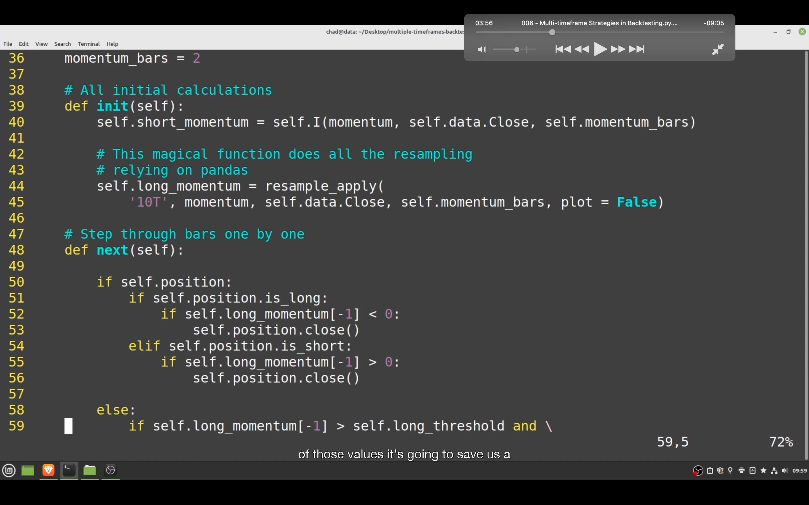
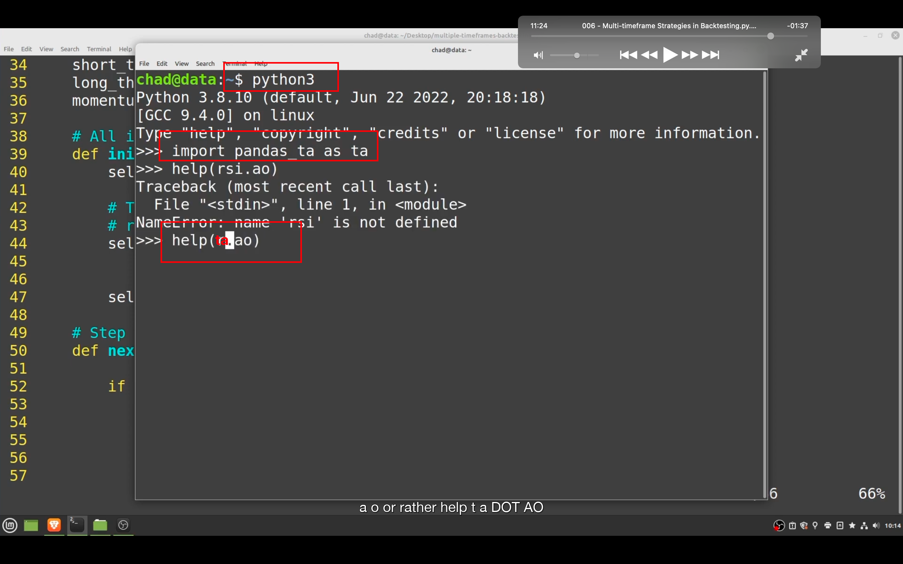

## 230128

</img>  
主要就是利用这个 def

</img>  
这里可以查到 pandas 的时间单位缩写。分钟不是 m 而是 T 或 min，因为 m 代表 month

</img>  
--=  
</img>  
--=  
</img>  
看图即可知道怎么使用不同长度时段作为 bar。视频代码未显示完全，就不做详细笔记了。此图是自己写的 indicator，视频还介绍了另外两种用库的 indicator 的方法，需要时再看。

</img>  
可以用此方法查看各种库策略的文档。
