## 230129

walk forward analysis is a common backtesting methodology used to reduce overfitting when researching and building strategy
.

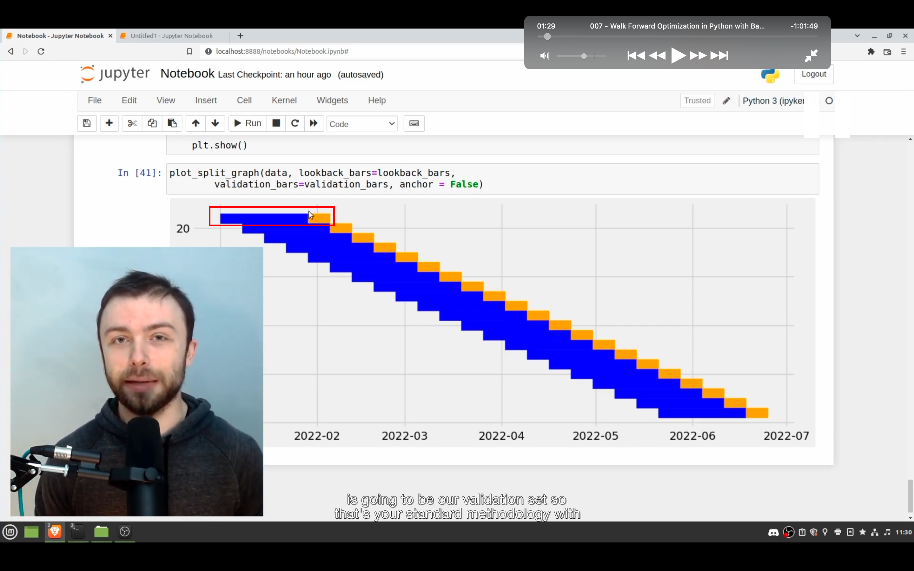</img>  
在前四周即第一行的蓝色区域做 optimization，第五周即橘黄色区域用最优化的参数来验证。即蓝色的是 training set，橘色的是 validation set。

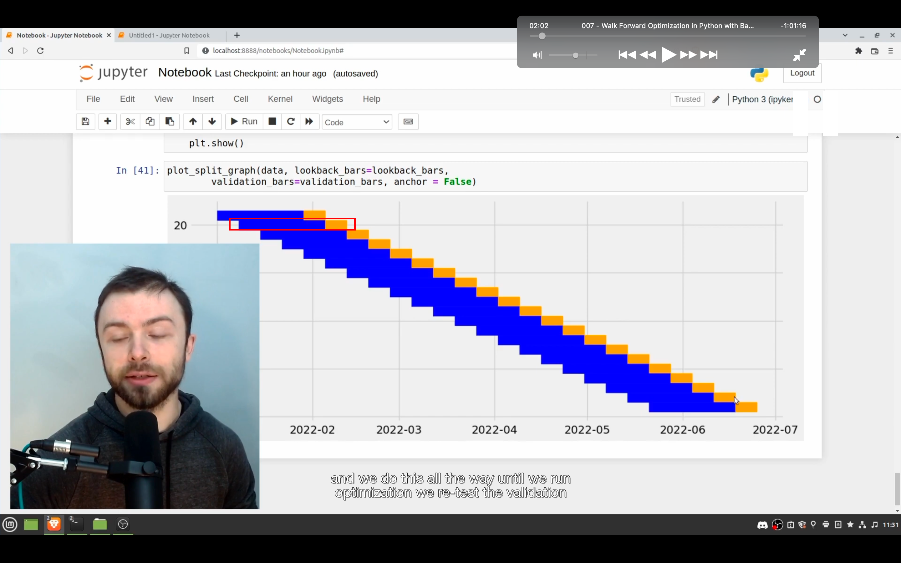</img>  
--=  
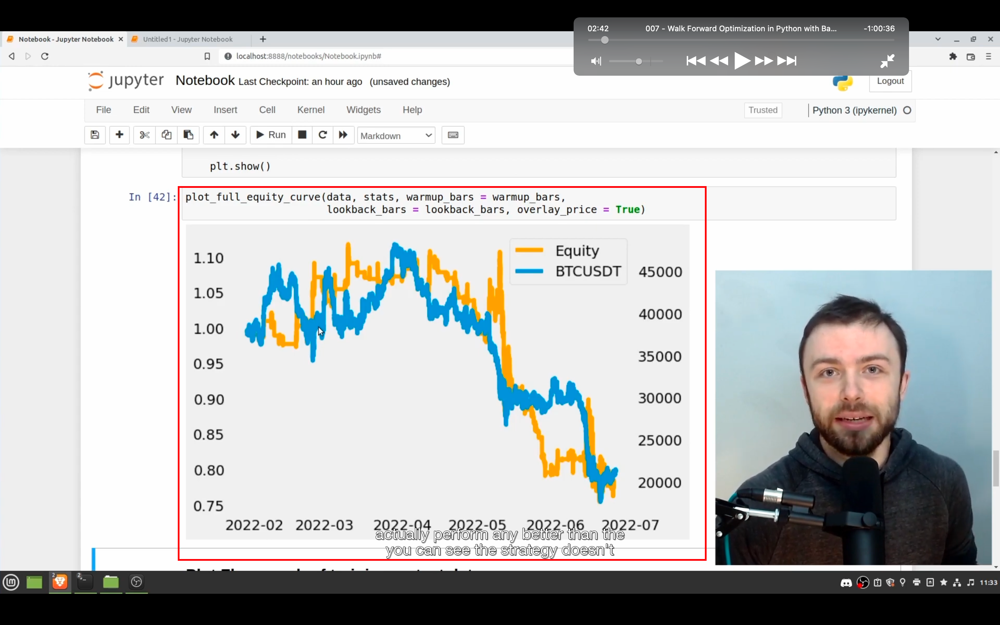</img>  
向前滚动一周（即 validation set 的长度）。即最优化 2-5 周的参数，用于第 6 周来验证。一直持续下去，直到最终完成最后一周的验证。最后会将每个 validation set 加起来，查看到 equity curve，如图二。这样就可以知道策略再没有样本的情况下表现怎样（即去处了过拟合的表现？）。可以看到其实策略表现并不怎样。

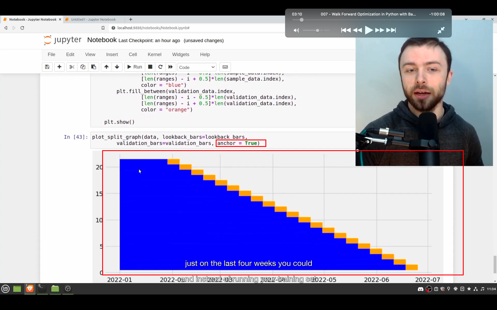</img>  
也可以设置 anchor = true，这样测试效果如图。但此视频不演示此方法。

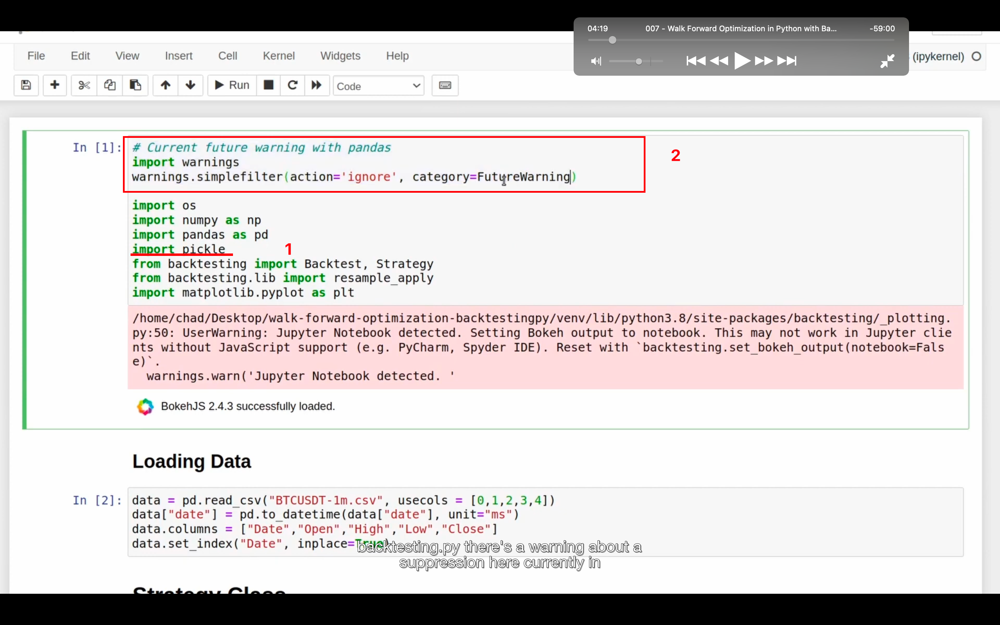</img>  
1，pickle 存储来自 walkforward backtest（需要一定时间运行） 的结果。  
2，取消 future warnning。  
loading data 的二三行可能需要交换位置

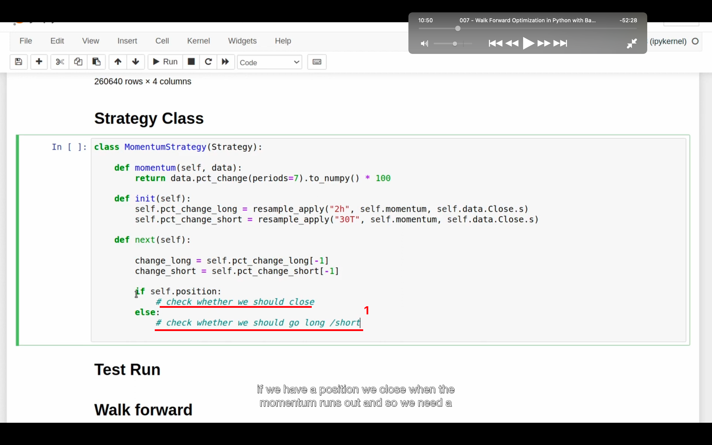</img>  
简单的 momentum 策略  
all in on everysingle trade  
1，买卖的本质思路。

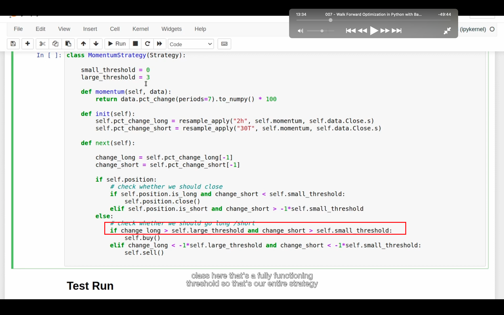</img>  
完整策略代码
当 2h 小时内上涨超 3 趴，且 30 分钟内至少上涨一点点就多。其余代码都说类似原理  
注意此截图 self.position 的 elif 部分最后忘了加 self.position.close()

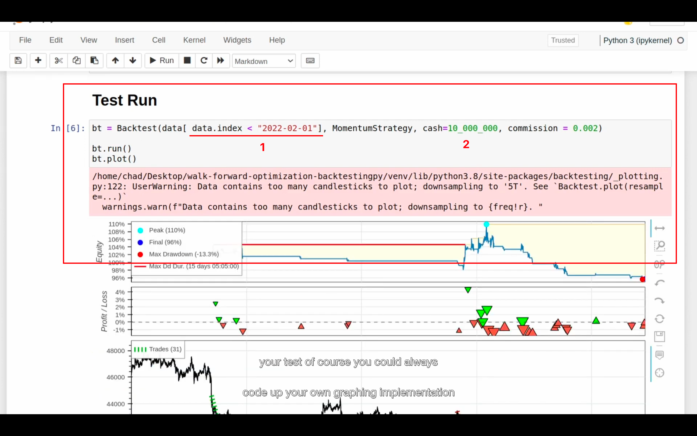</img>  
1，这样可以只策一部分  
2，bt 好像只能购买整数的 shares，所以测试比特币等大单价物，将 cash 加大很多结果更精确。

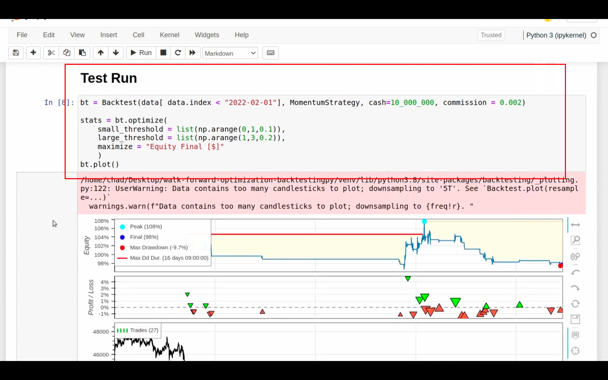</img>  
优化结果

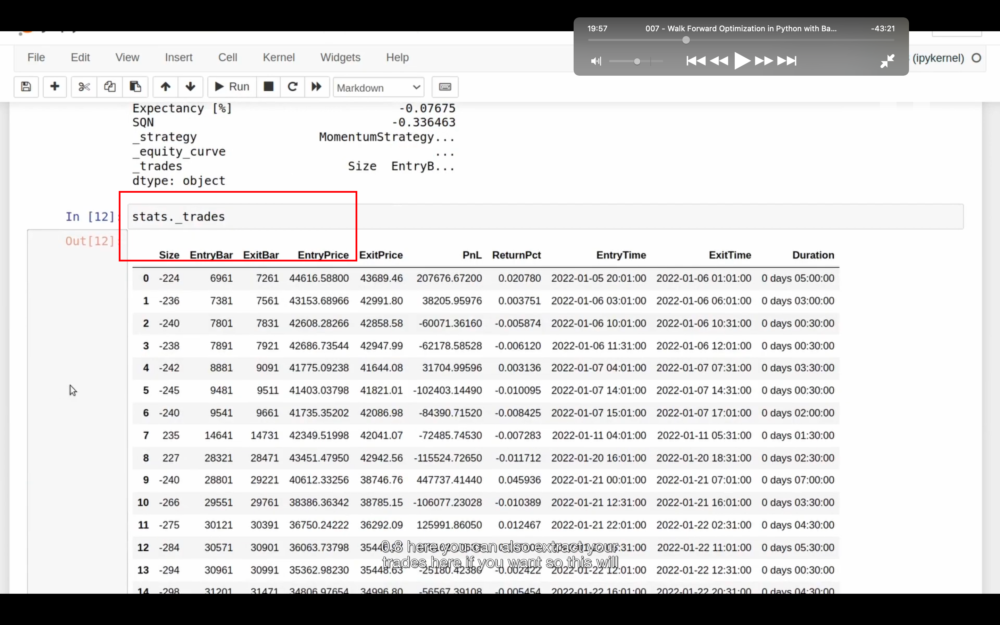</img>  
stats.\_trades 可以得到所有交易。其它变量还可以得到很多信息，具体看视频

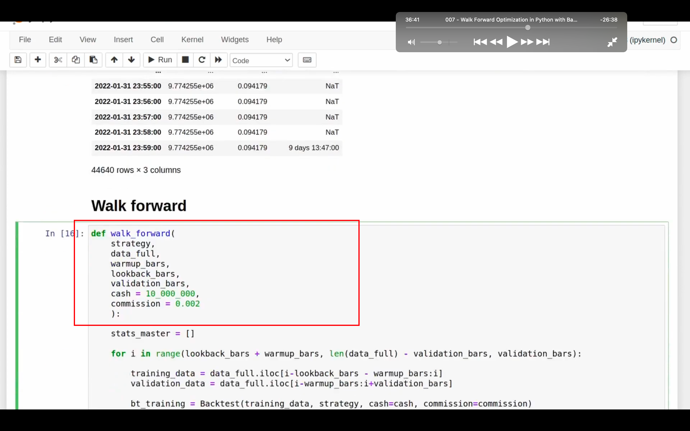</img>  
--=  
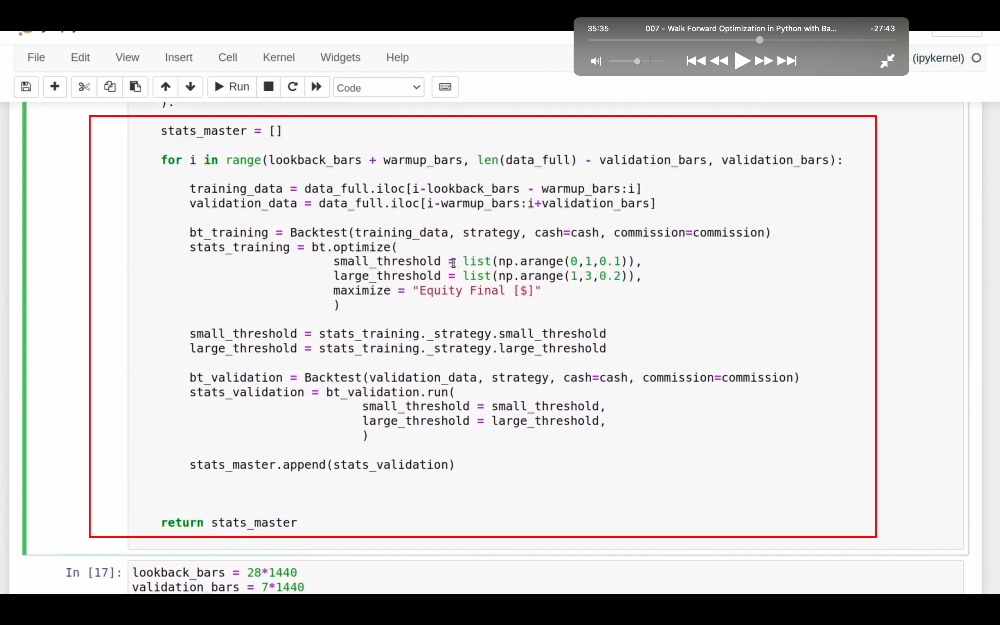</img>  
--=  
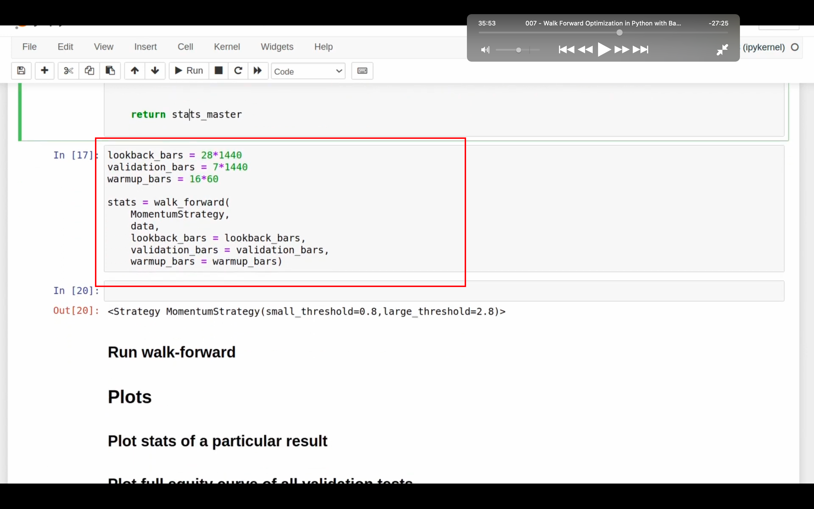</img>  
lookforward backtest 代码。需要再仔细学习。 2045-3600  
这些代码其实足够了，但之后内容还会教做视觉化等操作。较难，暂时省略
