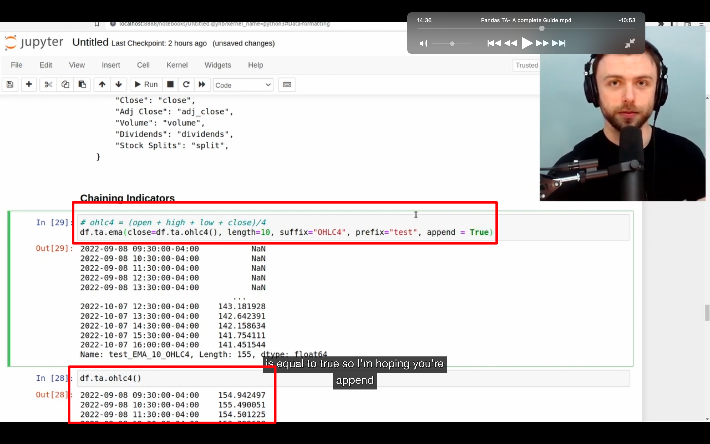
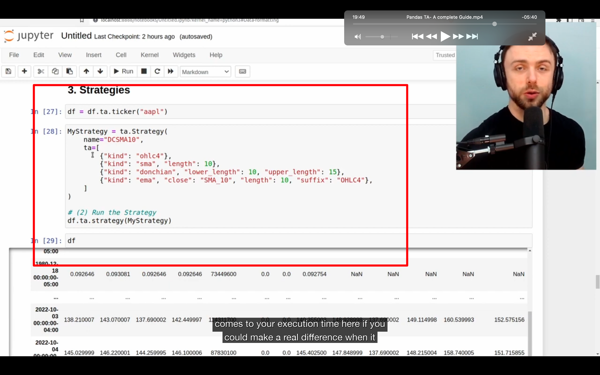
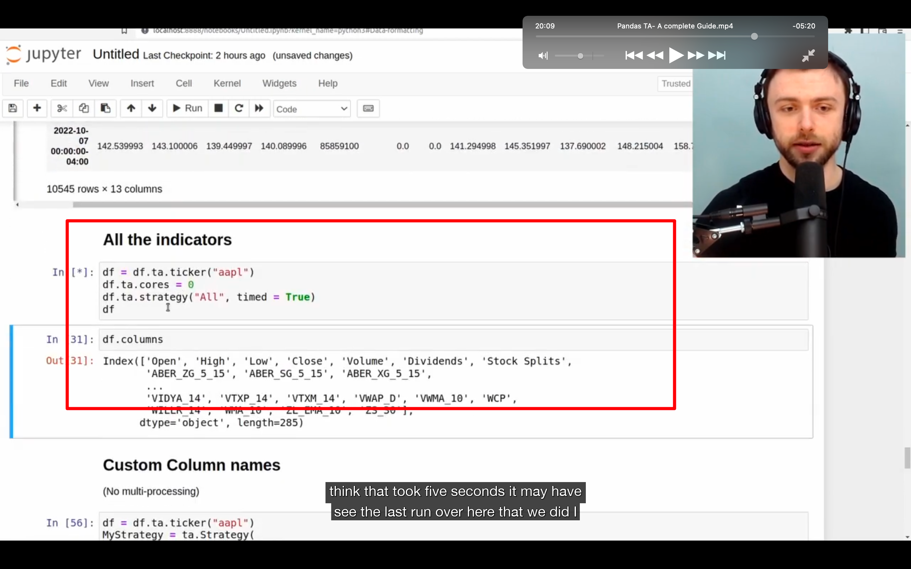
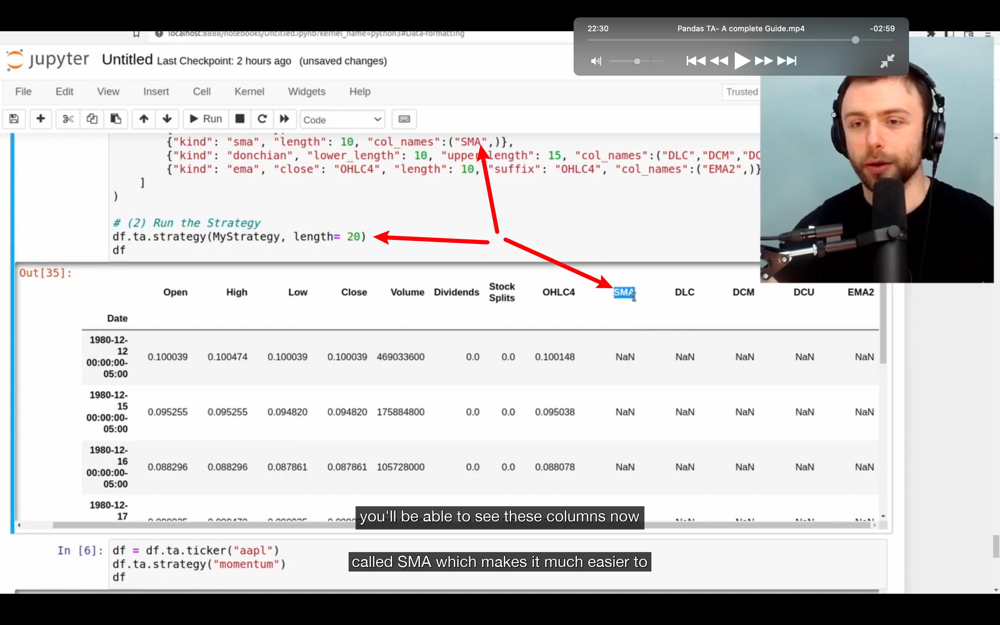
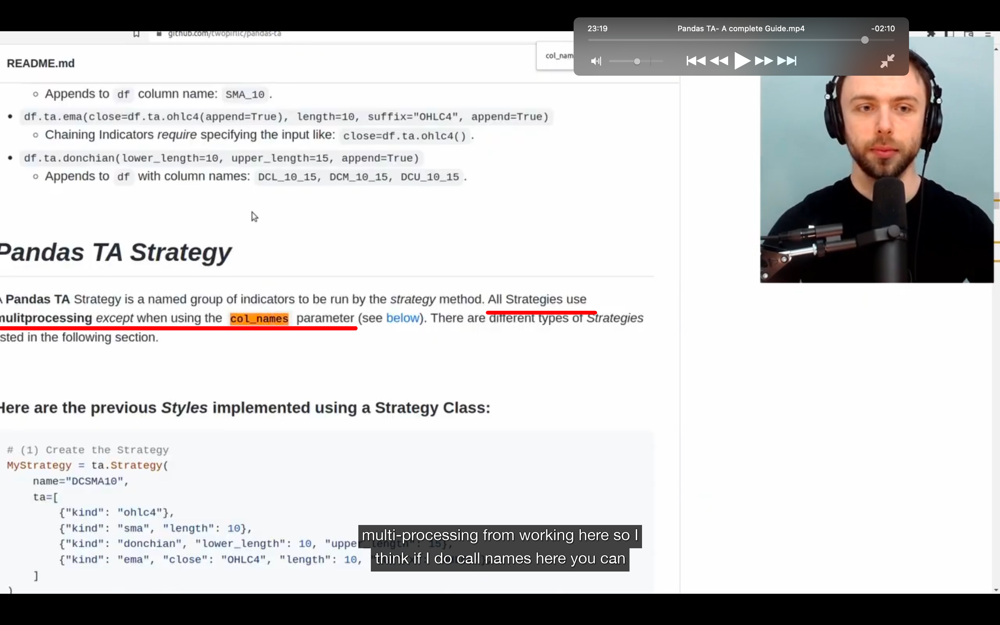
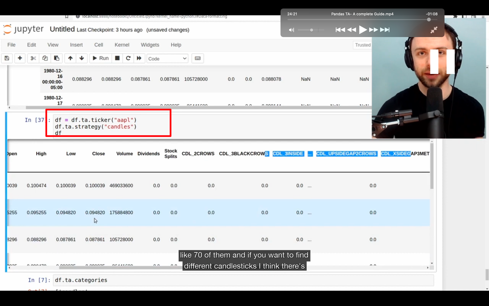
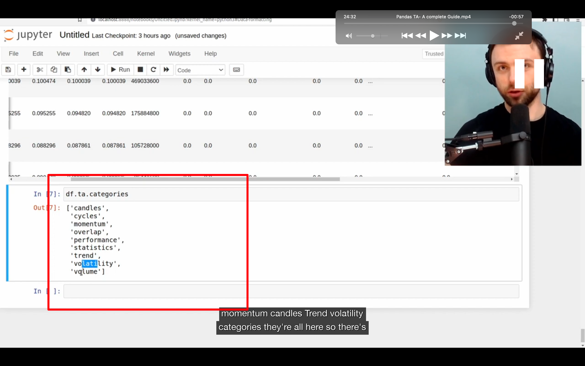

## 230129

https://www.youtube.com/watch?v=W_kKPp9LEFY

</img>  
1，pandas ta 有一个 yfinance integration，所以如果你安装了 yfinance，就可以创建一个空 df。  
2，用此方法就可以获得股票数据  
在 finance.yahoo.com/quote/amzn 可以获得 amzn 即亚马逊的 symbol。其它股票数据同样的方法可获得

</img>  
可以搭配不同单位，获得不同的数据  
但注意有限制。如超过限制则只能自己找数据源

### 图略

help(df.ta)可以获得整个库的文档  
help(df.ta.indicators())可以获得 indicators 的文档。此文档中可以看见指标名如 aberration(似乎显示不完全，完整的见：https://github.com/twopirllc/pandas-ta#indicators-by-category)  
hlep(ta.aberration)可以获得具体指标的文档  
其中似乎 df 必须是空 df。
ta 似乎没有官方文档，所以最好用这种方式来了解各个指标。当然也可以去 github 库搜相关指标关键词看源码

</img>  
--=  
</img>  
实例，掌握这个就足够了，但是还可以掌握以下两个 feature，会提高不少效率

</img>  
可以 df 这样直接调用 ta。会自动抓取 df 里的 close 列。这样就方便了很多，特别是需要添加很多列的情况下。

</img>  
ta 会自动推测列名。如上图的 bbands 需要 close 作为参数。则 close，Close 都行。

## 230130

</img>  
chaining indicators，大概意思是可以把各列进行运算得到个新列。每一行都自动运算，成一条链。如这里每一行都将 ohlc 进行了运算。  
注意 output 的结果有误，因为之前没加 append = true  
可以设置后缀 suffix，前缀 prefix，方便识别  
Exponential Moving Average (EMA)，类似 SMA，但是给越近的数据越高的权重。

</img>  
--=  
</img>  
大概意思是可以同一个 df 同时跑多个甚至所有指标。较繁琐，需要时再仔细看

</img>  
如不加 col_names，则列名会根据 length 显示为 sma_20

</img>  
但似乎加了 col_names 会导致程序不能多线程运行？

</img>  
--=  
</img>  
还可以运行同种类的所有指标。图二显示了所有种类名字
