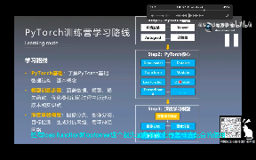
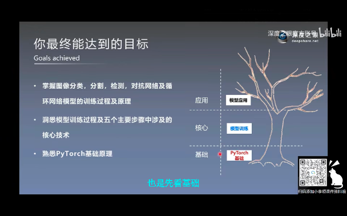

## 0301

### pytorch 深度学习开发者用的，很热门，快赶超第一的 tensorflow 了。

</img>  
pt 优点

</img>  
人工智能包含机器学习，机器学习包含深度学习。深度学习是搞笑的机器学习算法

</img>  
--=  
</img>  
学哪些知识

</img>  
--=  
</img>  
学习路径

</img>  
学习路线

</img>  
能达到的目标

</img>  
其它可能要学的

