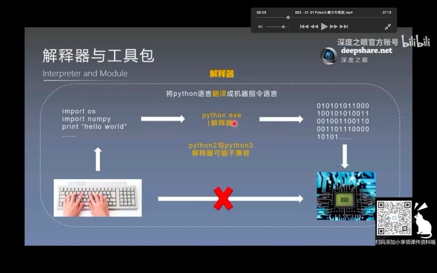
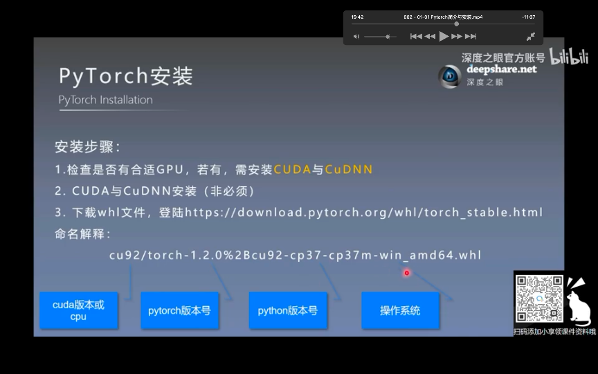
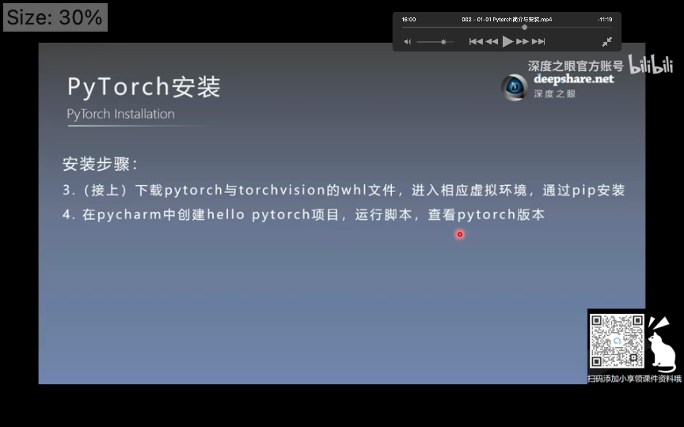
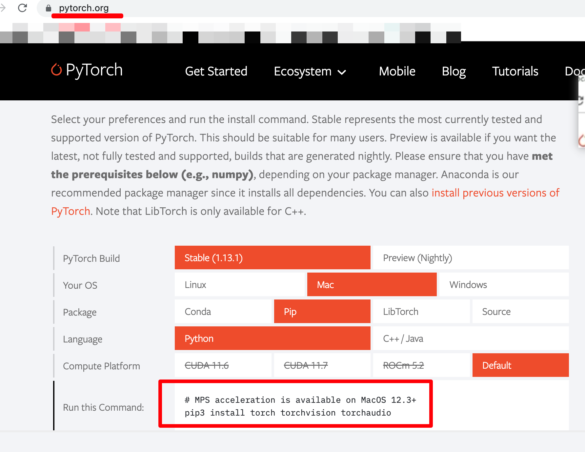

## 0301

</img>  
安装

</img>  
...

</img>
--=  
</img>  
安装

</img>  
以这个为准安装
python 太新会提示 ERROR: Could not find a version that satisfies the requirement torch (from versions: none)

### 以上可以忽略，直接看这个：

创建 python=3.7 虚拟环境  
conda create -n pytorch_gpu python=3.7  
进入虚拟环境  
conda activate pytorch_gpu  
按上图的提示安装  
pip3 install torch torchvision torchaudio

进入 pycharm，选择刚刚的环境

```
import torch
print("hello pytorch {}".format(torch.__version__))
```

输出：hello pytorch 1.13.1  
运行成功

在 jupyter notebook 运行可能会报错
