## 230319

## Basic RSI strategy

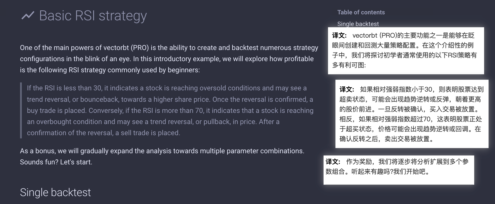</img>

### single backtest

</img>
--=  
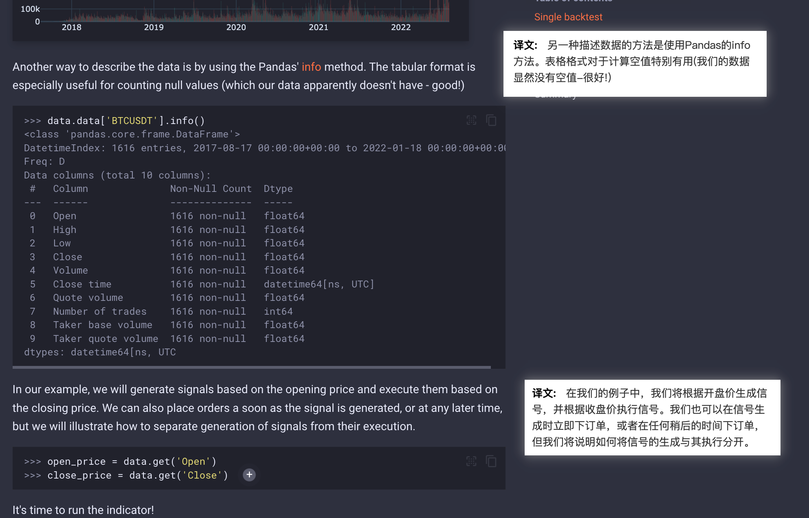</img>  
--=  
</img>  
--=  
</img>  
--=  
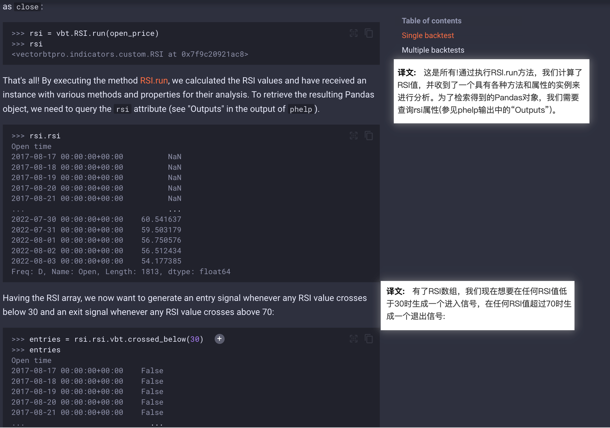</img>  
--=  
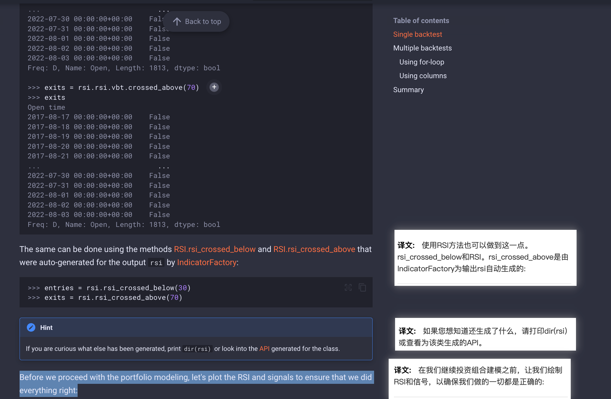</img>  
--=  
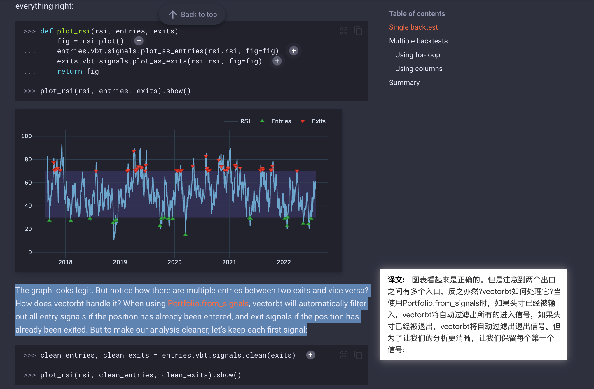</img>  
--=  
</img>  
--=  
</img>  
--=  
</img>  
--=  
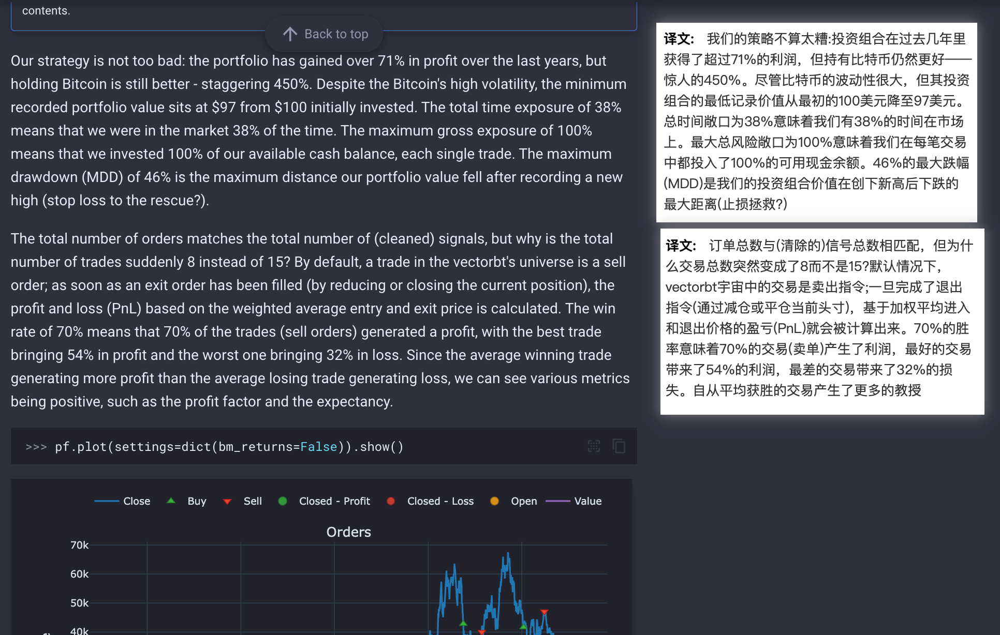</img>  
--=  
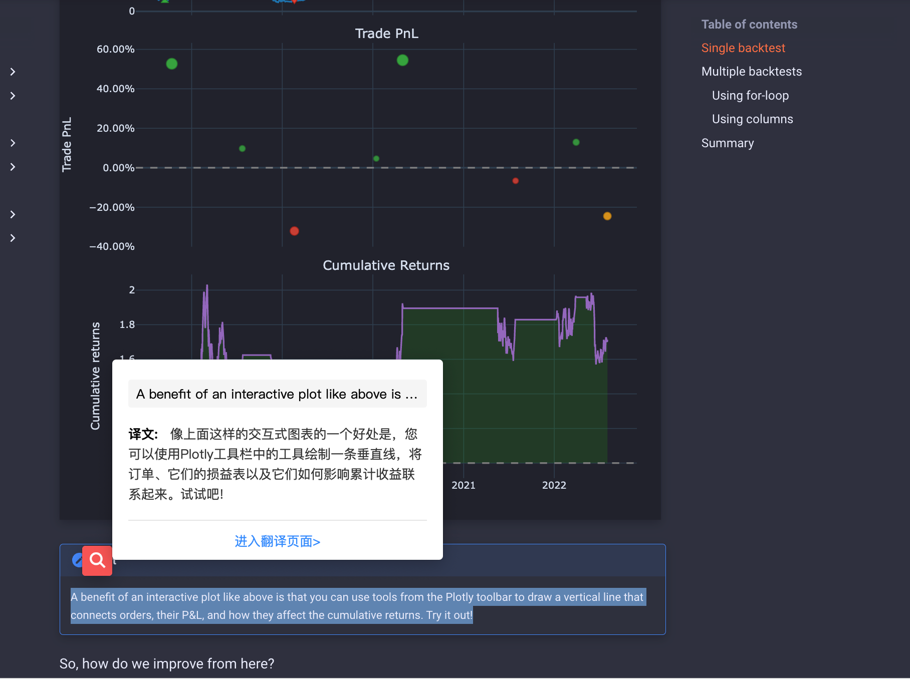</img>  
--=

### Multiple backtests

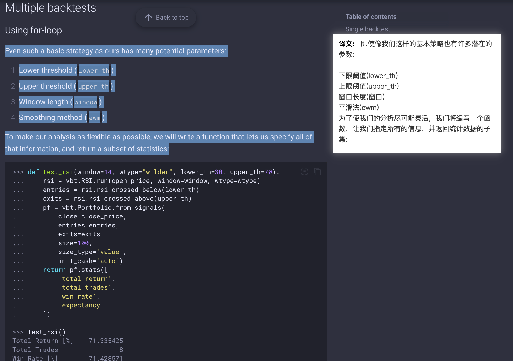</img>  
--=  
</img>  
--=  
</img>  
--=  
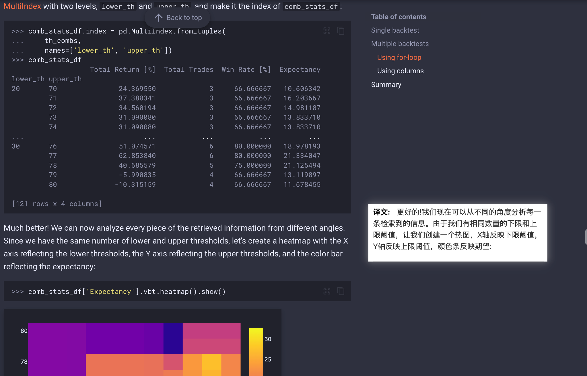</img>  
--=  
</img>  
--=  
</img>  
--=  
</img>  
--=  
</img>  
--=  
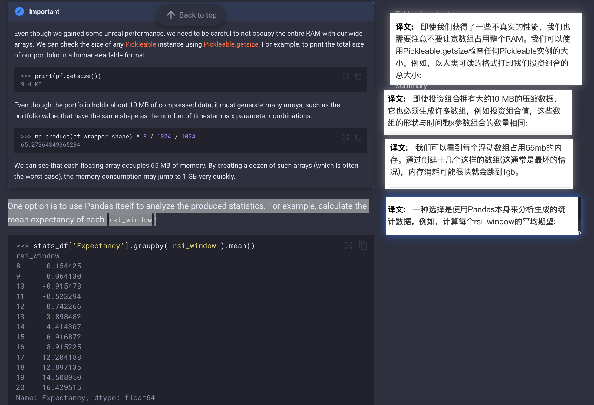</img>  
--=  
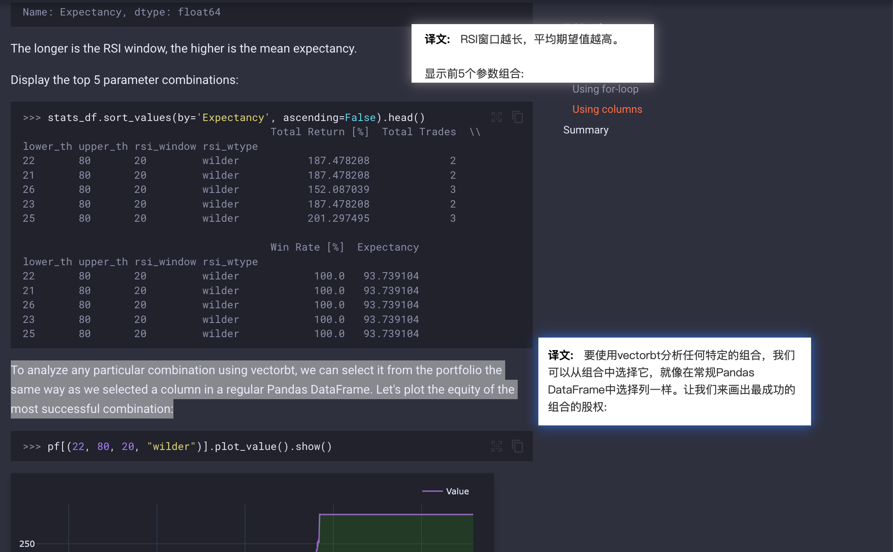</img>  
--=  
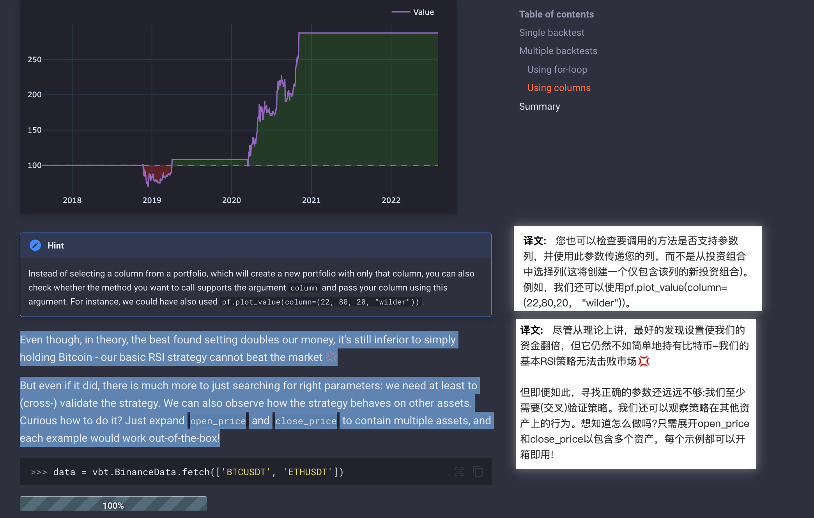</img>  
--=  
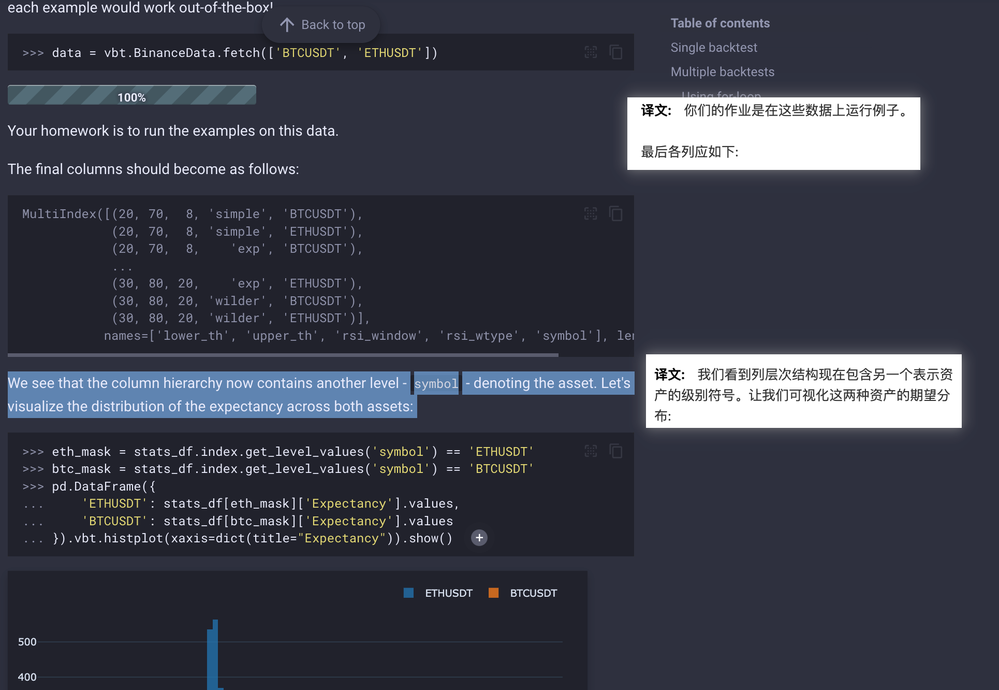</img>

### summary

</img>
