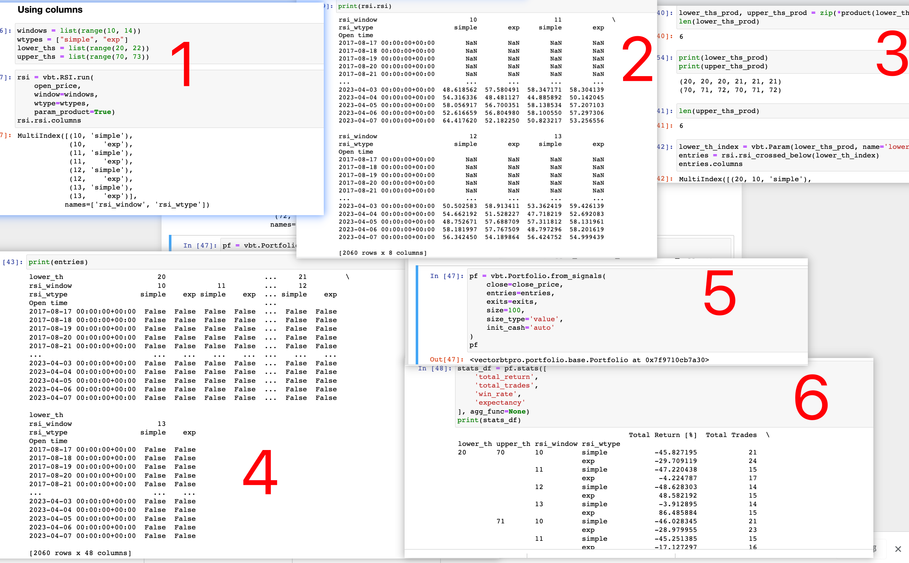

</img>  
减少教程代码的参数，即可较清楚理解

1-2，根据 2 个 rsi 计算公式参数和 4 个 window 参数。计算出共 8 种 rsi 可能性。
3，计算出所有可能的 lower_thres 和 higher_thres 组合。但以 lower 和 higher 分开取值，分别为不同的 lower list 和 higher list。再转换为可被 vbt 使用的参数。  
3-4，根据 lower list 中的不同值和 rsi 中的不同值穷举结合得到 entries。同理可得到 exits。  
5，把 entries 和 exits 代入 pf 中。  
6，算出各种可能性的结果。（注意此时不再穷举结合了。而是一个 entry 对应一个 exit，它们所在的列名需一样，即它们的各种可变参数都一样，即 rsi 的种类，window 的大小是一样的。这样就能穷举完所有可能性）
