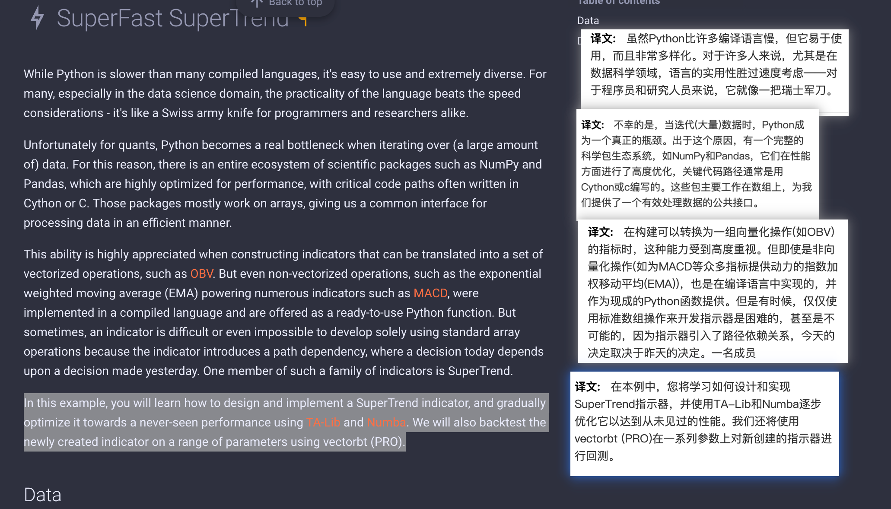
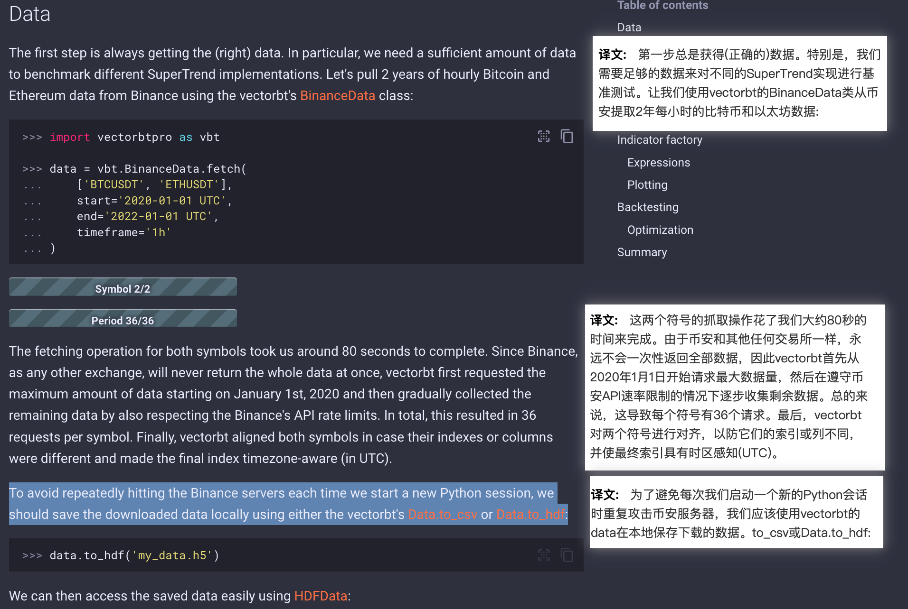
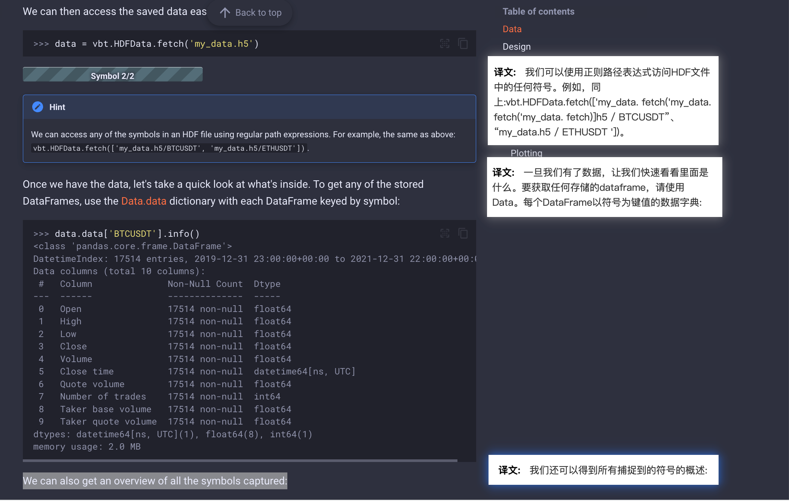
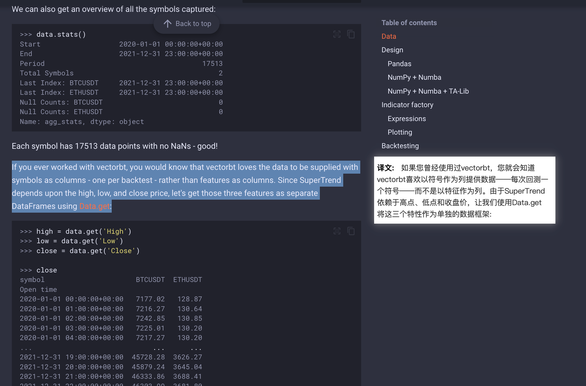
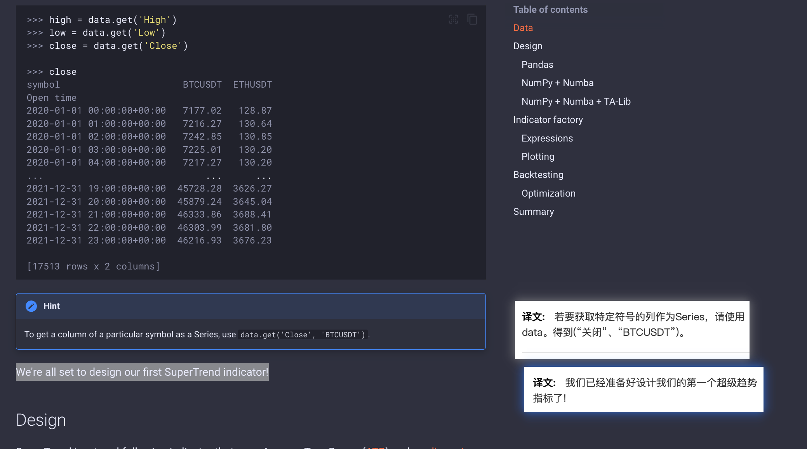
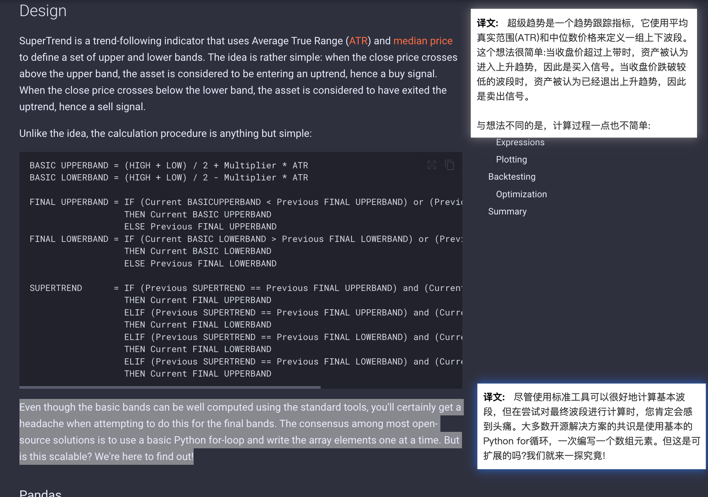
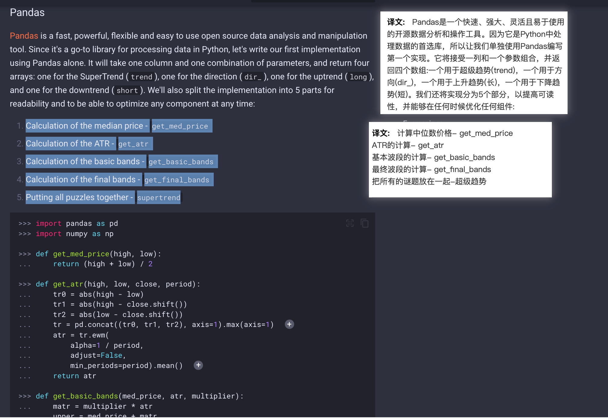
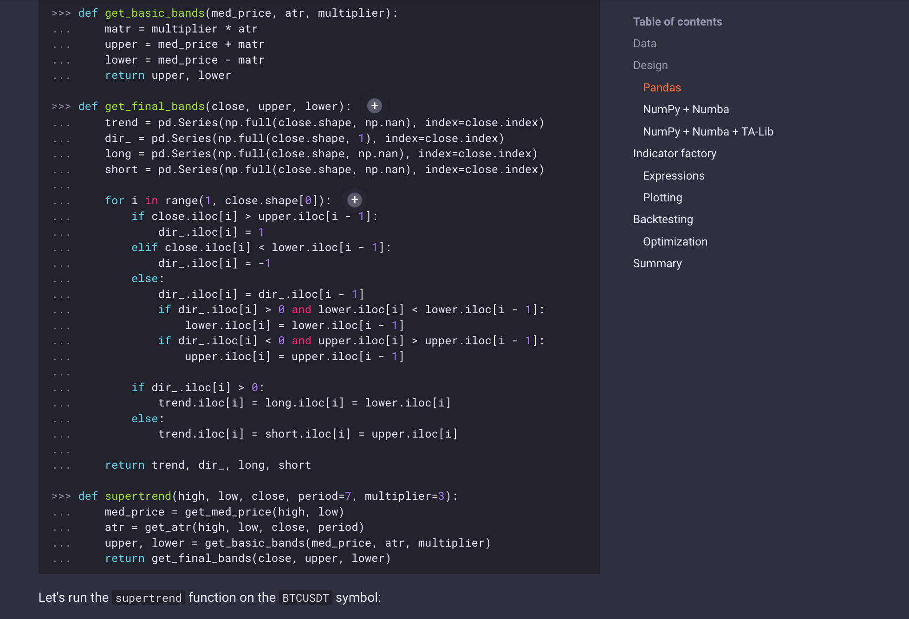
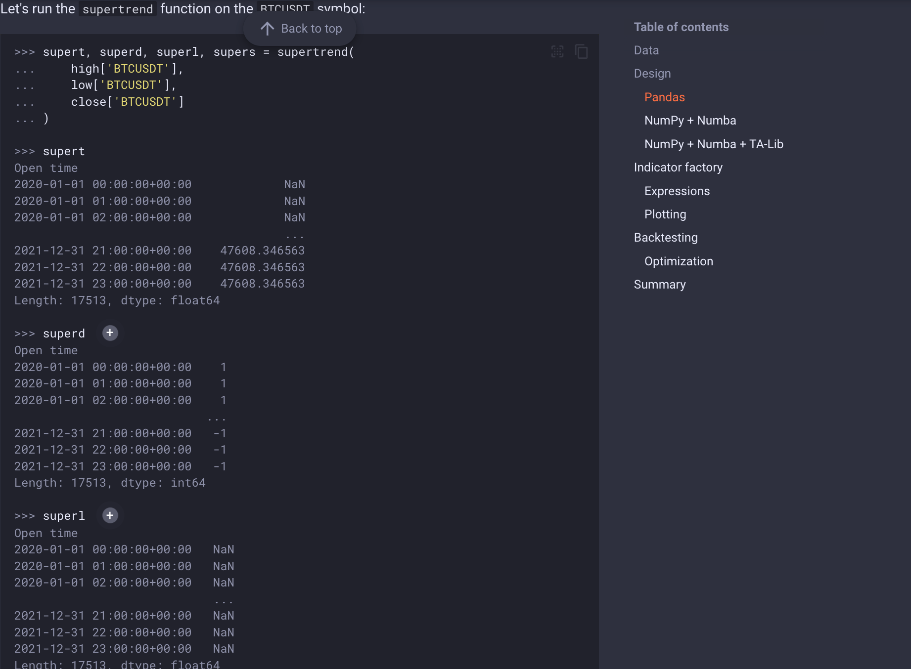

## 230319

## SuperFast SuperTrend

</img>  
--=  
这段话主要介绍了 Python 语言的优缺点以及在数据科学领域中的应用。虽然 Python 比许多编译语言慢，但易于使用且功能多样。对于许多人来说，特别是在数据科学领域，语言的实用性胜过速度考虑 - 它就像程序员和研究人员的瑞士军刀。

然而，对于量化交易者来说，当迭代（大量）数据时，Python 成为一个真正的瓶颈。因此，有一个整个生态系统的科学包，如 NumPy 和 Pandas，它们高度优化了性能，关键代码路径通常是用 Cython 或 C 编写的。这些包大多在数组上工作，为我们提供了一种处理数据的有效方式的通用接口。

当构建可以转换为一组矢量化操作的指标（例如 OBV）时，高度赞赏这种能力。但是，即使是非矢量化操作，例如指数加权移动平均线（EMA），也是用编译语言实现的，并作为一个现成的 Python 函数提供。但有时，指标很难甚至不可能仅使用标准数组操作开发，因为指标引入了路径依赖性，其中今天的决策取决于昨天做出的决策。这类指标家族的一个成员是 SuperTrend。  
（  
ask：这里的矢量化操作和非矢量化操作具体是指什么呢？  
answer：根据上下文，矢量化操作指的是可以应用于整个数组的操作，而非矢量化操作则需要对数组中的每个元素进行单独的计算。在 Python 中，使用 NumPy 和 Pandas 等科学包可以高效地进行矢量化操作，因为这些包的关键代码路径通常是用 Cython 或 C 编写的，从而提高了性能。例如，指数加权移动平均线（EMA）是一种常见的技术指标，可以通过 NumPy 中的函数进行矢量化计算。  
然而，有些指标具有路径依赖性，其中今天的决策取决于昨天做出的决策。这些指标很难甚至不可能仅使用标准数组操作开发。在这种情况下，需要使用其他方法来实现这些指标。在本例中，SuperTrend 是这样一种指标，需要使用其他方法来实现。  
)  
在这个例子中，您将学习如何设计和实现一个 SuperTrend 指标，并逐步使用 TA-Lib 和 Numba 进行优化，以实现前所未有的性能。我们还将使用 vectorbt（PRO）在一系列参数上回测新创建的指标。
</img>  
--=         

HDF文件是一种用于存储和管理大量数据的文件格式。它的优点包括：

- 支持多种数据类型和数据结构，包括数字、字符串、数组、表格等等。
- 可以存储大量数据，因为它使用二进制格式，可以压缩数据并减少存储空间。
- 可以快速读取和写入数据，因为它使用了索引和块状存储技术。
- 可以在不同的平台和编程语言之间共享数据，因为它是一个开放的标准。

然而，HDF文件也有一些缺点：

- 它需要特定的软件库来读取和写入数据，这可能会增加开发和维护的成本。
- 它可能不适合存储小量数据，因为它的文件头和索引可能会占用较大的存储空间。
- 它可能不适合存储需要频繁修改的数据，因为它的块状存储技术可能会导致数据碎片化和性能下降。

总的来说，HDF文件是一种非常有用的文件格式，特别适合存储和管理大量数据。但是，在选择文件格式时，需要考虑到具体的应用场景和需求，以便选择最合适的文件格式。
</img>  
--=  
</img>  
--=  
</img>

### design

</img>

### pandas

</img>  
--=  
</img>  
--=  
</img>
