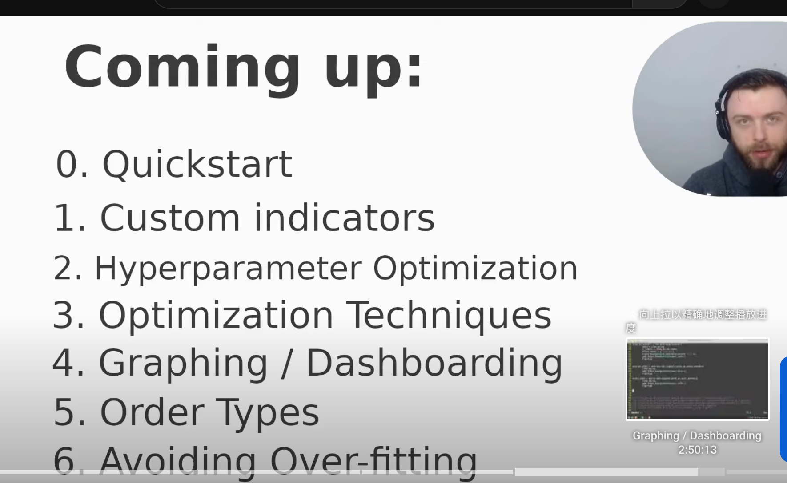

## 230317

before 0636

参数优化是这个库做得最好的，视频教程作者没见过更好的。

</img>  
此视频要讲的内容

```
(00:00:00) Course Introduction
(00:06:36) Quickstart
(00:32:51) Creating Custom Indicators
(01:14:47) Parameter Optimization
(01:45:52) Optimization Techniques
(02:14:59) Graphing / Dashboarding
(02:55:21) Order types, stop-loss, take-profit, shorting
(03:18:21) Avoiding Over-fitting
```
