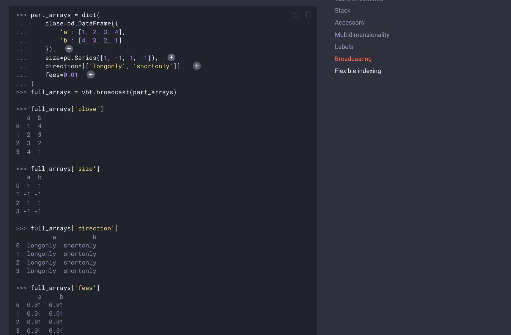

## 230318

## Fundamentals

</img>

### stack

</img>  
--=  
</img>  
--=  
</img>  
--=  
</img>  
--=  
</img>  
--=  
</img>  
--=  
</img>  
以上代码不用学会，大意是 numpy arrays 很快但是不易读，pandas 易读但是不快。numba 可以以机器码的形式进行 for 循环（即易读且快？），但 numba 只理解 numpy 不理解 pandas。vectorbt 就发挥了作用，它使用 numba 复制了很多 pandas 函数。大概就是实现了又快又易读？？？

### Accessors/存取器

</img>  
--=  
</img>

### Multidimensionality/多维数

</img>  
--=  
</img>  
--=  
</img>  
--=  
</img>

### Labels/标签

</img>  
--=  
</img>

### broadcasting

</img>  
--=  
</img>

### 之后还有很多内容，但应该都是概念性的东西，说明为什么要这么做，暂时省略
