## 230317

pip install vectorbt  
如有 numpy 报错，则执行以下  
pip install numpy==1.20

自己看视频前就装了，用的是  
pip install -U "vectorbt[full]"  
装了很久，运行会报错，根据报错找到文件，修改下文件名即可，暂不知道是否会导致之后的错误

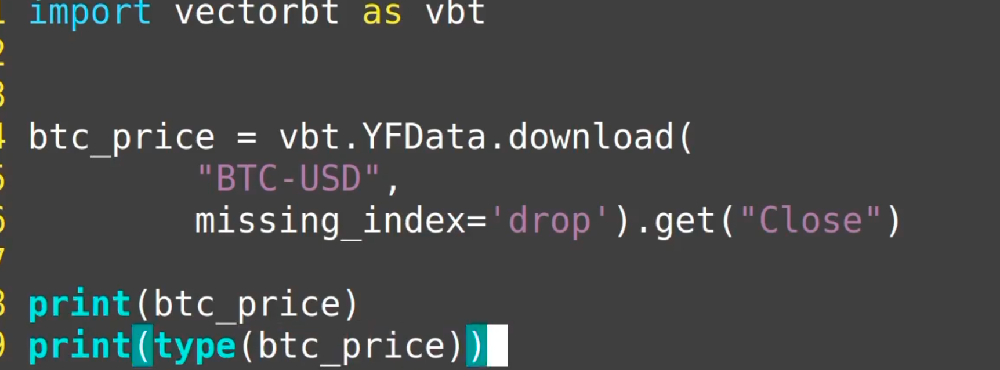</img>  
--=  
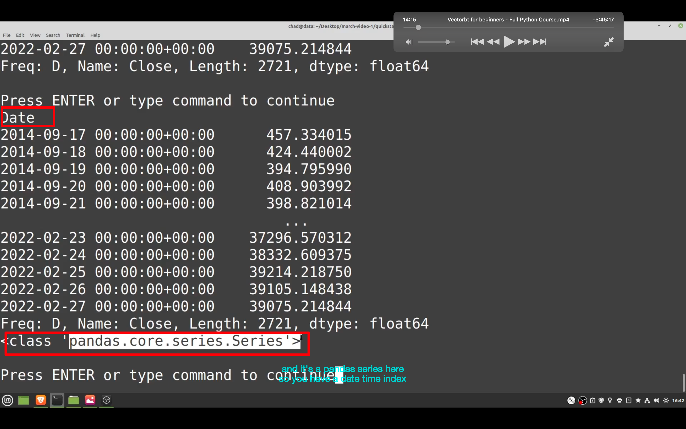</img>  
用自带的 YFData 获取数据  
也可以自己用 csv 等，但需要保证有 date index 和类型是 pandas.series  
BTC-USD 后加上 ETH-USD 就可以增加一列。但注意只取两者共用的 index。

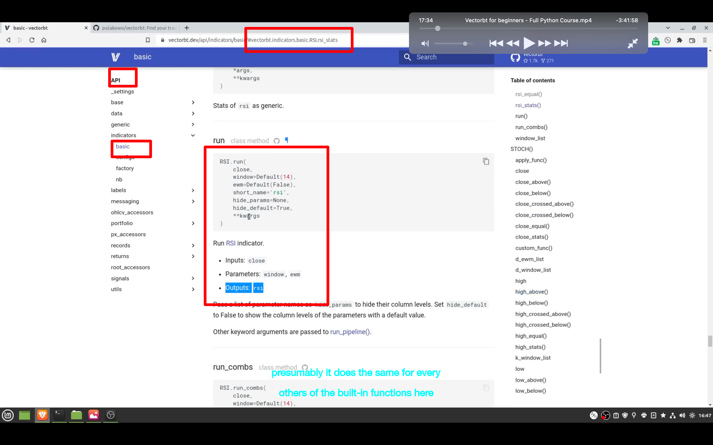</img>  
官方文档找到 rsi 插件

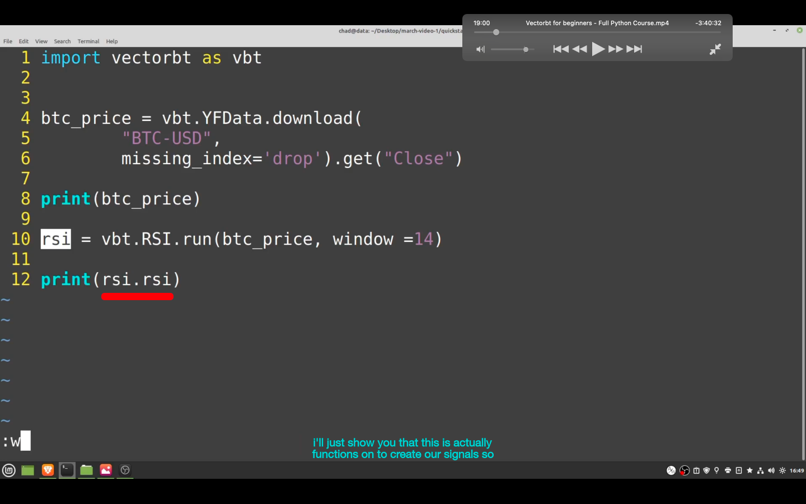</img>  
--=  
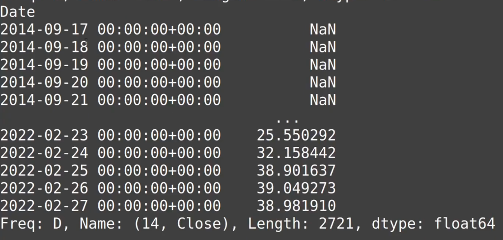</img>  
执行 rsi，注意，要用 rsi.rsi 才能看到直接效果。单独一个 rsi 的话会很复杂，因为可以方便的用它调用各种方法

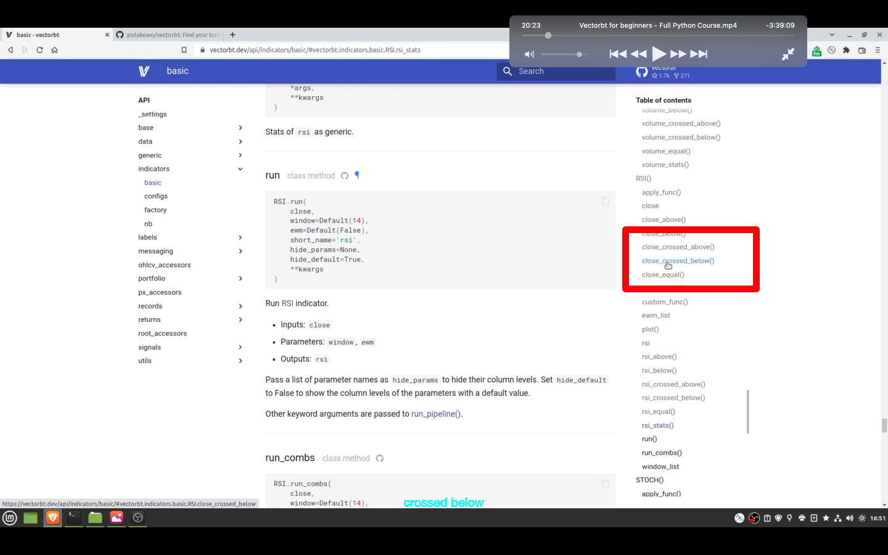</img>  
--=  
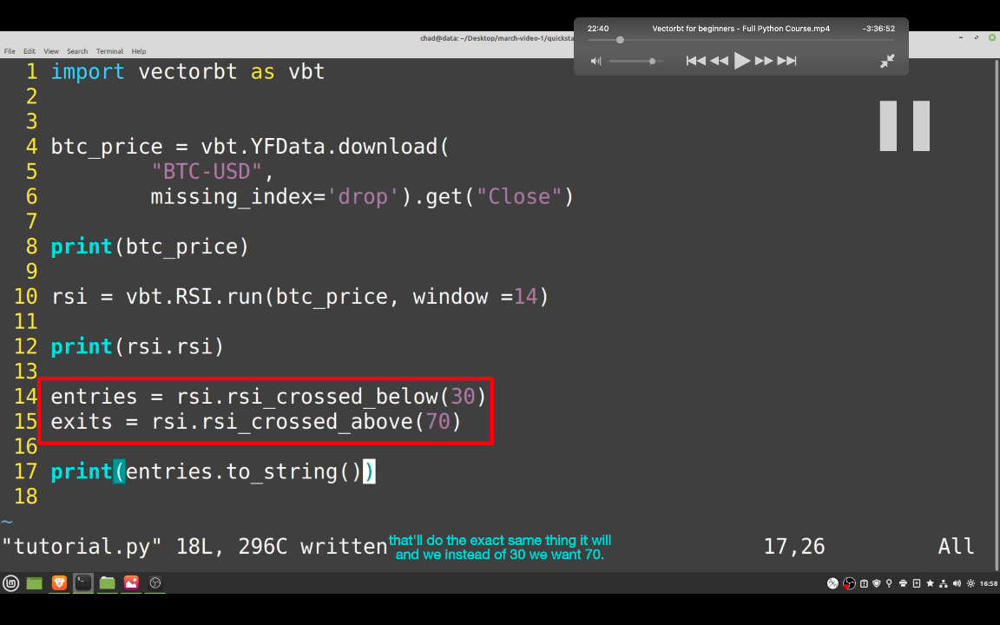</img>  
--=  
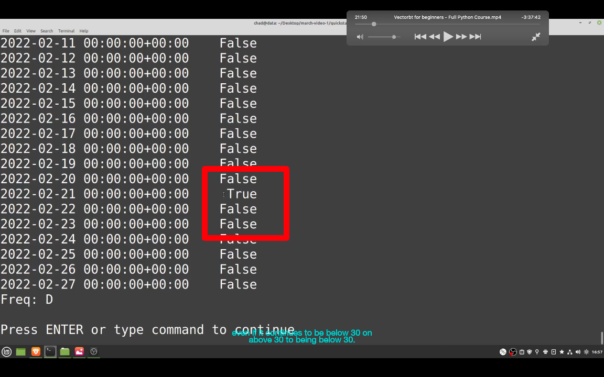</img>
如图，设置出入点

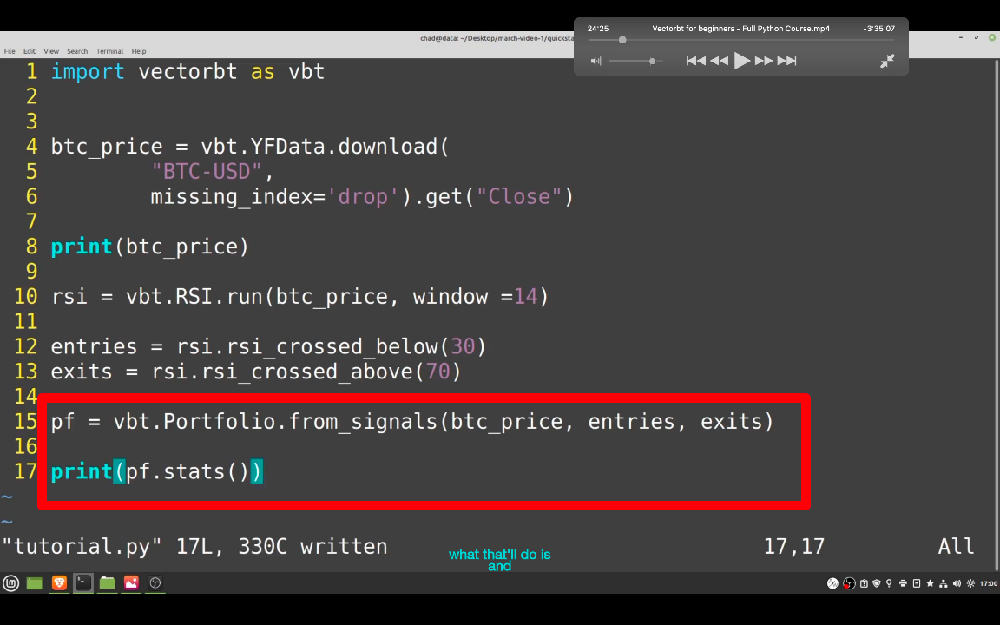</img>  
--=  
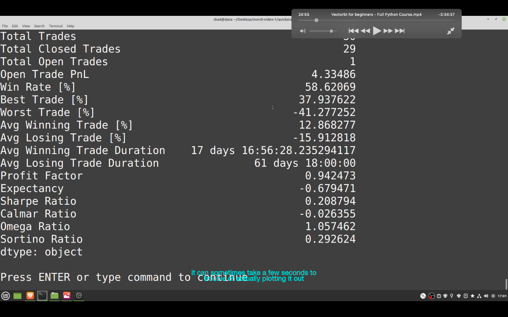</img>  
portfolio  
回测，并打印出成绩  
简单来说，提供 price，出入点就行了  
也可以打印 pf.total_return()等

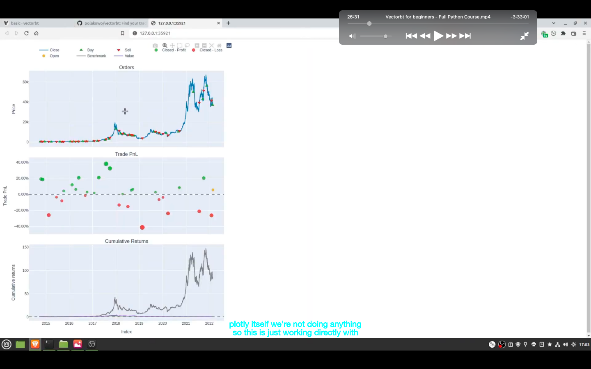</img>  
pf.plot().show()  
最简单的画图

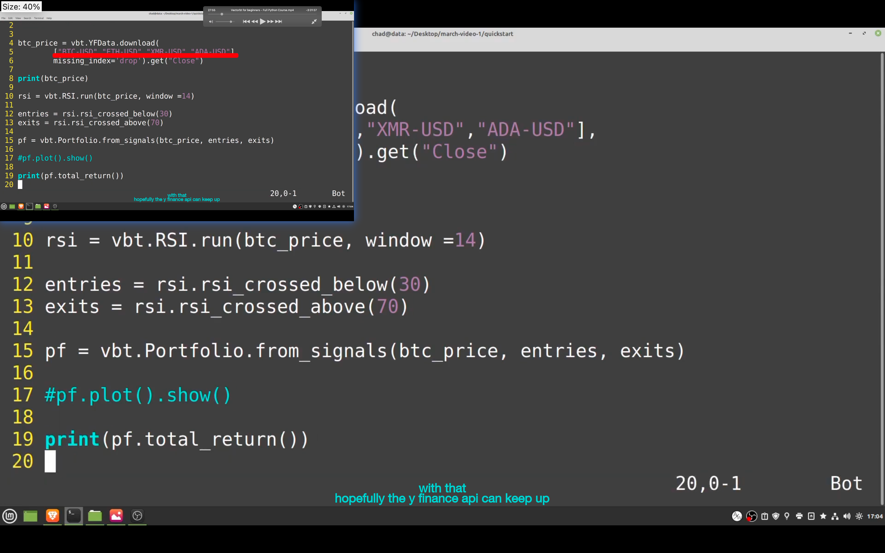</img>  
--=  
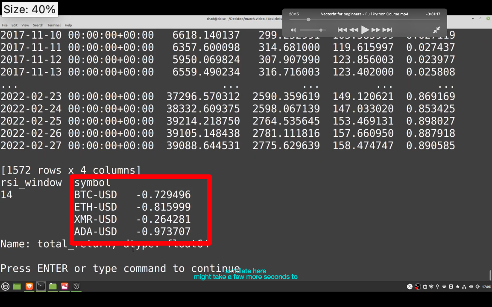</img>
多个组合快速测试

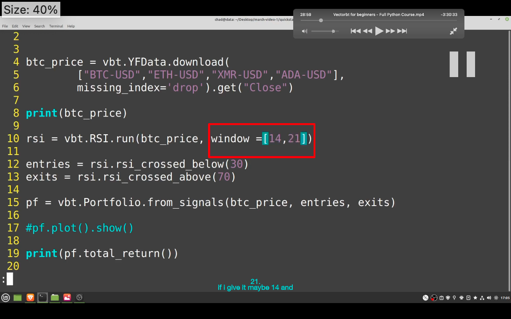</img>  
--=  
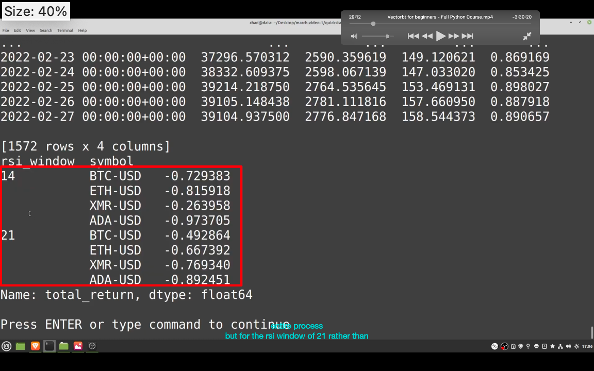</img>
多参数效果

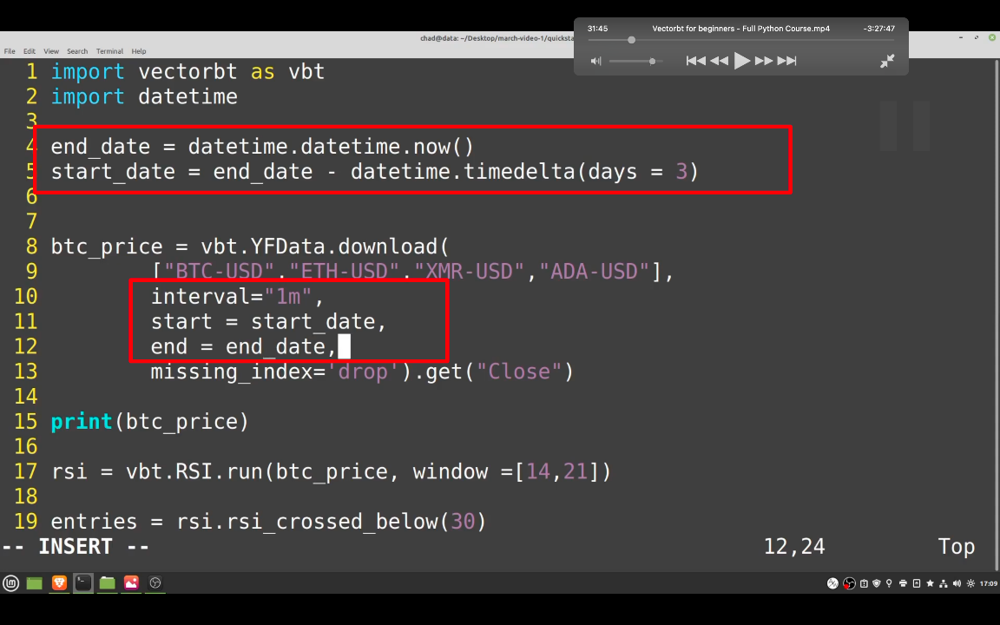</img>  
--=  
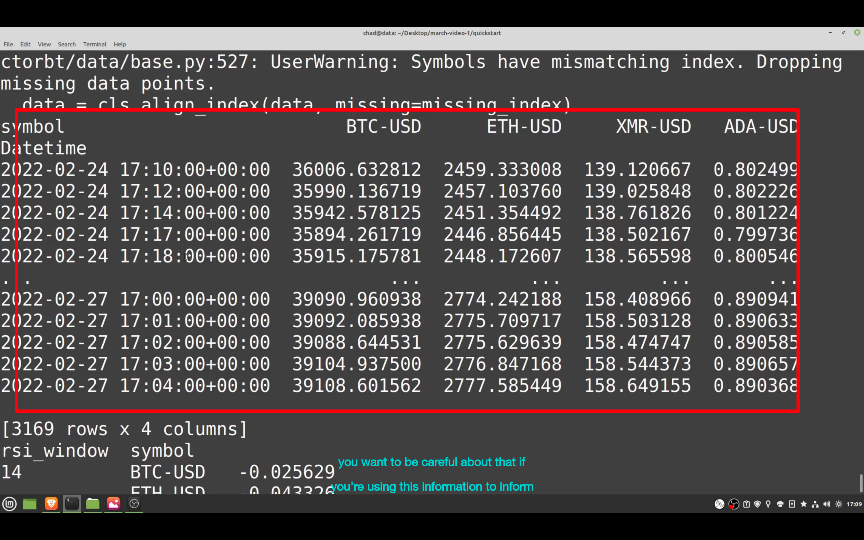</img>  
指定时间单位和区间
