## 230317

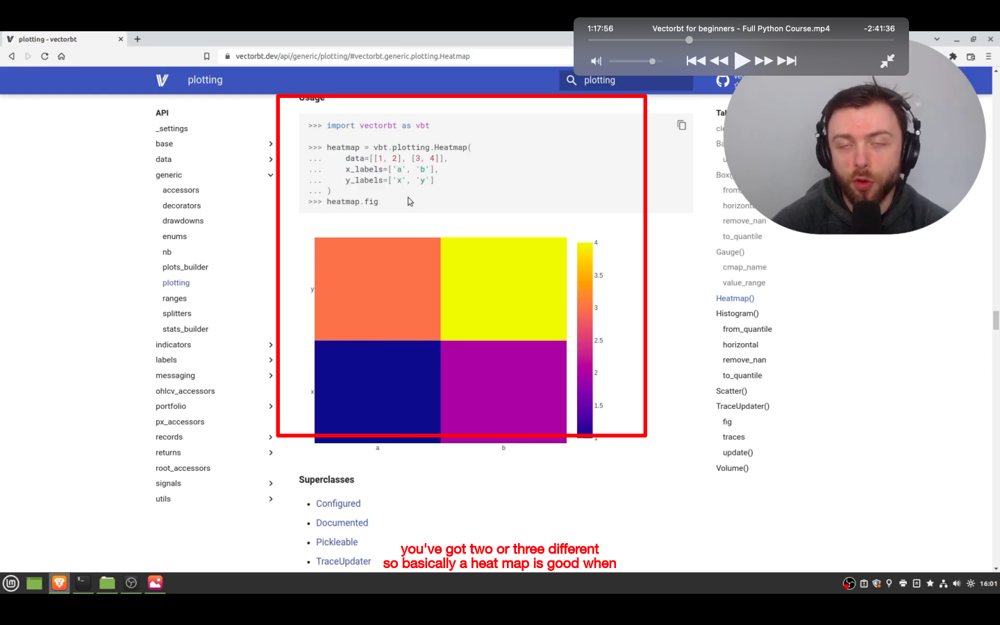</img>  
--=  
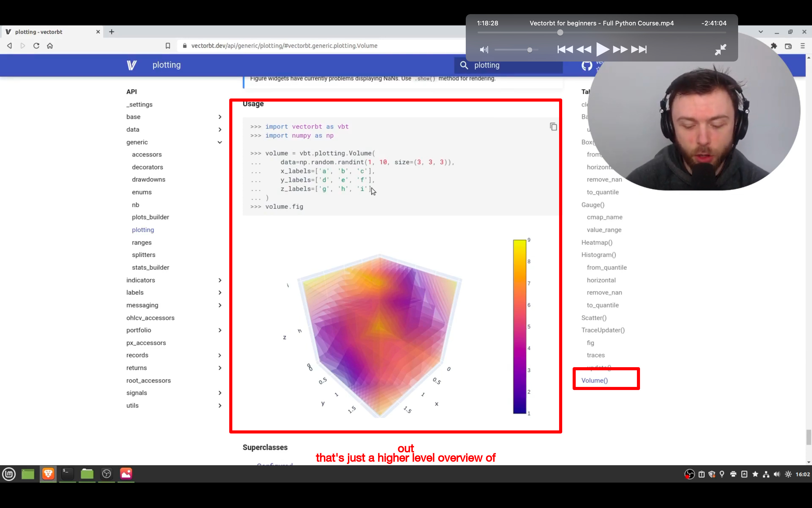</img>  
两种调参的显示形势，heatmap，volume，  
heatmap 包含两个参数，volume 包含三个

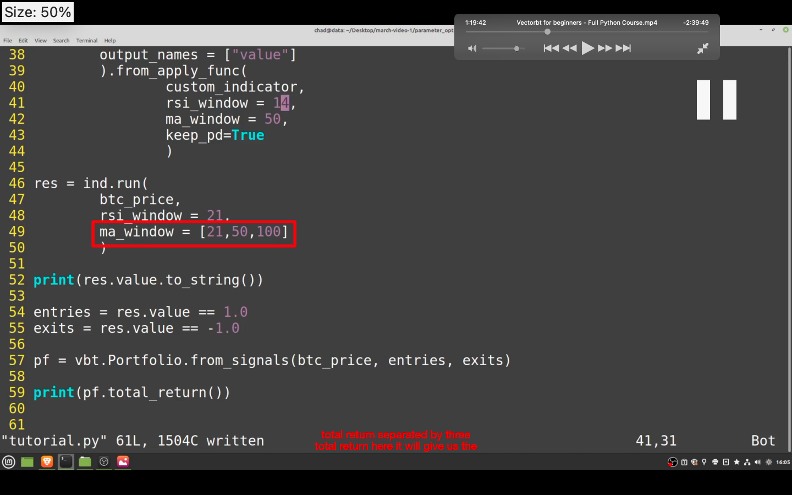</img>  
--=  
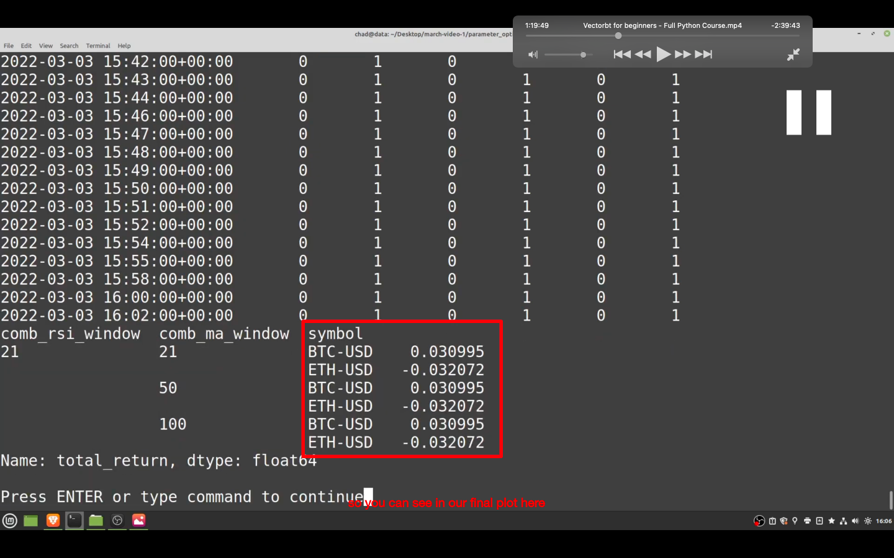</img>
--=  
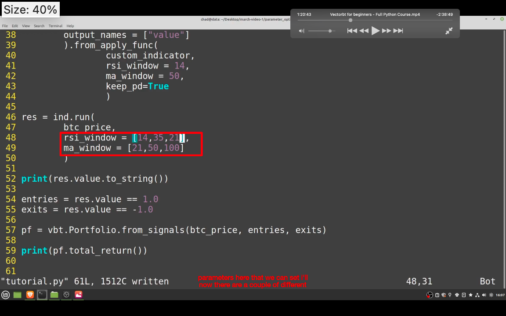</img>  
--=  
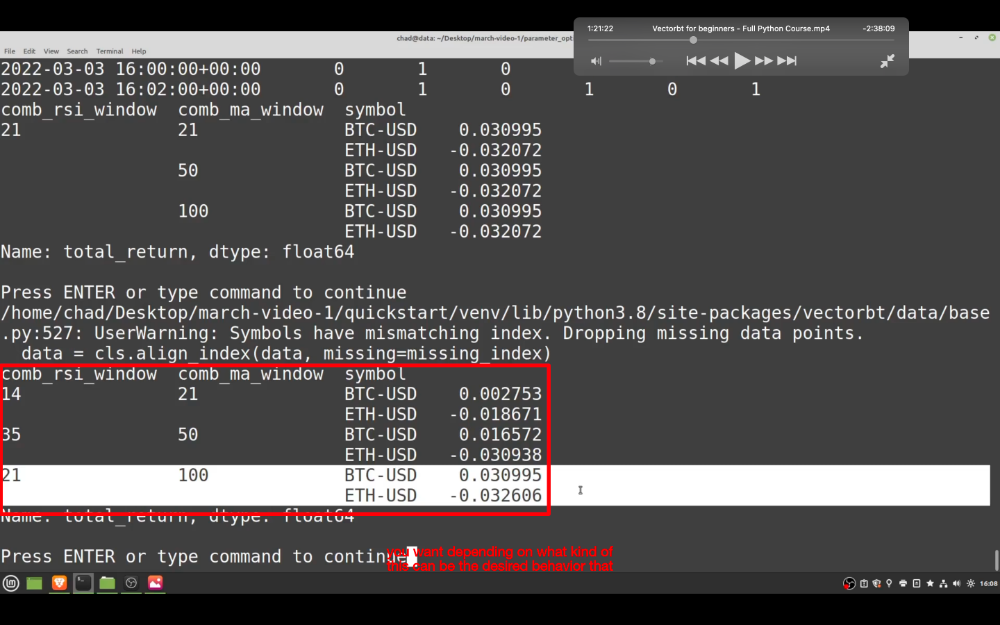</img>
如图

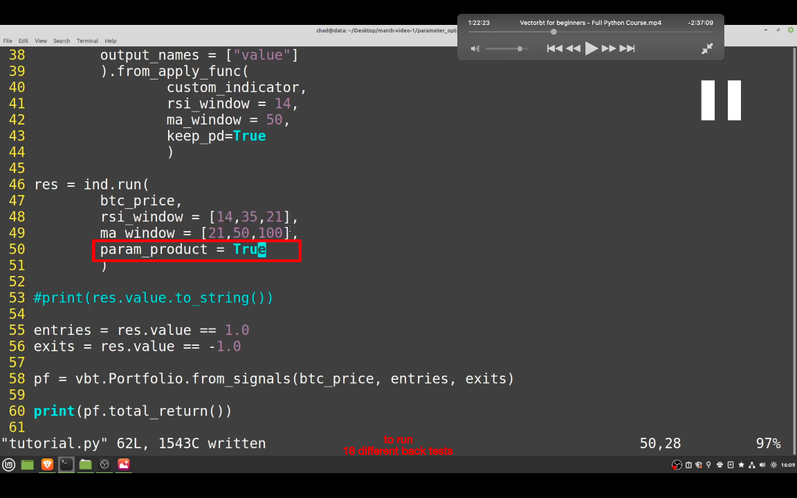</img>  
--=  
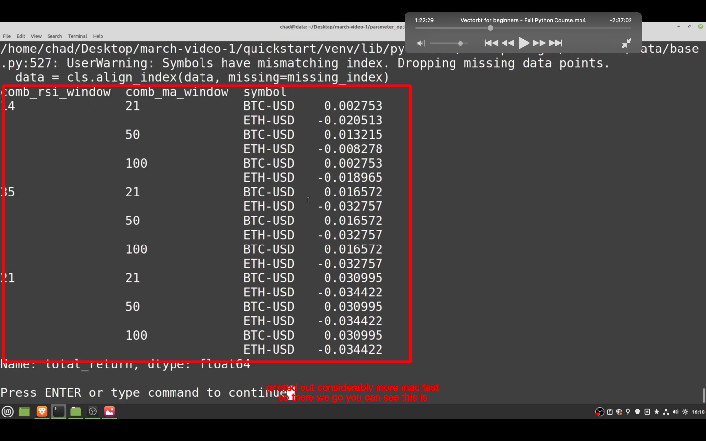</img>  
如图

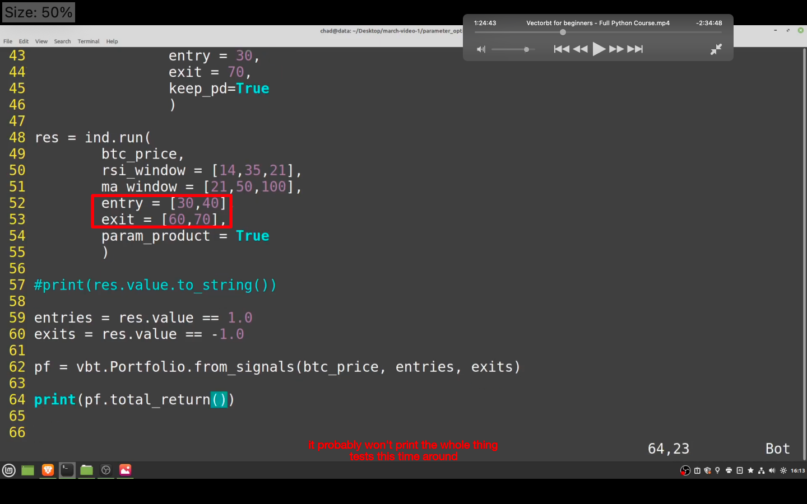</img>  
--=  
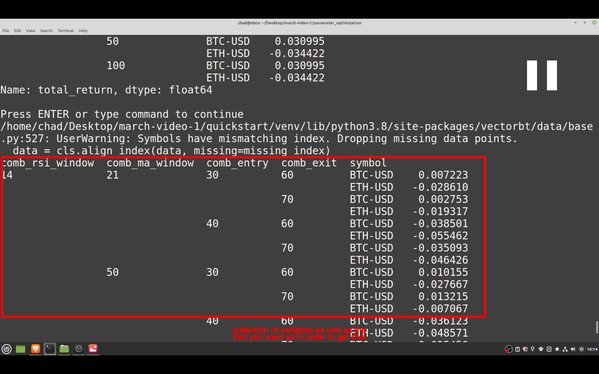</img>  
再加入进出参数的效果，注意不止修改了图一的地方，还有很多地方有修改，具体看视频

</img>  
--=  
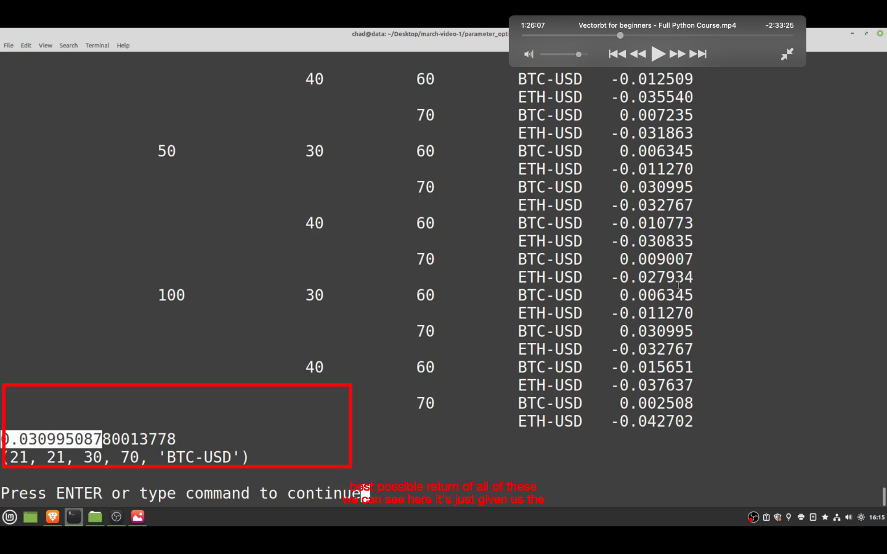</img>
这样方便找到最佳参数组合

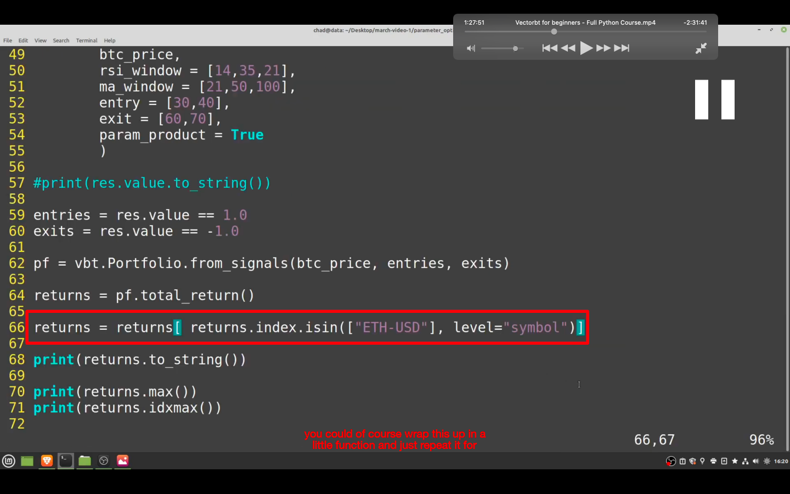</img>  
要找到特定币的最佳组合就加入这段

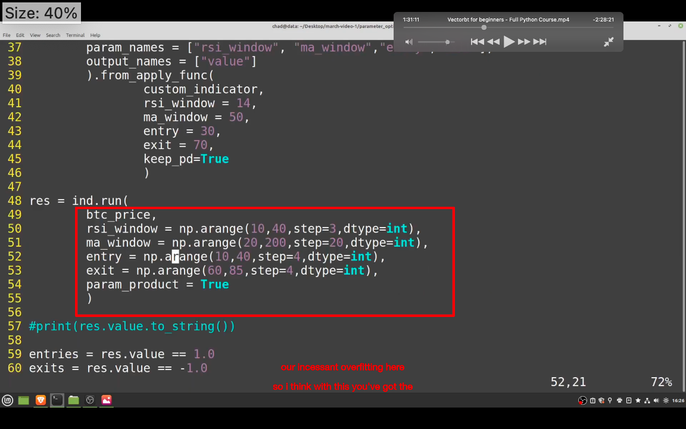</img>  
另一种简便写法

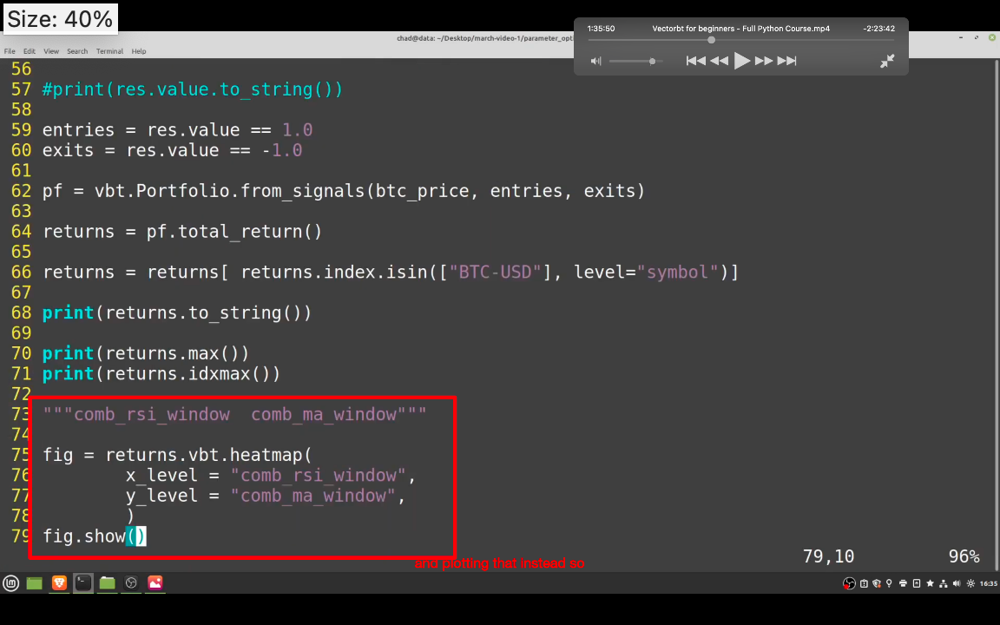</img>  
--=  
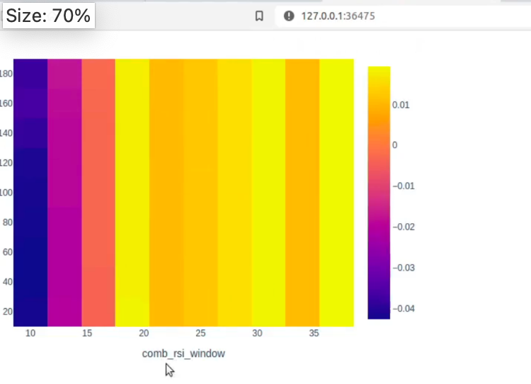</img>  
heatmap

### 后面还有些内容，包括介绍 volume 的，暂时用不到就不学了
