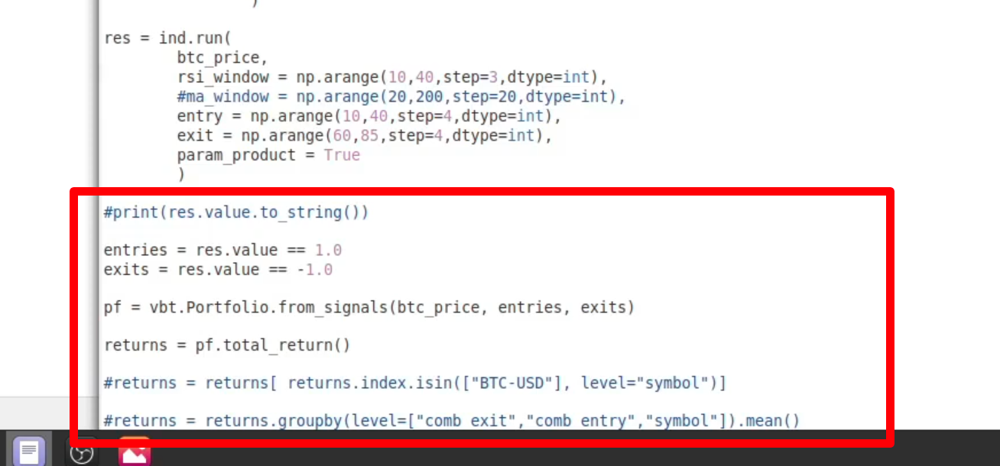

## 230318

### 让回测提升 10-100 倍速度

### pandas 虽然功能多，但速度慢，而 numpyarrary 速度很快，因为它更底层，很多代码都是预编译好的 c。

### talib 用 assembly 写的，更底层，速度更快，

### numba 能把你写的 python 代码转换为 machine code。提升 10-100 倍速度

</img>  
--=  
</img>  
上节课的最终代码

### 暂时用不上，未完待续
