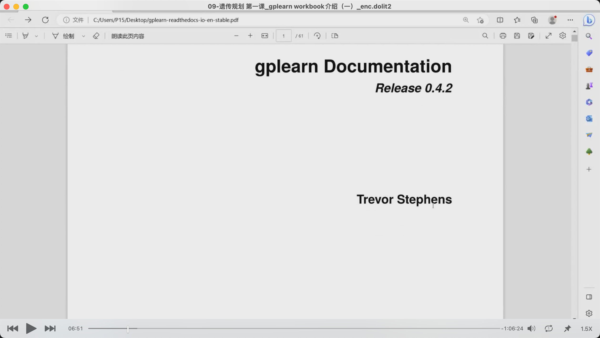

### 230409

### 在上一章分四节把多因子完结了，包括宏观，货币资金，银行信用，产业链等因子，主要是些慢变量。但因子不能只有慢变量或慢变量处理成的快变量。还需要量价因子，或者需要增加一些敏感的算法。这样模型或者说因子体系才能增加广度。之后的学习再增加深度。

</img>  
交易风险不在于出错，而在于有因素没有考虑进去。如此图假设每段代表一个因子，则有一段没考虑进去则可能造成亏损。

### 量价因子，均线，macd，rsi，cci 这些所谓的指标都是量价的，都可以做成量价因子。这些因子刚造出来时赚钱，但用的人越来越多后就不赚钱了，市场上有一股力量会反过来用它。所以 1：在挖掘因子时，既要守正也要出奇。2：手动生成因子速度较慢。机器学习或深度学习就能批量生产因子。gplearn 就是用来专门挖掘因子的工具。

</img>  
https://github.com/trevorstephens/gplearn  
gplearn 最早不是用在金融上，而是医学上的，作者 TS。

</img>  
这节课先不看代码，先看文档  
gplearn 底层逻辑来自遗传规划，也就是遗传算法 ，遗传算法采用了生物进化隐含的策略：1，交叉，2，变异，3，繁殖。  
不用完全搞懂底层代码，知道咋用就是。  
可能会在 Bloat 膨胀这里犯错，就是在繁殖的过程中繁殖出很多不认识，一看就不合理的东西。

还有个重点是 2.2transformer，转化，变形金刚。通过工具把一些简单的算法合成，融合，繁殖，交叉。产生一些新的东西。

3 api reference 主要讲 2 的那些东西究竟是怎么用的。3 是重点，前面的 1，2 都是大概介绍下。

（没听太懂）gplearn 经过 mutation，crossover，reproduction 后会产生表达式 expression。最终产生新的表达示，也就是算法。量价因子主要就是这样创造的。机器不能凭空生成，需要输入一些算法进去。包括底层算法，基础算法，合成算法。所以最重要的是两部分，第一是底层算法，第二就是这个工具。所以除了把 gplearn 学会，还要不断进化算法库。

</img>  
gplearn 底层是 scikit-learn。所以要先安装 sl，

## 之后的内容听不太懂。也许需要先接触些实例
