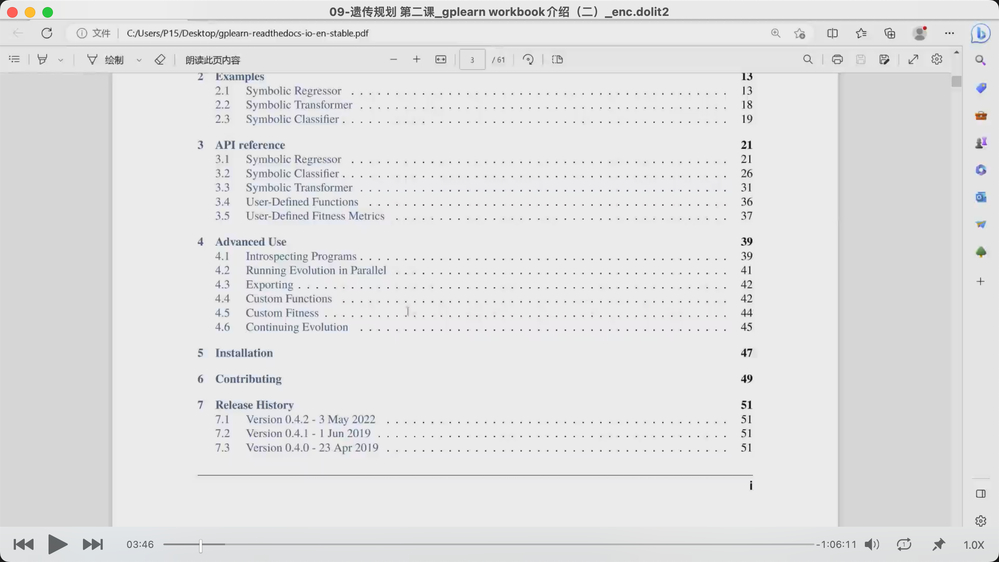
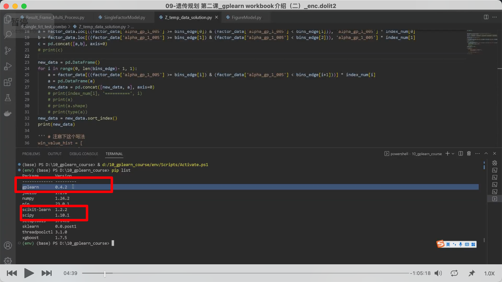
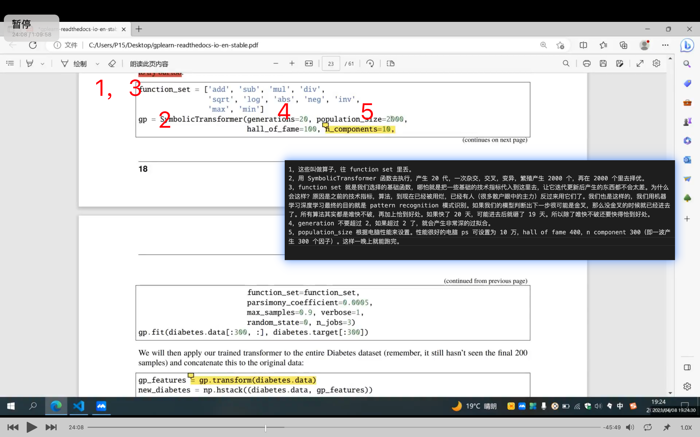
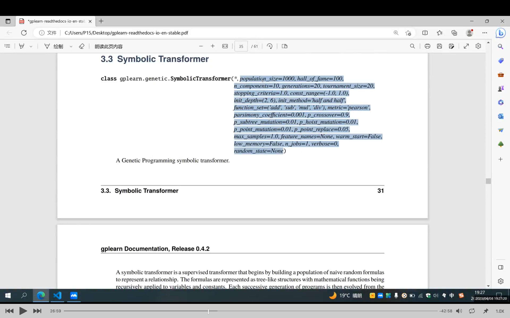
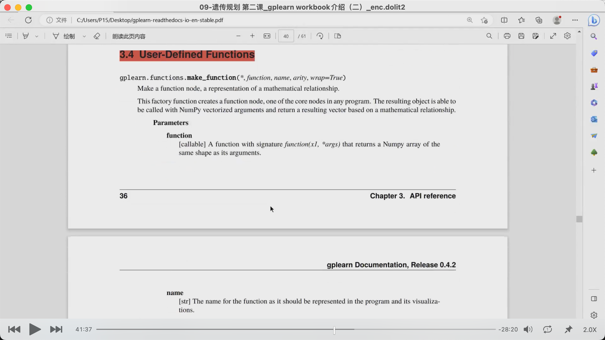
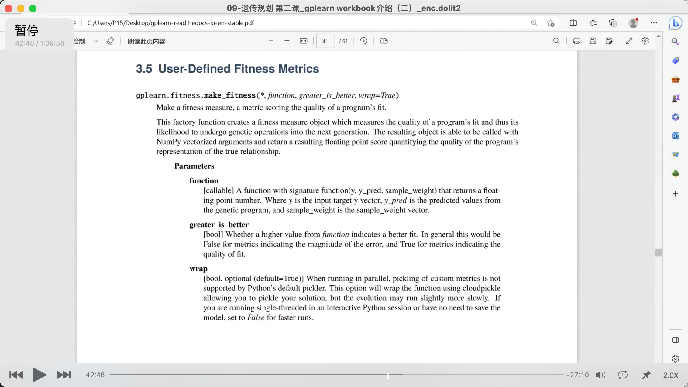

## 230409

</img>  
这节课主要是讲 3.3。3.1，3.2 不讲。3.4，3.5 是重点。4 会大概看下。5 安装很简短，大概说下。

</img>  
先装 scipy，再装 scikitlearn，再装 gplearn。还得装 joblib。

### 之后内容较复杂，只记录较重要的内容，具体做实例后应该就能理解了。

</img>  
1，这些叫做算子，往 function set 里丢。  2000
2，用 SymbolicTransformer 函数去执行，产生 20 代，一次杂交，交叉，变异，繁殖产生 2000 个，再在 2000 个里去择优。  
3，function set 就是我们选择的基础函数，哪怕就是把一些基础的技术指标代入到这里去，让它迭代更新后产生的东西都不会太差。为什么会这样？原因是之前的技术指标，算法，到现在已经被用烂，已经有人（很多散户眼中的主力）反过来用它们了。我们也是这样的，我们用机器学习深度学习最终的目的就是 pattern recognition 模式识别。如果我们的模型判断出下一步很可能是金叉，那么没金叉的时候就已经进去了。所有算法其实都是唯快不破，再加上恰到好处。如果快了 20 天，可能进去后就砸了 19 天。所以除了唯快不破还要快得恰到好处。  
4，generation 不要超过 2，如果超过 2 了，就会产生非常深的过拟合。  
5，population_size 根据电脑性能来设置。性能很好的电脑 ps 可设置为 10 万，hall of fame 400，n component 300（即一波产生 300 个因子）。这样一晚上就能跑完。  
6，parsimony_coefficient 数值要设置得很小，控制膨胀用的。

### regressor 和 classifier 都不咋用。是给测基因，监测肺癌等用的。

</img>  
transformer 的 class 比 regressor 和 classifier 大得多。  
此段内容很多，需要时看视频 4120e。

</img>  
user-defined functions 自建函数 4130-4215

</img>  
user-defined fitness metrics 自建评判标准 4600e

### 4700s，看最后输出到东西怎么打分

### 5310s，经验分享

从机构出来定方向，想的是干个很难的事，难的事垄断性强。所以选定价，落实到某个点上，所以选量化，选期权，因为期权难。刚开始期权定价不错，无风险套利玩的溜。但后来会吃亏，如遇到黑天鹅或极端情况。所以想到得有个底层的策略来指挥这些期权策略。所以开始多因子做 cta。量价因子最简单，但同时也是最难的。因为门槛低，所以很多人进来挖掘。比如九坤，幻方，现在已经挖的比较空了，但仍然可以做？，比如用 gplearn 在比特币等币的数据上挖掘因子，搭建模型进行交易。

量价这块容易上手，但是想精通却极难。宏观因子，资金流因子等有十几年经验，且有硬性逻辑可以讲，如 m2 或社融扩张时是要放水不是要紧缩。但量价有时候是随机需要缘分的，数学，物理厉害的人更有优势，因为更懂算子。

每个人做出来的因子会根据自己个性，成长经历而不同。如可以用货币，资金流因子。组合各因子其实是最难的，到时候可以请教老师。

做出来的组合，第一步夏普可以达到 1.6 都能轻松达到，第二步 2.4。

之后会讲模型组合的方法，再之后会讲怎么输出信号。

