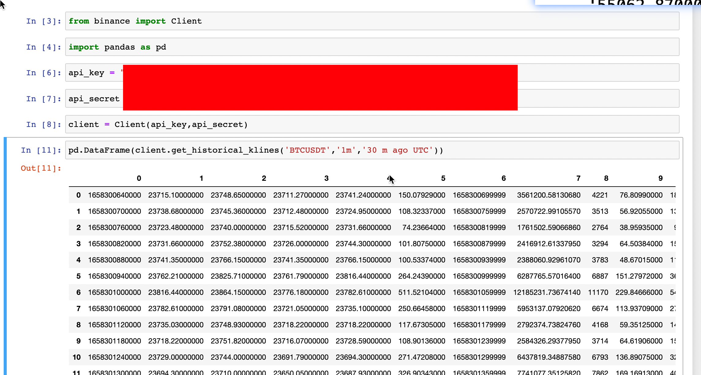
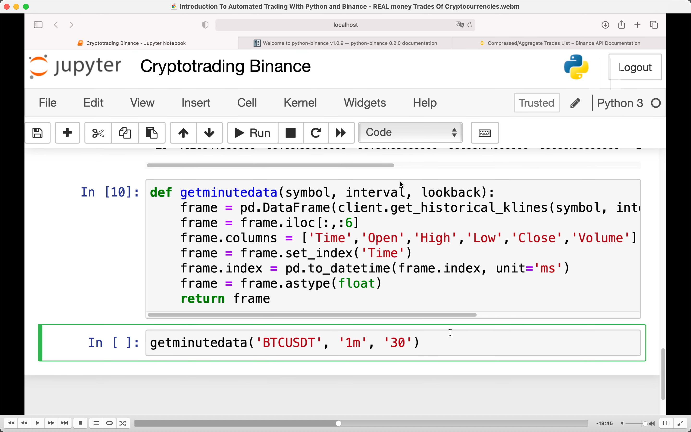
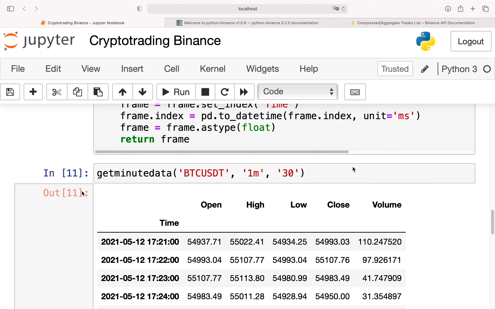
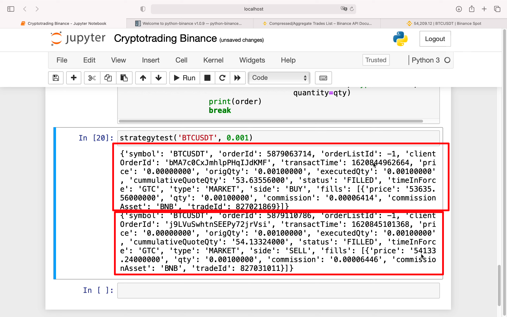

  
首先执行 !pip install python-binance  
然后才是截图的内容，截图源于自己的代码而非视频。
此视频未介绍 websocket 方式  
1m 代表 1 分钟 k 线，30 m ago，代表截取现在以前 30 分钟时间。

add 221030  
可能会遇到报错 bad escape \d at position 7，执行以下命令并重启内核即可  
pip uninstall regex -y  
pip install regex==2022.3.2

  
这里介绍了上图获取到的信息是什么意思。

  
  
  
更好的方式获得数据，具体信息看视频。

add 221030  
iloc[:,:6]大概意思是只获取所有行，前 6 列的数据  
set_index 可以指定数据中的某一列，将其作为该数据的新索引

  
Open.plot() 可以画出折线图

  
交易策略，一段时间内降了一些就买，涨了一些就卖

  
具体交易策略代码，未显示部分为-1。  
cumulret = cumulative return 查看近 30 分钟资产的表现。  
pct_change = percentage change 显示百分比变化  
cumprod 累计连乘  
cumulret[-1] 应该是最新一次 cumulret 的数据的意思。  
while true: 死循环的意思，只有遇到 break 才结束  
想知道购买资产后怎么表现，所以就用发起 order 得到的 ts 来过滤。过滤为只显示所有 dataframe 中大于 order 的 ts。loc 大约是 location 的意思。

  
执行交易，返回结果时两个交易，第一个买，第二个卖。

add221101  
产生一个交易后，会产生一个 timeStamp，用 order['transactTime']获取，其中 transactTime 是固定值，order 是之前交易的函数名

%run ./filename.ipynb 即可运行 filename 文件并使用其中的变量  
如 filename 中有 aaa = "bbb",则在当前文件运行 aaa 输出 "bbb"

