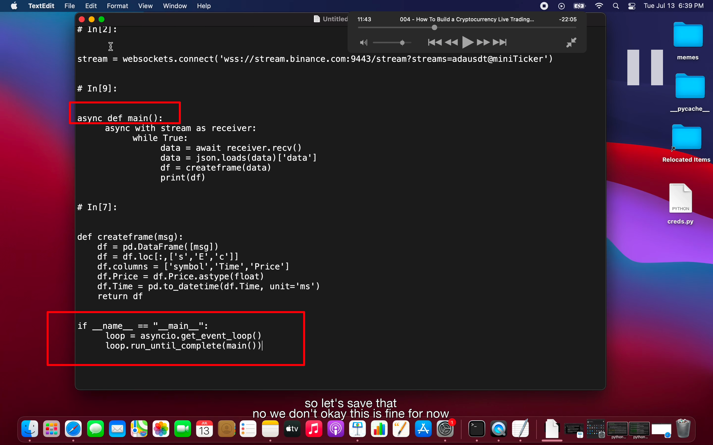
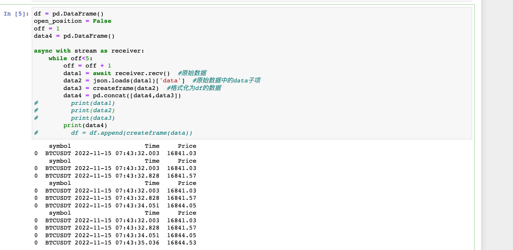

## 221111

</img>  
--=  
</img>  
roc rate of change 本节介绍的策略

</img>  
获取当前某币数据。这节用的获取数据方法跟上节不一样了。上节是 binancesockermanager，实操中有错误，这节是 websocket。所以不要纠结有问题的地方。  
miniticker，应该是最小的瞬时单位。上节课用的是蜡烛图，是一个时间范围单位

add221115  
已更正，上节的方法没问题。两者的区别是这节用的 socket 连接币安的接口，上节是直接用币安封装的 socket，上节是所有交易都显示，这节是一秒抽取一个交易显示？？？？

</img>  
将数据用 pd 改善

</img>  
以上的加个 while true 就能每秒循环获得数据

</img>  
add221115  
一直在 jupyter 运行可能会报错，将之前的文件保存为纯 py 文件。  
先在第一段中添加 import asyncio，然后点击 file，download as，python，获得如图所示  
添加红色内的内容即可

</img>  
--=  
</img>  
执行以上文件得到如图效果，注意可以直接把文件拖到窗口里，则可获得其路径

</img>  
引入币安 client  
另外，在第一段加上 import ta，ta 即 technical analysis 库。

## 221112

</img>  
--=  
</img>  
最终策略代码 aaav 1425 - 2900
最上面被挡住的两行是  
df = pd.DataFrame()  
open_position = False

</img>  
实际操作遇到此报错，无法解决  
add  
其实不是报错而是警告。显示不出来 print 的信息是因为缩进写错了。

</img>  
add221115  
使用 concat 代替 append，使用方式如图。注意 concat 来自 pd 而不是 df。参数是需要合并的元素组成的数组。
