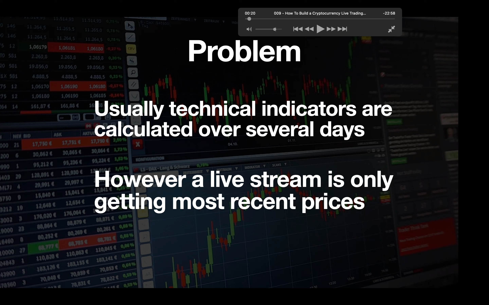

## 221119

</img>  
problem

</img>  
goal

</img>  
短线超过长线，即金叉时买入。

</img>  
初始代码，红色部分为仅在 jupyter 才需加入

</img>  
--=  
</img>  
此代码获得 sma 的 sum 和 lma 的 sum。但都是减了最后一天的，因为最后一天要用下面所说的方法获得

</img>  
准备代码

</img>  
策略代码  
mark

</img>  
执行代码，注意在执行前先人工确保 sma 在 lma 下面。这样代码才有效，且这里指定的 symbol 必须和之前输入的 symbol 一样。

</img>  
执行结束后会有个这个提示。
